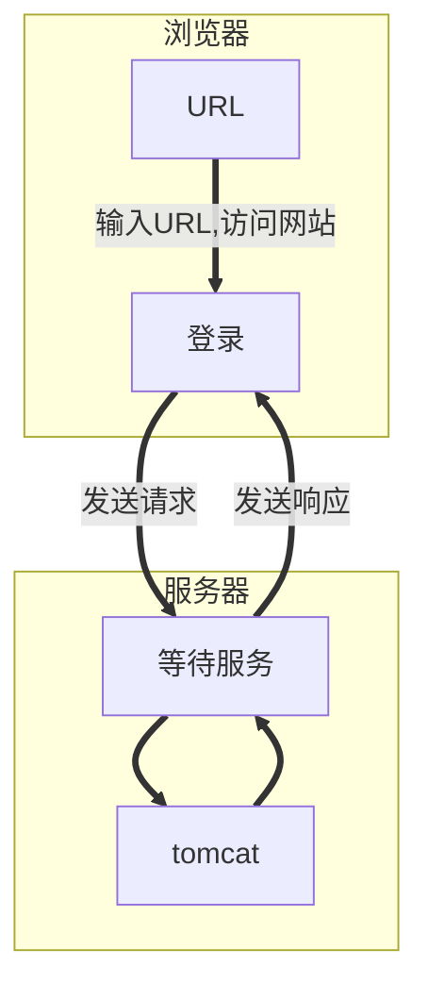
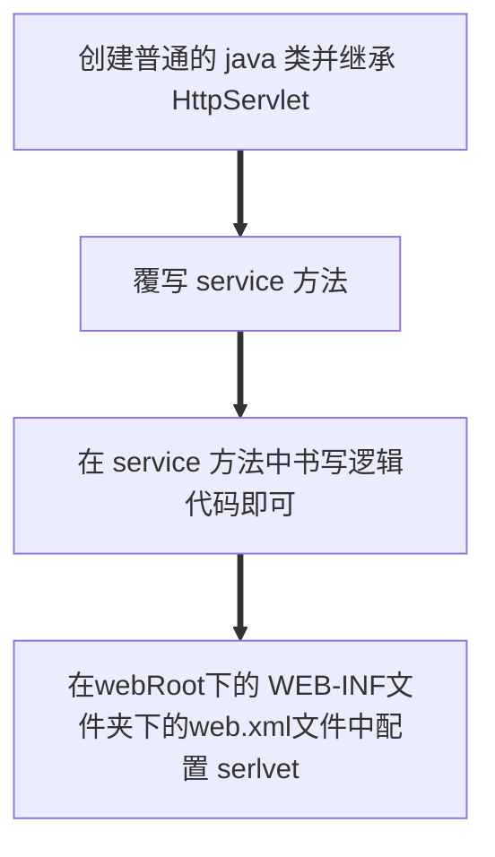
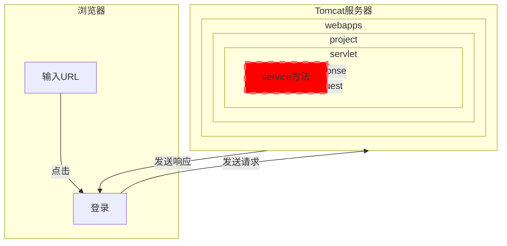
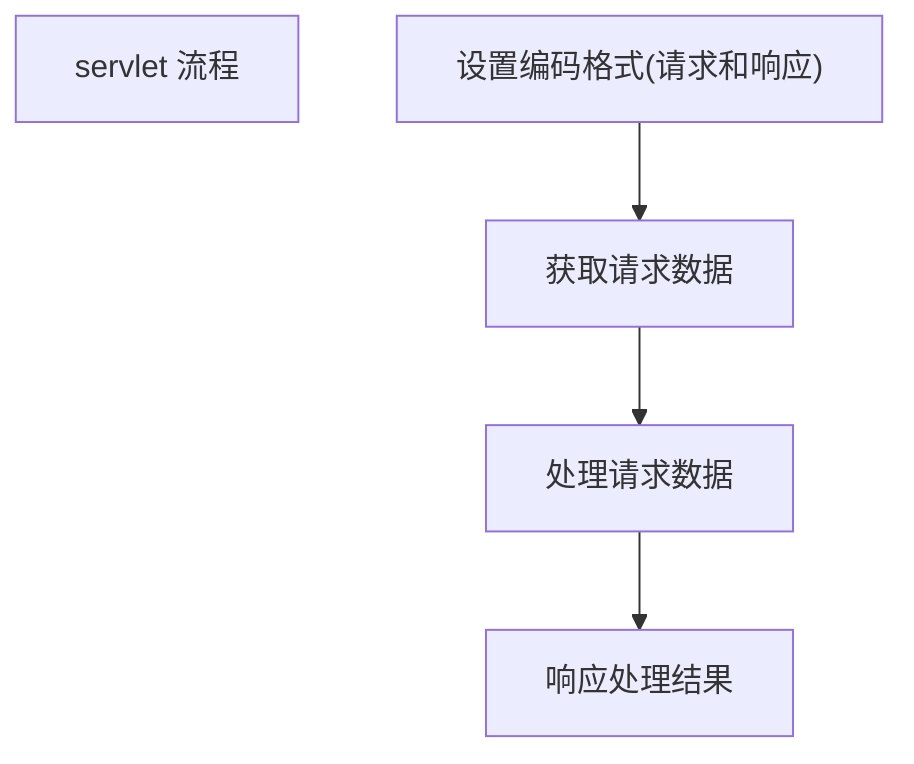
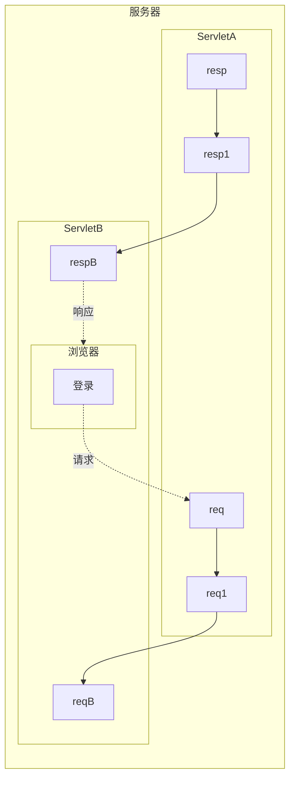

# 1 Web 交互模式和 HTTP 协议

## 1.1 Web 交互模式

> 浏览器 Client 通过统一资源定位符（ URL） 确定对应服务器资源的地址并向服务器发送请求，服务器接受到浏览器的请求后，查到对应的资源后再将浏览器所需的资源(HTML+CSS+Js+Data数据)响应给浏览器，浏览器接受到服务器的资源后再页面上展现给用户。
>
> 请求：指浏览器发送请求信息给服务器的过程
>
> 响应：指服务器发送资源给浏览器响应的过程
>

```sequence
浏览器->>服务器: 1 发送请求
服务器-->浏览器: 2 发送响应
Note over 浏览器,服务器: HTTP协议
Note left of 浏览器:用户登录网站
Note right of 服务器:接受请求，并根据对应业务逻辑的规则进行处理

title: web交互
```




## 1.2 HTTP 协议概述

> 规范浏览器与服务器之间信息交换的内容格式

### 1.2.1 B/S 模式中使用 HTTP协议

第一部分：浏览器通过 HTTP 协议发送请求信息给服务器

第二部分：服务器按照 HTTP 协议解析浏览器的请求信息

第三部分：服务器通过 HTTP 协议发送响应内容给浏览器

第四部分：浏览器按照 HTTP 协议解析服务器的响应内容

### 1.2.2 HTTP 协议的特点

1. 简单快速
2. 灵活
3. 无连接
4. **无状态**（HTTP协议不会存储响应的内容）


### 1.2.3 HTTP协议 交互的过程

步骤一：浏览器与服务器之间建立连接通道

步骤二：浏览器发送通过HTTP协议发送请求信息给服务器

步骤三：服务器接受浏览器的请求并处理，再通过 HTTP 协议发送消息给浏览器

步骤四：浏览器与服务器之间的连接通道关闭(**HTTP 1.1 不会关闭**)


### 1.2.3 HTTP请求头和请求消息

> 请求行：  请求方式 请求路径 使用的协议
>
> 请求头：以键值对的形式
>
> 空行： \r\n 回车换行
>
> 请求主体

浏览器根据请求方式按照 HTTP协议 发送请求消息给服务器

```http
GET /HTTPTest/hello.html HTTP/1.1
Host: 127.0.0.1:8080
Connection: keep-alive
Cache-Control: max-age=0
Upgrade-Insecure-Requests: 1
User-Agent: Mozilla/5.0 (Windows NT 10.0; Win64; x64) AppleWebKit/537.36 (KHTML, like Gecko) Chrome/72.0.3626.109 Safari/537.36
Accept: text/html,application/xhtml+xml,application/xml;q=0.9,image/webp,image/apng,*/*;q=0.8
Referer: http://127.0.0.1:8080/HTTPTest/
Accept-Encoding: gzip, deflate, br
Accept-Language: zh-CN,zh;q=0.9
If-None-Match: W/"122-1550838557369"
If-Modified-Since: Fri, 22 Feb 2019 12:29:17 GMT
```


### 1.2.4 HTTP响应头和响应消息

> 响应头的结构：
>
> 响应行：使用的协议  状态码  状态消息
>
> 响应头：消息报头，客户端使用的附加信息（以键值对的形式）
>
> 空行：  响应头与响应实体之间的，必须的 （\r\n 回车换行）
>
> 响应主体：正文，服务器返回给浏览器的信息

```http
HTTP/1.1 200 OK
Server: Apache-Coyote/1.1
Date: Fri, 22 Feb 2019 12:35:45 GMT
Accept-Ranges: bytes
ETag: W/"183-1550838265071"
Last-Modified: Fri, 22 Feb 2019 12:24:25 GMT
Content-Type: text/html
Content-Length: 183
```


响应：服务器在接受到浏览器的请求信息后，会根据请求信息进行请求处理，将处理结果重新按照 HTTP  协议

的要求进行封装，然后将封装的数据响应给浏览器在接收到响应信息后，解析执行。到此一次请求就完整的被处理完毕。

​	


# 2 服务器简介

> 代码：是业务处理的规则，先声明后执行。
>
> 服务器：可以根据浏览器的请求**自动调用并执行对应的业务逻辑处理代码的应用程序(**狭义)
>
> 广义来说，只装载了服务器应用程序的主机也可以称之为服务器主机。
>
> 特点：
>
> ​	1、由代码编写的应用程序
>
> ​	2、可以解析浏览器发起的请求信息
>
> ​	3、可以根据请求信息调用并执行对象
>
> ​	4、将处理结果响应给浏览器。	

## 2.1  Tomcat 服务器

### 2.1.1 目录介绍

> bin： tomcat二进制文件
>
> lib：tomcat 所需的库文件和jar
>
> conf： 配置文件
>
> webapps：存放 javaweb项目（WebRoot 下的所有文件）
>
> work：有关 jsp 的文件

````mermaid
graph LR
A((Tomcat 服务器))--> B[bin]
B-->tomcat二进制文件
A-->C[lib]
C-->tomcat所需的库文件和jar
A-->D[conf]
D-->配置文件
A-->E[webapps]
E-->J["存放JavaWeb项目(WebRoot每个文件夹就是一个JavaWeb项目,也叫虚拟项目名)"]
A-->F[work]
````


## 2.2 总结 

1. 服务器不是一台电脑，而是一个具有特殊功能的应用程序。这个应用程序可以接受浏览器的请求，把请求交给对应的业务逻辑规则处理，将处理好的结果即响应按照 HTTP 协议的规范发送给浏览器。
2. 服务器一旦开启就不会轻易停止，总是等待用户请求访问服务器，然后服务器做出响应发送给浏览器。
3. 服务器的种类有很多，如 Tomcat 服务器、Apache 服务器、Nginx 服务器。


# 3 servlet 

## 3.1 Servlet 概念和使用

### 3.1.1 servlet 概念

> servlet 是实现了特殊接口的 Java 类，该类可以被 Tomcat 服务器 识别。
>
> 特点：servlet 由程序员创建，但是由服务器调用执行。

### 3.1.2 servlet 的创建和使用步骤

> 1、 创建普通的 java 类并继承 HttpServlet
>
> 2、 覆写 service 方法
>
> 3、在 service 方法中书写逻辑代码即可
>
> 4、 在 webRoot 下的 WEB-INF 文件夹下的  ==web.xml==  文件中配置 serlvet   




### 3.1.3 servlet 总结

> Servlet 是被服务器可以识别的 Java 类。 我们需要将**业务逻辑处理规则**放入 Servlet 中，然后将 Serlvet 放入 tomcat 服务器中，服务器根据请求调用对应的 Servlet 处理。总之，Servlet 可以称为后台处理程序的入口。




### 3.1.4 servlet 实践

> java 环境 tomcat 服务器  My Eclipse 开发环境
>

### 3.1.5 servlet 运行流程

> 以 localhost:8080/project/s 为例，使用 tomcat 服务器，运行 serlvet 程序。
>
> 【localhost:8080】首先根据 IP+Port 找到对应服务器同时服务器会去 webapps 下查找处理这次请求的代码
>
> 【project/s】URI(**Uniform Resource Identifier,统一资源标识符**) 数据，服务器根据 URI 找到对应的 servlet 执行， 去项目中的 web.xml 文件中去匹配。
>
> 注意： project 是 虚拟项目名

## 3.2 web.xml 配置

### 3.2.1 精确配置

> `<url-pattern>/拦截路径</url-pattern>`
>
> url-pattern 可以配置多个
>
> 注意：'/'  是不可省略

```xml
 <servlet-mapping>
  	<servlet-name>MyServlet</servlet-name>
    <url-pattern>/test</url-pattern>
  	<url-pattern>/te</url-pattern>
  	<url-pattern>/tes</url-pattern>
  </servlet-mapping>
```


### 3.2.2  模糊配置

> `<url-pattern>*.后缀名</url-pattern>`
>
> 注意：所以一指定的后缀名结尾的请求都会调用该 servlet
>
> 作用：进行模块化开发的划分等

```xml
 <servlet-mapping>
  	<servlet-name>MyServlet</servlet-name>
  	<url-pattern>*.action</url-pattern> 
  </servlet-mapping>
```

### 3.2.3  拦截所有请求

> `<url-pattern>/* <url-pattern>`
>
> 注意：会拦截所有类型的数据，包括静态资源请求(css、js、图片等)和jsp请求。

```xml
 <servlet-mapping>
  	<servlet-name>MyServlet</servlet-name>
  	<url-pattern>/*</url-pattern>
  </servlet-mapping>
```


### 3.2.4  某个目录下拦截所有的请求

> `<url-pattern>/one/*</url-pattern>`
>
> 注意：会拦截处理所有以 one 目开头的请求

```xml
 <servlet-mapping>
  	<servlet-name>MyServlet</servlet-name>
  	<url-pattern>/one/*</url-pattern>
  </servlet-mapping>
```


### 3.2.4 总结 

> 一个 servlet 可以配置多个 url-pattern ,反之 一个 url-pattern 不能对应多个 serlvet 。
>
> ==tomcat 服务器启动后将项目中 web.xml 会被加载到内存中==


## 3.3  Serlvet 单例

> 注意： 服务器在接受到浏览器的请求后，会开辟一个线程来处理这次请求，在线程中调用对应的 servlet 进行处理。但是服务器调用 serlvet 处理请求， ==一个 serlvet 服务器只会创建一个实例化对象==。该对象是线程共享的。


## 3.4 Servlet 生命周期

> 结论： serlvet 生命周期：从第一次被调用到服务器关闭
>
> 验证： 
>
> ​    init 方法： servlet 被初始化创建时调用
>
> ​    service方法：处理请求时调用
>
> ​    destory方法：servlet被销毁时调用(即服务器关闭时，触发 destory 方法执行)
>
> 注意：
>
> ​	在 web.xml 中 配置 load-on-startup 标签 来设置 servlet 的初始化加载为服务器启动时。
>
> ​	生命周期就变为从服务器开启到服务器关闭。


LifeServlet.java

```java
package cn.szxy.servlet;

import java.io.IOException;

import javax.servlet.ServletException;
import javax.servlet.http.HttpServlet;
import javax.servlet.http.HttpServletRequest;
import javax.servlet.http.HttpServletResponse;
/**
 * 
 *	 servlet 的生命周期
 *	 从第一次被调用初始化到servlet销毁
 *
 *	若使用 load-on-startup，则生命周期变为从服务器启动到服务器停止
 *	
 */
public class LifeServlet extends HttpServlet {
	@Override
	public void init() throws ServletException {
		System.out.println("LifeServlet.init(被初始化.....)");
	}
	@Override
	protected void service(HttpServletRequest req, HttpServletResponse resp)
			throws ServletException, IOException {
		System.out.println("LifeServlet.service(被调用了....)");
	}
	@Override
	public void destroy() {
		System.out.println("LifeServlet.destroy(被销毁了....)");
	}
}

```

web.xml

```xml
<?xml version="1.0" encoding="UTF-8"?>
<web-app xmlns:xsi="http://www.w3.org/2001/XMLSchema-instance" xmlns="http://java.sun.com/xml/ns/javaee" xsi:schemaLocation="http://java.sun.com/xml/ns/javaee http://java.sun.com/xml/ns/javaee/web-app_2_5.xsd" id="WebApp_ID" version="2.5">
  
  <!-- 配置 servlet  -->
  <servlet>
    <servlet-name>LifeServlet</servlet-name>
    <servlet-class>cn.szxy.servlet.LifeServlet</servlet-class>
    <load-on-startup>1</load-on-startup><!-- 设置服务器启动时加载 serlvet 初始化 -->
  </servlet>
  <servlet-mapping>
    <servlet-name>LifeServlet</servlet-name>
    <url-pattern>/life</url-pattern>
  </servlet-mapping>
</web-app>
```


## 3.5 doGet 方法和 doPost 方法

### 3.5.1 doGet 方法和 doPost 方法的区别

> doGet 方法用来处理服务器接受的 get 请求，doPost 方法永爱处理服务器接受的 post 请求。
>
> 若 一个 serlvet 中没有 service 方法，只有 doPost 方法，服务器接受 post 请求后不能处理，报 405 错误。
>
> 注意：==在 doGet 方法、doPost方法、service 方法中，service方法 优先被执行==

```java
package cn.szxy.servlet;

import java.io.IOException;

import javax.servlet.ServletException;
import javax.servlet.http.HttpServlet;
import javax.servlet.http.HttpServletRequest;
import javax.servlet.http.HttpServletResponse;

public class DoGetAndDoPost extends HttpServlet {
	
	@Override
	protected void doPost(HttpServletRequest req, HttpServletResponse resp)
			throws ServletException, IOException {
			System.out.println("DoGetAndDoPost.doPost(被调用了....)");
	}
	@Override
	protected void doGet(HttpServletRequest req, HttpServletResponse resp)
			throws ServletException, IOException {
			System.out.println("DoGetAndDoPost.doGet(被调用了....)");
	}
	@Override
	protected void service(HttpServletRequest arg0, HttpServletResponse arg1)
			throws ServletException, IOException {
			System.out.println("DoGetAndDoPost.service(优先于 doGet 和 doPost 方法，被调用了)");
	}
}
```

### 3.5.2 doGet 和 doPost  和 service 方法调用的本质

> 注意： Tomcat 服务器 只认识 service 方法。如果我们自己声明的 servlet 中没有覆写 service 方法，则会执行父类 HttpServlet  中 的service 方法，而 HttpServlet service 方法会根据请求方式调用对应 doXXX 方法处理请求。


## 3.6 Servlet 异常总结

### 3.6.1 404错误

> 资源找不到

原因：1、servlet 别名错误  2、虚拟项目名错误

### 3.6.2 500错误

> 内部服务器错误

原因： 1、类找不到 2、Java 语法有问题

### 3.6.3 405错误：

> 请求方式不支持

原因：请求方式 和 servlet 的方法不匹配所造成的。

解决：尽量使用 service 方法处理请求，不再调用 service 中父类 service 方法。


# 4 HttpServletRequest

> 服务器在接受请求后，会给此次请求创建一个 request 对象，此对象中封存此次请求的相关数据。
>
> 作用：存储请求数据
>
> 注意：==每次请求都会创建一个新的 request 对象存储请求数据==。
>
> 特点：request 对象由服务器创建，一次请求创建一次 request
>
> 生命周期为一次请求内，请求结束则销毁此次请求的 request 对象

## 4.1 HttpServletRequest 对象中的方法 

> 获取请求行信息
>
> ​	返回请求方法  getMethod()
>
> ​	返回请求 URL getRequestURL()
>
> ​	返回请求 URI  getRequestURI()
>
> ​	返回请求数据 getQueryString()    只适用于 get 请求
>
> ​	返回请求协议 getScheme()         	   
>
> 获取请求头信息
>
> ​	 根据键名获取请求头信息 getHeader(String name )
>
> ​	注意，如果获取的请求头键名不存在，则返回 null，不报错。
>
> ​	获取所有请求头的枚举键名 getHeaderNames()
>
> 获取请求实体数据 (用户数据)
>
> ​	根据键名获取用户数据 getParameter (String name)
>
> ​	键名其实是前端界面中表单标签的name属性的值或者前端页面
>
> ​	注意：如果获取的键名不存在，则返回 null， 不报错 
>
> ​	获取同名不同的值数据 getParameterValues(String name)
>
> ​	获取请求实体中键名的枚举 getParameterNames()
>
> 请求相关的网络数据
>
> ​	获取客户端信息 getRemoteAddr()
>
> ​	获取客户端的端口号(浏览器) getRemotePort()
>
> ​	获取服务器主机地址 getLocalAddr()
>
> ​	获取服务器的端口号 getLocalPort() 

```java
package cn.szxy.servlet;

import java.io.IOException;
import java.io.PrintWriter;
import java.util.Enumeration;

import javax.servlet.ServletException;
import javax.servlet.http.HttpServlet;
import javax.servlet.http.HttpServletRequest;
import javax.servlet.http.HttpServletResponse;
import javax.swing.plaf.SliderUI;


/**
 * 
 *  HttpServletRequest 
 *  请求信息:
 *  请求行： 请求的方式 请求的URL 请求的协议  
 *  请求头：以键值对的形式
 *  空行
 *  请求主体
 * 
 */

public class TestHttpServletRequest extends HttpServlet {
	@Override
	protected void service(HttpServletRequest req, HttpServletResponse resp)
			throws ServletException, IOException {
		
		//获取请求信息
		PrintWriter out = resp.getWriter();
		out.print("您好");
		//请求方式
		String method = req.getMethod();
		System.out.println("请求方式："+method);
		//请求资源路径
		String uri = req.getRequestURI();
		System.out.println("请求资源路径"+uri);
		//请求资源地址 http://localhost:8080/req
		StringBuffer url = req.getRequestURL();
		System.out.println("请求资源地址"+url.toString());
		//请求数据,只适用于 get 方式请求
		String queryString = req.getQueryString();
		System.out.println("请求get方式中url的数据："+queryString);
		String[] split = queryString.split("&&");
		String[] name = split[0].split("=");
		String[] pwd = split[1].split("=");
		System.out.println("用户名"+name[1]+" 密码："+pwd[1]);
		//使用的协议
		String scheme = req.getScheme();
		System.out.println("请求使用的协议："+scheme);
		//请求头信息： 根据键获得值
		String header = req.getHeader("User-Agent");
		System.out.println("请求头信息： "+header);
		//获取所有请求头键名的枚举
		Enumeration headerNames = req.getHeaderNames();
		while(headerNames.hasMoreElements()){
			String  element = (String)headerNames.nextElement();
			System.out.println(element+":"+req.getHeader(element));
		}
		//请求主体
		//根据键获取值
		String uname = req.getParameter("name2");
		String upwd = req.getParameter("pwd");
		System.out.println("用户名和密码："+uname+"\t"+upwd);
		
		
		//获取 同名不同值的数据
		String[] pv = req.getParameterValues("gpv");
		for (String string : pv) {
			System.out.println("pv的值为"+string);
		}
		
		//获取请求主体信息键名的枚举 
		Enumeration parameterNames = req.getParameterNames();
		while(parameterNames.hasMoreElements()){
			
			String elename = (String)parameterNames.nextElement();
			if(elename.equals("gpv")){
				String[] parameterValues = req.getParameterValues(elename);
				for (String str : parameterValues) {
						System.out.println(elename+"\t"+str);
				}
			}else{
				String parameter = req.getParameter(elename);
				System.out.println(elename+"\t"+parameter);
			}
			
		}
		//获取网络信息 
		String localAddr = req.getLocalAddr();
		int localPort = req.getLocalPort();
		System.out.println("服务器地址：端口号"+localAddr+":"+localPort);
		String remoteAddr = req.getRemoteAddr();
		int remotePort = req.getRemotePort();
		System.out.println("浏览器地址:端口号"+remoteAddr+":"+remotePort);
		
	}
}

```


## 4.2  Request 对象的作用域

> 作用域：一次请求转发中的servlet
>
> 作用：request 对象可作为数据流转的载体

```java
//设置 request 中的属性
setAttribute(String name,Object object) 
//获取request中的属性
getAttribute(String name)
```


## 4.2 总结

注意：

1、  对于同名不同的值的数据，需要通过 `getParameterValues`  方法获取，若采用 `getParameter`方法只能获取第一个值的数据。

2、 对于获取键值不存在的值，会返回 null，但是不报错。真正报错是用 `null `做其它事情，所以可以在获取键值先进行 `if` 判断不为空，再执行下一步的操作。

# 5 HttpServletResponse

> 获取响应消息
>
> 设置响应行: 协议 状态码 状态消息
>
> 发送状态码 sendError(int status）
>
> 添加响应头 addHeader(String name,String value) 
>
> 若同时添加两个键名相同的响应头，两个响应头之间互不影响
>
> 设置响应头 setHeader(String name,String value)
>
> 若响应头中没有对应的键名，则setHeader会创建一个响应头。
>
> 若同时修改两个键名相同的响应头，后者会覆盖前者
>
> 设置响应主体  getWriter().write()
>
> 注意：一旦 resp对象响应发送完毕，req对象和resp对象就会被销毁。

```java
package cn.szxy.servlet;

import java.io.IOException;
import java.io.PrintWriter;

import javax.servlet.ServletException;
import javax.servlet.http.HttpServlet;
import javax.servlet.http.HttpServletRequest;
import javax.servlet.http.HttpServletResponse;
/***
 * 
 *	获取响应信息
 *	获取响应行信息 
 *	添加响应头
 *	设置响应头 
 *	设置响应主体
 */

public class TestHttpServletResponse extends HttpServlet {
	
	@Override
	protected void service(HttpServletRequest req, HttpServletResponse resp)
			throws ServletException, IOException {
		//设置响应码
		//resp.sendError(404);  //404 不存在， 假装“我”不在
		//resp.sendError(500);  //500 服务器故障， 假装服务器生病了
		
		//添加响应头
		resp.addHeader("keyborad", "logitech");
		resp.addHeader("keyborad", "pink borad");
		
		//设置响应头
		//resp.setHeader("Content-Length","20");
		resp.setHeader("screen","dell1");
		resp.setHeader("screen","dell2");
		
		//发送响应头
		resp.getWriter().write("hello World！");
		resp.getWriter().write("hello World！");
		resp.getWriter().write("hello World！");
		resp.getWriter().write("hello World！");
		
	}
}

```


# 6 中文乱码问题

## 6.1 请求数据乱码

> 服务器接受浏览器数据时发生乱码问题

### 6.1.1  post 方式请求

```java
req.setCharacterEncoding("utf-8");
```

### 6.1.2 get 方式请求

> 由于Tomcat默认是按ISO-8859-1进行URL解码(get 方式数据在 URL中)，
>
> ISO-8859-1并未包括中文字符，导致中文不能解析。

- 方式一为每个数据单独设置编码

```java
String name = req.getParameter("username");
String name2 = new String(name.getBytes("iso-8859-1"), "utf-8");
```

- 方法二修改 Tomcat 服务器中 server.xml 文件，在Connector 标签中添加属性

  `useBodyEncodigForURI="true"`,同时添加`req.setCharacterEncoding("utf-8");`

## 6.2 响应数据乱码

> 浏览器接受服务器端数据时发生乱码问题
>

```java
resp.setContentType("text/html;character=utf-8");
//等价于下面的
resp.setHeader("content-type","text/html;charater=utf-8");
```

## 6.3 Demo

```java
package cn.szxy.servlet;

import java.io.IOException;

import javax.servlet.ServletException;
import javax.servlet.http.HttpServlet;
import javax.servlet.http.HttpServletRequest;
import javax.servlet.http.HttpServletResponse;

/**
 * 中文乱码问题的解决 
 *
 */
public class CodeServlet extends HttpServlet {
	
	@Override
	protected void service(HttpServletRequest req, HttpServletResponse resp)
			throws ServletException, IOException {
		 	//设置请求数据编码
			req.setCharacterEncoding("utf-8");
			//设置响应数据编码
			//resp.setContentType("text/html;charset=utf-8");
			//等价于下面的
			resp.setHeader("content-type","text/html;charset=utf-8");
			//获取请求数据
			String name = req.getParameter("username");
			//String name2 = new String(name.getBytes("iso-8859-1"), "utf-8");
			//处理请求数据
			System.out.println(name);
			//发送响应结果
			resp.getWriter().write("处理请求完毕，浏览器");
			
	}
}

```

## 6.4 Servlet 流程




# 7 请求转发

> 应用场景: 一个请求的处理需要多个(两个，或两个以上)servlet的联动操作，第一个servlet需要用到其他
>
> serlvet已经声明的业务逻辑代码，这时候怎么处理？解决:使用请求转发
>
> 请求转发是一个servlet中调用其他的servlet使用。
>
> 类似于第一个方法调用其他方法，最后还要回到第一个方法中结束。



```sequence
浏览器-->服务器: 1 请求
服务器-->浏览器: 6 响应
Note over 浏览器,服务器:HTTP协议
服务器-->servletA: 2 处理业务逻辑
servletA-->servletB: 3 处理servletA的剩余业务逻辑
Note over servletA,servletB: servletA调用servletB
servletB-->servletC: 4 处理servletB的剩余业务逻辑
Note over servletC,servletB: servletB调用servletC
servletC-->服务器: 5响应结果

```


## 7.1 方法

```java
req.getRequestDispatcher("转发的路径").forward(req, resp);
```

## 7.2 特点

> 1. 减少了代码的多余书写
> 2. 一次请求转发中servlet 间共享此次req对象和resp对象
> 3. ==请求转发中浏览器地址栏URL不变，一次请求==

## 7.3 缺点

> 使用请求转发，数据会重复提交，不安全


# 8 重定向

> 应用场景：如果服务器把第一次请求给对应的servlet处理，若这个servlet处理不了，则再发送一次请求到服务器，将这次请求交给另一个servlet处理。
>
> 作用：保护第一次请求，避免因为刷新动作频繁的触发负责处理请求的第一个servlet执行。

## 8.1 方法

```java
resp.sendRedirect("重定向的地址");
```

## 8.2 特点

> 1. ==两次请求==
> 2. 浏览器地址栏==信息改变==


## 8.3 缺点

> 重定向不能使用 第一请求 request 对象，因为重定向是两次请求，前后的 request对象 不一样。
>
> 也就是说不能使用 request 对象作为 数据流转的载体。


## 9.4 登录练习

[源码](#sendredict)


# 9 Cookie 技术

> 应用场景：不同的请求使用相同的请求数据，但是请求只要结束，
>
> 数据就会被销毁了，其他请求需要将公共数据重新书写发送。而
>
> 利用 Cookie 技术可以告诉浏览器将其他请求会的请求数据保存下
>
> 来，并再其他请求中附带上保存的数据。
>
> 作用：解决不同请求之间的请求数据共享的问题


## 9.1 方法

```java
Cookie(String name，Object value)    //构造方法
getName()	//获取cookie中一个键名
getValue()  //获取对应一个键名的值
addCookie() //响应 cookie 信息
setMaxAge(int mi) //设置 cookie 有效期，以秒为单位
setPath(String path)   //设置有效路径
    
```


## 9.2 特点

> 1. 浏览器端的数据存储技术
> 2. 数据存储在服务端进行声明，以响应的方式告诉浏览器进行存储
> 3. 不适合大量数据的存储


## 9.2 cookie 有效期

> 若不设置 cookie 有效期，则Cookie 默认存储在内存中，浏览器关闭 Cookie 失效。
>
> 设置 cookie 有效期，cookie存储在硬盘中。

## 9.3 cookie 有效路径

> 若不设置 cookie 有效路径，则任意项目路径请求都会附加 cookie 信息。
>
> 若设置 cookie 有效路径， 则只有在指定项目路径上请求才会附加 cookie 信息 

## 9.3 Demo

- MyServlet1

```java
package cn.szxy.servlet;

import java.io.IOException;

import javax.servlet.ServletException;
import javax.servlet.http.Cookie;
import javax.servlet.http.HttpServlet;
import javax.servlet.http.HttpServletRequest;
import javax.servlet.http.HttpServletResponse;

/**

- 
- 学习 cookie
  */
  public class MyServlet1 extends HttpServlet {
  @Override
  protected void service(HttpServletRequest req ,HttpServletResponse resp)
  		throws ServletException, IOException {
  	//设置请求编码格式
  	req.setCharacterEncoding("utf-8");
  	//设置响应编码格式
  	resp.setContentType("text/html;charset=utf-8");
  	//获取请求数据
  	String a = req.getParameter("a");
  	String b = req.getParameter("b");
  	//处理请求数据
  	System.out.println(a+"\t"+b);
  	//响应处理结果
  		//创建 cookie
  		Cookie cookie = new Cookie("b",b);
  		//将 cookie 添加到 响应汇总
  		resp.addCookie(cookie);
  		//直接响应
  		resp.getWriter().print("MyServlet1 响应处理完毕，请指示!");
  		//请求转发
  		//重定向
  }
  }


```

- MyServlet2.java

```java
package cn.szxy.servlet;

import java.io.IOException;

import javax.servlet.ServletException;
import javax.servlet.http.Cookie;
import javax.servlet.http.HttpServlet;
import javax.servlet.http.HttpServletRequest;
import javax.servlet.http.HttpServletResponse;

/**
 * 学习 cookie 
 *
 */
public class MyServlet2 extends HttpServlet {
	@Override
	protected void service(HttpServletRequest req, HttpServletResponse resp)
			throws ServletException, IOException {
			//设置请求编码格式
			req.setCharacterEncoding("utf-8");
			//设置响应编码格式
			resp.setContentType("text/html;charset=utf-8");
			//获取请求数据  
			//注意 getParameter 方法只能获取请求实体中的数据而不能获取 cookie 中的数据
			//String b = req.getParameter("b");
			String c = req.getParameter("c");
			//获取 cookie 数据
			String b1 = null;
			Cookie[] cookies = req.getCookies();
			for (Cookie ck : cookies) {
				if("b".equals(ck.getName())){
					b1 = ck.getValue();
				}
			}
			//处理请求数据
			System.out.println(b1+"\t"+c);
			//响应处理结果
				//直接响应
			resp.getWriter().write("MyServlet2 响应处理结果完毕!");
	}
}

```


## 9.4 总结 

> Cookie 技术是在一种在服务端技术，将用户信息保存在用户浏览器中，以便之后的请求
>
> 通过获取 Cookie  技术，从而获取用户信息，减少了用户重复填写用户信息的麻烦。
>
> 注意: getParameter() 方法只能获取请求实体中的数据而不能获取 cookie 中的数据

# 10 Session 技术

> 应用场景：用户请求数据时，需要其他请求中的数据
>
> 定义：用户信息保存在服务器端的技术


## 10.1 使用

```java
//创建 session 对象
HttpSession session  = req.getSession();//注意若 session 对象不存在，则创建 session 对象，否则获取
//存储 数据到 session 对象
session.setAttribute(String name,String value);
// 获取 session 中的数据
session.getAttribute(String name); //注意 getAttribute 方法返回的是 Object 类型，需要强转
// 删除 session 中的数据
session.removeAttribute(String name);
```

## 10.2 流程

> 1. 用户第一次登陆网站发出请求给服务器，服务器给用户一个 cookie信息并保存在浏览器中，同时也会在服务器端为用户创建专门的session对象存储在浏览器中，用于存储同一个用户不同请求之间的数据共享。
> 2. 当用户再次访问该网站时，若 session对象 未失效，可以根据 sessionID 确定对应用户的 session 对象，并从中获取 session 对象的存储的数据。若 session 对象过期，则需要重新访问，再次获取 session 对象。（举例，登录一个网站并保存密码，长时间过后，会要求重新登录）

## 10.3 特点

> session 解决了同一个不同请求的数据共享问题
>
> session的作用域: 浏览器不关闭，session不失效，则同一个用户的任意请求获取的都是同一个session  。

## 10.4 session 有效期

### 10.4.1 默认有效期

> 默认 session 对象有效期为 30 min，在 tomcat 目录下的conf的web.xml中配置
>
> ​	注意：此中配置方式是所有的 tomcat  下项目的默认为 30分钟

```xml
  <!-- ==================== Default Session Configuration ================= -->
  <!-- You can set the default session timeout (in minutes) for all newly   -->
  <!-- created sessions by modifying the value below.                       -->

    <session-config>
        <session-timeout>30</session-timeout>
    </session-config>
```

### 10.4.2 自定义有效期

> 设置 session 的有效时间

```java
session.setMaxInactiveInterval(int interval);//参数 interval 以秒为单位
```

### 10.4.5 强制销毁

> 应用场景：用户主动退出登录情形

```java
//强制销毁 session 
session.invalidate(); 
```

## 10.5 session 作用域

> 一次会话


## 10.6 登录练习

[查看源码](#jump)


# 11 ServletContext 对象

> 应用场景：
>
> request 解决一个请求中数据共享
>
> session 解决一个用户不同请求中数据共享
>
> ServletContext 不同用户之间的数据共享
>
> 原理： servletContext 在**项目只有一个** ServletContext 对象，并且被所有用户共享
>
> 生命周期：服务器创建，从项目启动到项目关闭
>
> 作用域：项目内

## 11.1 获取 ServletContext 对象

```java
//获取 ServletContext 对象的三种方式
ServletContext sc1 = this.getServletContext();
ServletContext sc2 = this.getServletConfig().getServletContext();
ServletContext sc3 = req.getSession().getServletContext();
```


## 11.2 存储和获取数据

```java
String str = "我是所有用户共享的数据A";
//获取 ServletContext 对象
ervletContext sc1 = this.getServletContext();
ServletContext sc2 = this.getServletConfig().getServletContext();
ServletContext sc3 = req.getSession().getServletContext();
sc1.setAttribute("str", str);
```

```java
ServletContext sc = this.getServletContext();
String str = (String) sc.getAttribute("str");
```


## 11.3 方法

```java
//存储数据
setAttribute(String  name,Object object);
//获取数据
getAttribute(String name)
//删除数据
removeAttribute(String name);
//获取 web.xml 中全局配置,注意返回值类型是 String 类型
getInitParameter(String name)
//获取 WebRoot 下资源的流对象
getResourceAsStream(String name）;
//获取 WebRoot 下的资源的绝对路径，path 是相对地址
getRealPath(String pth);
```


## 11.4 使用

> 使用：配置 web.xml 全局配置文件，作用：将部分动作和源文件分藕，在 web.xml 中 配置
>
> ​	  获取  webRoot 下资源的流对象
>
> ​	  获取 webRoot 下资源的绝对路径	  

```xml
 <!-- 全局配置  -->
  <context-param>
  	 	<param-name>flag</param-name>
  	 	<param-value>true</param-value>
  </context-param>
  
```

```java
String flag = sc1.getInitParameter("flag");
if(flag.equals("false")){
	System.out.println("TestServletContextA.service() 关闭资源");
}else{
	System.out.println("TestServletContextA.service() 打开资源");
}
//获取 WebRoot 下资源	的流对象
InputStream resourceAsStream = sc1.getResourceAsStream("images/kai.jpg");
// 获取 WebRoot 下资源的绝对路径
String realPath = sc1.getRealPath("images/kail.jpg");
System.out.println("绝对路径:"+realPath);
```


## 11.5 网页浏览次数统计

> 在 WebRoot 下新建一个目录 nums，在这个目录前面新建一个 nums.txt。
>
> 创建一个 NumsServlet.java 并在 web.xml ，设置生命周期为服务器开启到服务器停止。
>
> 在服务器停止之前，把 ServletContext 对象的网页浏览次数的是数据保存到 nums.txt
>
> 在服务器开启后，把 nums.txt 读取到 ServletContext 对象中。

#### NumsServlet.java

```java
package cn.szxy;

import java.io.BufferedReader;
import java.io.BufferedWriter;
import java.io.File;
import java.io.FileInputStream;
import java.io.FileNotFoundException;
import java.io.FileOutputStream;
import java.io.IOException;
import java.io.InputStreamReader;
import java.io.OutputStreamWriter;

import javax.servlet.ServletConfig;
import javax.servlet.ServletContext;
import javax.servlet.ServletException;
import javax.servlet.http.HttpServlet;

import org.apache.taglibs.standard.tag.common.core.OutSupport;

/**
 * 	
 * 
 * 	从 ServletContext 对象中 获的网站的用户访问量，并保存到 nums.txt 文件中
 *  从 nums.txt 读取网站的用户访问量，并放在 ServletContext 对象
 * 	
 *
 */

public class NumServlet extends HttpServlet {
	
	
	
	//从 ServletContext 对象中 获的网站的用户访问量，并保存到 nums.txt 文件中
	@Override
	public void destroy() {
		System.out.println("NumServlet.destroy()被销毁了......");
		//获取文件的绝对路径
		//ServletContext context = this.getServletContext();
		ServletContext context = this.getServletConfig().getServletContext();
		String path = context.getRealPath("nums/nums.txt");
		File file = new File(path);
		System.out.println(file+"\t"+path);
		FileOutputStream fos = null;
		OutputStreamWriter osw = null;
		BufferedWriter bw = null;
		try {
			//获取文件流
			fos = new FileOutputStream(file);
			osw = new OutputStreamWriter(fos);
			bw = new BufferedWriter(osw);
			int nums = (int) context.getAttribute("nums");
			//将用户访问量写入 nums.txt 中
			bw.write(String.valueOf(nums));
			//刷新缓冲区
			bw.flush();
			
		} catch (IOException e) {
			e.printStackTrace();
		}finally{
			if( bw != null){
				try {
					bw.close();
				} catch (IOException e) {
					e.printStackTrace();
				}
			}
			if( osw != null){
				try {
					osw.close();
				} catch (IOException e) {
					e.printStackTrace();
				}
			}
			if( fos != null){
				try {
					fos.close();
				} catch (IOException e) {
					e.printStackTrace();
				}
			}
		}
	}
	
	//从 nums.txt 读取网站的用户访问量，并放在 ServletContext 对象
	@Override
	public void init() throws ServletException {
		System.out.println("NumServlet.init() 被初始化.....");
		//获取 nums.txt 文件的绝对路径
		ServletContext context = this.getServletContext();
		String path = context.getRealPath("nums/nums.txt");
		File file = new File(path);
		FileInputStream fis = null;
		InputStreamReader isr = null;
		BufferedReader bw = null;
		try {
			fis = new FileInputStream(file);
			isr = new InputStreamReader(fis);
			bw = new BufferedReader(isr);
			String nums = bw.readLine(); //获取是 String 数据，需要使用 Integer 包装流，转为 int 数据
			context.setAttribute("nums", Integer.parseInt(nums));
		} catch (IOException e) {
			e.printStackTrace();
		}finally{
			if(bw != null){
				try {
					bw.close();
				} catch (IOException e) {
					e.printStackTrace();
				}
			}
			if(isr != null){
				try {
					isr.close();
				} catch (IOException e) {
					e.printStackTrace();
				}
			}
			if(fis != null){
				try {
					fis.close();
				} catch (IOException e) {
					e.printStackTrace();
				}
			}
		}
		
	}
	
}
```

####   web.xml 中的配置 

```xml
<servlet>
    <servlet-name>NumServlet</servlet-name>
    <servlet-class>cn.szxy.NumServlet</servlet-class>
    <load-on-startup>1</load-on-startup><!-- 设置开启服务器时启动 -->
</servlet>
 <servlet-mapping>
    <servlet-name>NumServlet</servlet-name>
    <url-pattern>/num</url-pattern>
  </servlet-mapping>
```

#### 注意问题

```java
@Override
public void init() throws ServletException{}

@Override
public void init(ServletConfig config) throws ServletException{}

//在使用的时候，使用 void init() 这个方法，而不使用。
```

# 12 ServletConfig

> 为特定 Servlet 做单独的配置
>
> 使用：获取 ServletConfig 对象
>
> ​	  获取 web.xml 中配置信息

#### TestServletConfig.java

```java
package cn.szxy.servlet;

import java.io.IOException;
import javax.servlet.ServletConfig;
import javax.servlet.ServletException;
import javax.servlet.http.HttpServlet;
import javax.servlet.http.HttpServletRequest;
import javax.servlet.http.HttpServletResponse;

public class TestServletConfig extends HttpServlet {
	@Override
	protected void service(HttpServletRequest req, HttpServletResponse resp)
			throws ServletException, IOException {
		
			//获取 ServletContext 对象 
			ServletConfig config = this.getServletConfig();
			String enCoding = config.getInitParameter("enCoding");
			//设置编码格式
			req.setCharacterEncoding("utf-8");
			resp.setContentType("text/html;charset=utf-8");
			//获取并处理请求数据
			String uname = req.getParameter("uname");
			System.out.println("uname:"+uname);
			String flag = config.getInitParameter("flag");
			System.out.println("flag="+flag);
			//处理响应结果
			
	}
}

```


#### web.xml 配置

```xml
<servlet>
    <servlet-name>TestServletConfig</servlet-name>
    <servlet-class>cn.szxy.servlet.TestServletConfig</servlet-class>
    <!-- 配置 servlet  -->
    <init-param>
    	<param-name>flag</param-name>
    	<param-value>true</param-value>
    </init-param>
    <init-param>
    	<param-name>enCoding</param-name>
    	<param-value>utf-8</param-value>
    </init-param>
  </servlet>

  <servlet-mapping>
    <servlet-name>TestServletConfig</servlet-name>
    <url-pattern>/sc</url-pattern>
  </servlet-mapping>
```


# 登录练习

> LoginServlet  编写用户登录界面
>
> UserServlet  编写用户登录密码校验


### 6.5.1   1.0 版本

LoginServlet.java

```java
package cn.szxy.servlet;

import java.io.IOException;

import javax.servlet.ServletException;
import javax.servlet.http.HttpServlet;
import javax.servlet.http.HttpServletRequest;
import javax.servlet.http.HttpServletResponse;

/**
 * 	
 *	简单登录界面
 */
public class LoginServlet extends HttpServlet {
	@Override
	protected void service(HttpServletRequest req, HttpServletResponse resp)
			throws ServletException, IOException {
		//设置请求数据编码
		req.setCharacterEncoding("utf-8");
		//设置响应数据编码
		resp.setContentType("text/html;charset=utf-8");
		//获取请求数据
		//处理请求数据
		//发送响应结果
		resp.getWriter().write("<html>");
		resp.getWriter().write("<head>");
		resp.getWriter().write("<title>登录哦</title>");
		resp.getWriter().write("</head>");
		resp.getWriter().write("<body>");
		resp.getWriter().write("<form action='user' method='post'>");
		resp.getWriter().write("用户名:<input type='text' name='userName'><br/>");
		resp.getWriter().write("密码: &nbsp;&nbsp;&nbsp;<input type='password' name='passWd'><br/>");
		resp.getWriter().write("<input type='submit' value='登录'><br/>");
		resp.getWriter().write("</form>");
		resp.getWriter().write("<body>");
		resp.getWriter().write("</html>");
	}
}

```

UserServlet.java

```java
package cn.szxy.servlet;

import java.io.IOException;

import javax.servlet.ServletException;
import javax.servlet.http.HttpServlet;
import javax.servlet.http.HttpServletRequest;
import javax.servlet.http.HttpServletResponse;

/**
 * 
 *	处理用户登录
 */
public class UserServlet extends HttpServlet {
	@Override
	protected void service(HttpServletRequest req, HttpServletResponse resp)
			throws ServletException, IOException {
		//设置请求编码格式
		req.setCharacterEncoding("utf-8");
		//设置响应编码格式
		resp.setContentType("text/html;charset=utf-8");
		//获取请求数据
		String name = req.getParameter("userName");
		String pwd = req.getParameter("passWd");
		//处理请求数据
		System.out.println(name+"\t"+pwd);
		if(name.equals("李四")&&pwd.equals("123")){
			//响应数据
			resp.getWriter().write(name+" 登录成功!");
		}else{
			//响应数据
			resp.getWriter().write("用户名或密码错误");
		}
		
		
	}
}

```


### 6.5.2   1.2 版本 请求转发

> 对 UserServlet.java 进行修改，当密码不正确时，跳转到登录界面。

```java
package cn.szxy.servlet;

import java.io.IOException;

import javax.servlet.ServletException;
import javax.servlet.http.HttpServlet;
import javax.servlet.http.HttpServletRequest;
import javax.servlet.http.HttpServletResponse;

/**
 * 
 *	处理用户登录
 */
public class UserServlet extends HttpServlet {
	@Override
	protected void service(HttpServletRequest req, HttpServletResponse resp)
			throws ServletException, IOException {
		//设置请求编码格式
		req.setCharacterEncoding("utf-8");
		//设置响应编码格式
		resp.setContentType("text/html;charset=utf-8");
		//获取请求数据
		String name = req.getParameter("userName");
		String pwd = req.getParameter("passWd");
		//处理请求数据
		System.out.println(name+"\t"+pwd);
		if(name.equals("李四")&&pwd.equals("123")){
			//响应数据
			resp.getWriter().write(name+" 登录成功!");
		}else{
			//响应数据
			//resp.getWriter().write("用户名或密码错误");
			//使用请求转发，会覆盖之前响应数据
			req.getRequestDispatcher("/login").forward(req, resp);
			//System.out.println("调用 LoginSevlet 结束");
			//结束
			return; 
		}
		
		
	}
}

```


### 6.5.3   1.5 版本 request作用域

> 使用 request 作用域
>
> 请求转发可以使用 request 对象作为数据流转的载体

LoginServlet.java

```java
package cn.szxy.servlet;

import java.io.IOException;

import javax.servlet.ServletException;
import javax.servlet.http.HttpServlet;
import javax.servlet.http.HttpServletRequest;
import javax.servlet.http.HttpServletResponse;

/**
 * 	
 *	简单登录界面
 */
public class LoginServlet extends HttpServlet {
	@Override
	protected void service(HttpServletRequest req, HttpServletResponse resp)
			throws ServletException, IOException {
		//设置请求数据编码
		req.setCharacterEncoding("utf-8");
		//设置响应数据编码
		resp.setContentType("text/html;charset=utf-8");
		//获取请求数据
		String str = (req.getAttribute("str")==null?" ":(String)req.getAttribute("str"));
		System.out.println(str);
		//处理请求数据
		//发送响应结果
		resp.getWriter().write("<html>");
		resp.getWriter().write("<head>");
		resp.getWriter().write("<title>登录哦</title>");
		resp.getWriter().write("</head>");
		resp.getWriter().write("<body>");
		resp.getWriter().write("<form action='user' method='post'>");
		resp.getWriter().write("用户名:<input type='text' name='userName'>");
		resp.getWriter().write("&nbsp;&nbsp;&nbsp;<font color='red'>"+str+"</font><br/>");
		resp.getWriter().write("密码: &nbsp;&nbsp;&nbsp;<input type='password' name='passWd'><br/>");
		resp.getWriter().write("<input type='submit' value='登录'><br/>");
		resp.getWriter().write("</form>");
		resp.getWriter().write("<body>");
		resp.getWriter().write("</html>");
	}
}

```


UserServlet.java

```java
package cn.szxy.servlet;

import java.io.IOException;

import javax.servlet.ServletException;
import javax.servlet.http.HttpServlet;
import javax.servlet.http.HttpServletRequest;
import javax.servlet.http.HttpServletResponse;

/**
 * 
 *	处理用户登录
 */
public class UserServlet extends HttpServlet {
	@Override
	protected void service(HttpServletRequest req, HttpServletResponse resp)
			throws ServletException, IOException {
		//设置请求编码格式
		req.setCharacterEncoding("utf-8");
		//设置响应编码格式
		resp.setContentType("text/html;charset=utf-8");
		//获取请求数据
		String name = req.getParameter("userName");
		String pwd = req.getParameter("passWd");
		//处理请求数据
		System.out.println(name+"\t"+pwd);
		if(name.equals("李四")&&pwd.equals("123")){
			//响应数据
			resp.getWriter().write(name+" 登录成功!");
		}else{
			//响应处理结果
			//resp.getWriter().write("用户名或密码错误");
			//req对象用于数据流转的载体
			req.setAttribute("str", "用户名或密码错误");
			//使用请求转发，会覆盖之前响应数据
			req.getRequestDispatcher("login").forward(req, resp);
			//System.out.println("调用 LoginSevlet 结束");
			//结束
			return; 
		}
		
		
	}
}

```

### 6.5.4  1.7 版本 重定向

> 使用重定向，可以解决保护第一次请求的UserSevlet，避免浏览器刷新导致重复执行 UserServlet。
>
> 但是不能保留第一次请求的UserServlet 中的 request 对象的数据<span>sendredict</span>

LoginServlet.java

```java
package cn.szxy.servlet;

import java.io.IOException;

import javax.servlet.ServletException;
import javax.servlet.http.HttpServlet;
import javax.servlet.http.HttpServletRequest;
import javax.servlet.http.HttpServletResponse;

/**
 * 	
 *	简单登录界面
 */
public class LoginServlet extends HttpServlet {
	@Override
	protected void service(HttpServletRequest req, HttpServletResponse resp)
			throws ServletException, IOException {
		//设置请求数据编码
		req.setCharacterEncoding("utf-8");
		//设置响应数据编码
		resp.setContentType("text/html;charset=utf-8");
		//获取请求数据
		String str = (req.getAttribute("str")==null?" ":(String)req.getAttribute("str"));
		System.out.println(str);
		//处理请求数据
		//发送响应结果
		resp.getWriter().write("<html>");
		resp.getWriter().write("<head>");
		resp.getWriter().write("<title>登录哦</title>");
		resp.getWriter().write("</head>");
		resp.getWriter().write("<body>");
		resp.getWriter().write("<form action='user' method='post'>");
		resp.getWriter().write("用户名:<input type='text' name='userName'>");
		resp.getWriter().write("&nbsp;&nbsp;&nbsp;<font color='red'>"+str+"</font><br/>");
		resp.getWriter().write("密码: &nbsp;&nbsp;&nbsp;<input type='password' name='passWd'><br/>");
		resp.getWriter().write("<input type='submit' value='登录'><br/>");
		resp.getWriter().write("</form>");
		resp.getWriter().write("<body>");
		resp.getWriter().write("</html>");
	}
}

```


UserServlet.java

```java
package cn.szxy.servlet;

import java.io.IOException;

import javax.servlet.ServletException;
import javax.servlet.http.HttpServlet;
import javax.servlet.http.HttpServletRequest;
import javax.servlet.http.HttpServletResponse;

/**
 * 
 *	处理用户登录
 */
public class UserServlet extends HttpServlet {
	@Override
	protected void service(HttpServletRequest req, HttpServletResponse resp)
			throws ServletException, IOException {
		//设置请求编码格式
		req.setCharacterEncoding("utf-8");
		//设置响应编码格式
		resp.setContentType("text/html;charset=utf-8");
		//获取请求数据
		String name = req.getParameter("userName");
		String pwd = req.getParameter("passWd");
		//处理请求数据
		System.out.println(name+"\t"+pwd);
		if(name.equals("李四")&&pwd.equals("123")){
			//响应数据
			resp.getWriter().write(name+" 登录成功!");
		}else{
			//响应数据
			//resp.getWriter().write("用户名或密码错误");
			//使用重定向
			resp.sendRedirect("login");
			//req对象用于数据流转
			req.setAttribute("str", "用户名或密码错误");
			//使用请求转发，会覆盖之前响应数据
			//req.getRequestDispatcher("login").forward(req, resp);
			//System.out.println("调用 LoginSevlet 结束");
			//结束
			return; 
		}
		
		
	}
}

```


### 6.5.5 2.0 session版本

> 利用 session 对象，实现在登录界面login请求和用户user界面请求两者数据之间的数据共享。
>
> 若 UserServlet 判断用户输入的用户名或密码不正确，则响应界面重定向到 LoginServlet 界面中，并在登录界面上，提示用户名或密码错误，登录失败。<span id="jump"></span>

- LoginServlet.java

```java
package cn.szxy.servlet;

import java.io.IOException;

import javax.servlet.ServletException;
import javax.servlet.http.HttpServlet;
import javax.servlet.http.HttpServletRequest;
import javax.servlet.http.HttpServletResponse;
import javax.servlet.http.HttpSession;

public class LoginServlet extends HttpServlet {
	@Override
	protected void service(HttpServletRequest req, HttpServletResponse resp)
			throws ServletException, IOException {
			//设置请求编码格式
			req.setCharacterEncoding("utf-8");
			//设置响应编码格式
			resp.setContentType("text/html;charset=utf-8");
			//获取请求数据
			HttpSession session = req.getSession();
			String str = (session.getAttribute("flag")==null?"":"用户名或密码不正确");
			String str2 = (session.getAttribute("flag2")==null?"":"用户名或密码不能为空");
			//获取 用户登录失败的标志，然后强制销毁 session 对象
			session.invalidate();
			//处理请求数据
			//处理响应数据
				resp.getWriter().write("<html>");
				resp.getWriter().write("<head>");
				resp.getWriter().write("<title>登录</title>");
				resp.getWriter().write("</head>");
				resp.getWriter().write("<body>");
				resp.getWriter().write("<form action='user' method='get'>");
				resp.getWriter().write("用户名: <input type='text' name='uname' value=''><br/>");
				resp.getWriter().write("密码: &nbsp;&nbsp;&nbsp;<input type='password' name='pwd' value=''><br/>");
				resp.getWriter().write("<input type='submit'  value='登录'>");
				resp.getWriter().write("<font color='green'>"+str+"\t"+str2+"</font>");
				resp.getWriter().write("</form>");
				resp.getWriter().write("<body>");
				resp.getWriter().write("</body>");
				resp.getWriter().write("</html>");
				
	}
}

```

- UserServlet.java

```java
package cn.szxy.servlet;

import java.io.IOException;

import javax.servlet.ServletException;
import javax.servlet.http.HttpServlet;
import javax.servlet.http.HttpServletRequest;
import javax.servlet.http.HttpServletResponse;
import javax.servlet.http.HttpSession;

public class UserServlet extends HttpServlet {
	@Override
	protected void service(HttpServletRequest req, HttpServletResponse resp)
			throws ServletException, IOException {
			//设置请求编码格式
			req.setCharacterEncoding("utf-8");
			//设置响应编码格式
			resp.setContentType("text/html;charset=utf-8");
			//获取请求数据
			String name = req.getParameter("uname");
			String pwd = req.getParameter("pwd");
			//处理请求数据
			//创建 session 对象
			HttpSession session = req.getSession();
			if(name!= null && pwd!= null){
				if(name.equals("张三")&&pwd.equals("pwd")){
					//处理响应结果
					resp.getWriter().write(name+"登录成功！");
					resp.getWriter().write("<a href='login'>退出</a>");
				}else{
					//处理响应结果
					session.setAttribute("flag", "loginFalse");
					//重定向
					resp.sendRedirect("login");
				}
			}else{
					//处理响应结果
					session.setAttribute("flag2", "null");
					//重定向
					resp.sendRedirect("login");
			}
			
	}
}	

```

  


#   MyEclipse 的使用

## 4.1 添加新的服务器和删除自带的服务器

### 4.1.1 添加新的服务器

> window -> pre


### 4.1.2 删除自带的服务器

> window -> preference -> servers -> Integrated Sandbox -> MyEclipse Tomcat 7


## 4.2  MyEclipse 中启动和关闭服务器

> 当项目被部署到 tomcat 服务器上，tomcat 服务器启动并加载项目，浏览器可以正常访问。这时，若修改项目中 src 下的源文件 servlet 并保存文件到本地磁盘，浏览器重新刷新后访问服务器，浏览器中请求服务器的资源是之前 在 tomcat 服务器的项目，所以浏览器访问与之前修改前一模一样。
>
> 解决方法：重启 tomcat 服务器，使 servlet 的 class 文件被重新 tomcat 服务器加载。


## 4.3 修改虚拟项目名

> 虚拟项目名是浏览器访问服务器的根路径
>
> 虚拟项目名默认为最创建web项目名


