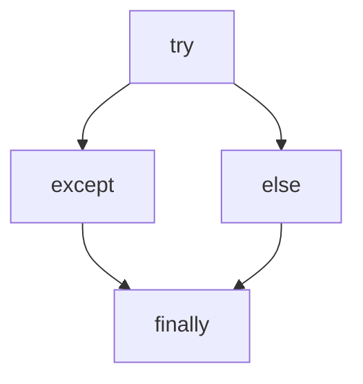

[TOC]


## 异常 ##

> 异常指程序运行过程中出现的非正常现象

所谓异常处理，就是指程序在出现问题时依然可以正确的执行剩余的程序，而不会因为异常而终止程序


```python
a = 3/0 # 简单的异常
```

### 处理异常的过程 ###

> Python  中一切都是对象，异常也是采用对象的方式处理。处理过程

1. 抛出异常：在执行一个方法中，如果发生异常则这个方法生成代表异常的一个对象，停止当前执行路径，并把异常对象提交给解释器
2. 捕获异常：解释器得到该异常后，寻找相应的代码来处理该异常

### try except  ###

> 注意： return 语句不要在 try except else  finally  块中，直接放在方法的最后

异常结构

```python
try:
	被监控的可能引发异常的语句块
except Exception [as e]:
	异常处理语句块

```

##### Just Test It  #####

```python
try:
    a = input("请输入一个被除数: ")
    b = input("请输入一个除数: ")
    c = float(a)/float(b)
    print(c)
except ZeroDivisionError as e:
    print("除数不能为零",e)
except ValueError as  e:
    print("异常，字符串不能转为数字",e)
except NameError as  e :
    print("异常。变量不存在",e)
except  BaseException as  e:
    print(e)


```

### else 语句 ###

```
#coding=utf-8
# 测试 try - except - else 语句

try:
    a = input("请输入一个被除数: ")
    b = input("请输入一个除数: ")
    c = float(a)/float(b)
except  Exception as  e:  # try 语句块发生异常，执行 except 中语句
    print(e)
else:  #没有异常，执行 else 语句
    print(c)


```

### finally 语句 ###

> finally 语句块无论是否发生异常都会被执行：通常用来释放  try 块中申请的资源



```python
# coding=utf-8
# 测试 try - except - else 语句

if __name__ == '__main__':
    try:
        a = input("请输入一个被除数: ")
        b = input("请输入一个除数: ")
        c = float(a) / float(b)
    except  Exception as  e:  # try 语句块发生异常，执行 except 中语句
        print(e)
    else:  # 没有异常，执行 else 语句
        print(c)
    finally:  # 无论是否发生异常， finally 块中代码都执行
        print("程序执行完毕 ...")

```

运行结果1 

```python
D:\python\python3\python.exe "F:/pythoWorkspaces/20190905 python-primary/03-exception/03-finally.py"
请输入一个被除数: 1
请输入一个除数: 1
1.0
程序执行完毕 ...
```

运行结果2

```python
D:\python\python3\python.exe "F:/pythoWorkspaces/20190905 python-primary/03-exception/03-finally.py"
请输入一个被除数: 1
请输入一个除数: 0
float division by zero
程序执行完毕 ...

Process finished with exit code 0

```

#### 文件操作 ####

```python
# coding=utf-8
# 读取文本文件资源

if __name__ == '__main__':
    try:
        f = open("text.txt")
        content = f.readline()
        print(content)
    except Exception as e:
        print(e)
    finally:
        try:
            f.close()
        except Exception as  e:
            print(e)
```

### 常见的异常错误 ###

|                   |                        |
| ----------------- | ---------------------- |
| SyntaxError       | 语法错误               |
| NameError         | 未声明指定的命名变量   |
| ZeroDivisionError | 除数为0 错误           |
| ValueError        | 数值错误               |
| TypeError         | 类型错误               |
| AttributeError    | 访问对象的不存在的属性 |
| IndexError        | 索引越界异常           |
| KeyError          | 字典的关键字不存在     |

#### 常见异常汇总 ####


### with 上下文管理 ###

> with 上下文管理可以自动管理资源，在 with 代码块执行完毕还原进入该代码之前的现场或上下文。不论何种原因跳出 with 块，不论是否有异常，总能保证资源正常释放。

#### 语法结构 ####

```python
with context_expr[as var]
	语句块
```

#### 文件操作 ####

```python
# coding=utf-8
# with 上下文管理器

if __name__ == '__main__':
    with open("text.txt") as f:
        content = f.readline()
        print(content)

```

注意：with 上下文管理并非取代 try-except-finally 

### trackback 模块 ###

> 打印异常信息

```python
# coding=utf-8
# 测试 trackback 异常日志处理
import traceback
import calendar
if __name__ == '__main__':

    # try:
    #     print("step1")
    #     i = 1 / 0
    # except:
    #     traceback.print_exc()

    try:
        print("step1")
        i = 1 / 0
    except:
        # 将异常信息写日志文件中
        with open("exception.log", 'a') as  f:
            traceback.print_exc(file=f)


    print("程序执行结束 ...")

```

### 自定义异常类 ###

> 自定义异常类一般是运行时异常，通常继承 Exception 类即可。

```python
# coding=utf-8
# 测试自定义异常

class AgeError(Exception):
    def __init__(self, errorInfo):
        super().__init__(self)  # 调用父类的 __init__ 方法
        self.__errorInfo = errorInfo

    def __str__(self):
        return str(self.__errorInfo) + "不在年龄在(0,200] 之间"


if __name__ == '__main__':
    age = int(input("请输入一个年龄:"))
    if age < 0 or age > 200:
        raise AgeError(age)
    else:
        print("年龄为:", age)

```

### Pycharm 调试模式 ###


## IO 技术 ##

### 文本文件和二进制文件 ###

文本文件存储的是 字符，默认使用 unicode 字符集

二进制文件按字节存储


### 创建文件对象 open() ###

#### 语法格式 ####

```python
open(文件名[,打开方式])
```

#### 打开方式 ####

| 打开方法 | 说明                 |
| -------- | -------------------- |
| r        | 读模式               |
| w        | 写模式               |
| a        | 追加模式             |
| b        | 以二进制方式操作文件 |
|          |                      |

### 文本文件的操作 ###

```

```

#### 中文乱码的解决 ####

> 乱码问题：由于编码和解码时所使用的字符集不一致造成的


```python
# coding=utf-8
# 测试写入文本文件

if __name__ == '__main__':
    with open("a.txt", 'a', encoding='utf-8') as f:
        s = "Hello World Python！ 您好"
        f.write(s)
    # f.close()  # 使用 with 语句可以省略该语句

```

#### write()/writeline() 写入 ####

```python

```

#### close()  关闭流 ####

```

```

