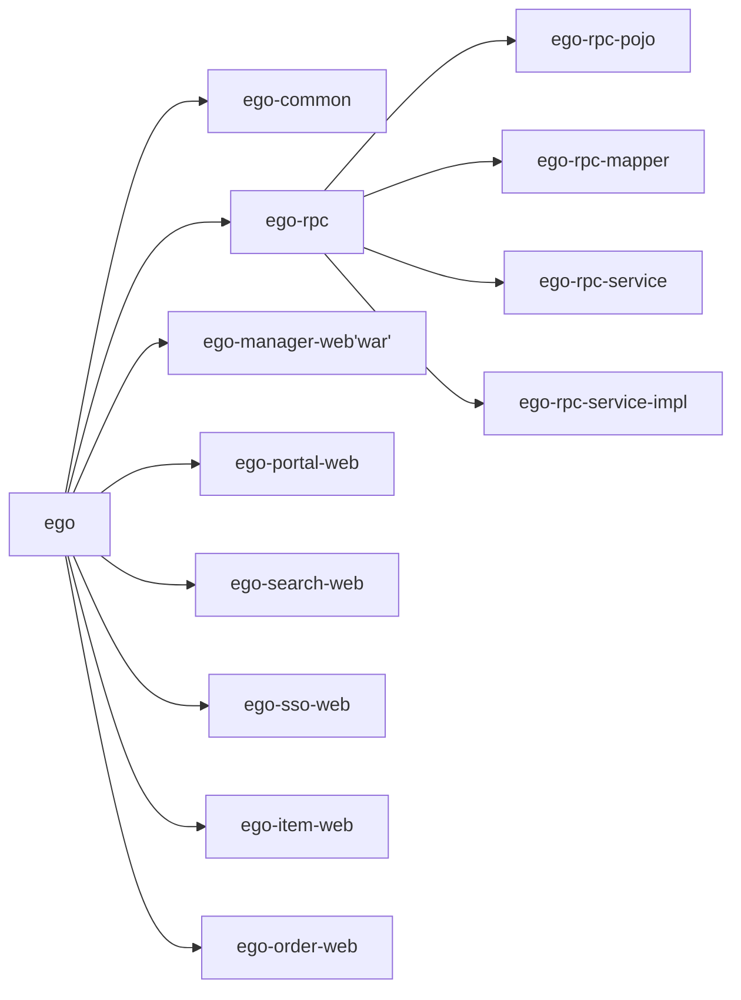
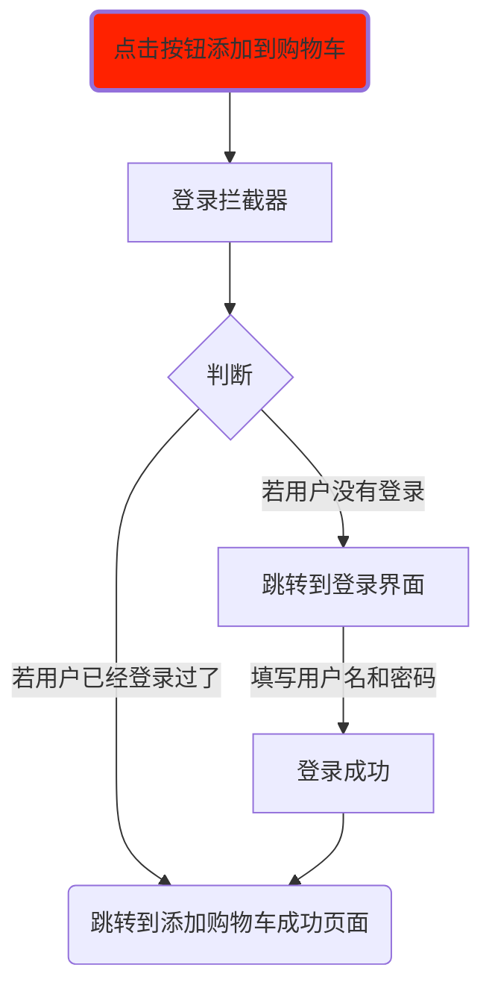
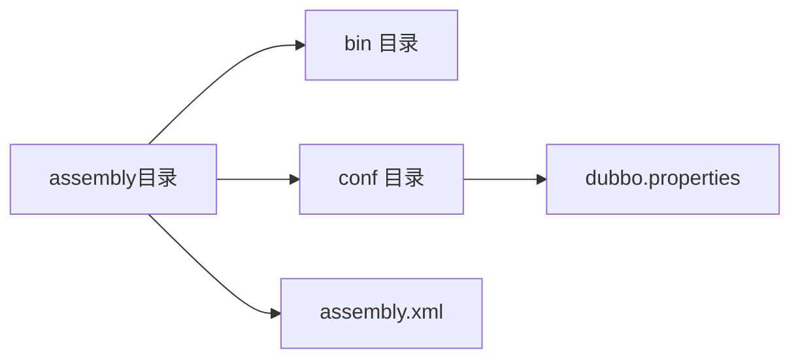
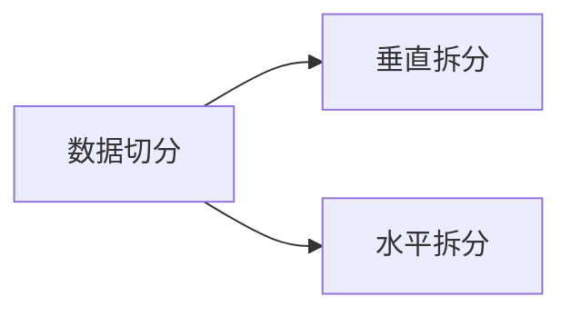
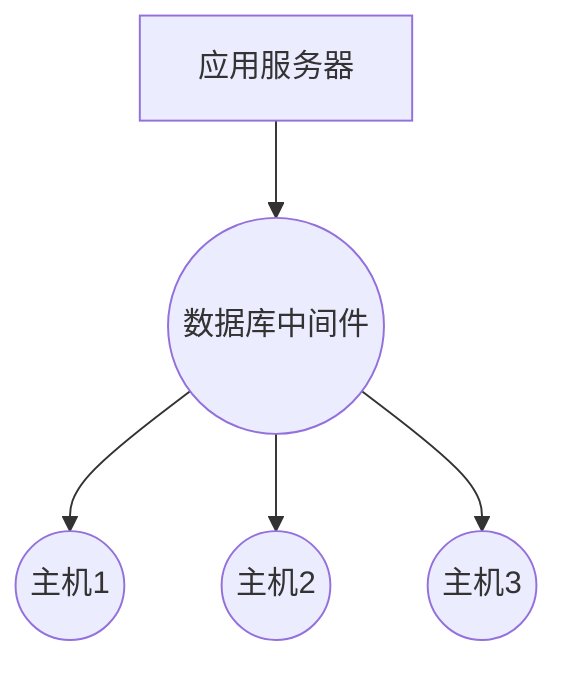

## 电商介绍:arrow_double_down:

**互联网电商技术特征**

- 技术新，范围广
- 分布式
- 高并发、集群、负载均衡
- 海量数据
- 业务复杂
- 系统安全

**电商行业模式**

- B2B：企业到企业。阿里巴巴

- B2C：商家到客户。京东、天猫
- C2C：：客户到客户。 淘宝集市

- O2O：线上到线下

## 易购商城项目:sparkling_heart:

**易购商业模式**

B2C 商业模式，类似于京东、天猫

**技术选型**

- Spring、SpringMVC、Mybatis
- JSP、JSTL、JQuery、JQuery Plugin、EasyUI、KindEditor、CSS+DIV
- Redis（缓存服务器）
- Solr（搜索）
- Dubbo RPC(Remote Rrocess Call) 解决方案
- MySQL
- Nginx（web 服务器）
- Maven

## Mybatis 逆向工程:heart_eyes:

> 根据数据库中表结构数据转为每张表对应的 POJO 类及映射配置文件。

**所需 Jar 包**

- asm-4.2.jar
- cglib-3.1.jar
- commons-logging-1.2.jar
- log4j-1.2.17.jar
- log4j-api-2.2.jar
- log4j-core-2.2.jar
- mybatis-3.3.0.jar
- mybatis-generator-core-1.3.2.jar
- mysql-connector-java-5.1.20-bin.jar
- slf4j-api-1.7.12.jar
- slf4j-log4j12-1.7.12.jar

**逆向的配置文件**

> 指定数据库连接信息，生成的 POJO 类和映射配置文件的位置
>

config.xml:

```xml
<?xml version="1.0" encoding="UTF-8"?>
<!DOCTYPE generatorConfiguration
  PUBLIC "-//mybatis.org//DTD MyBatis Generator Configuration 1.0//EN"
  "http://mybatis.org/dtd/mybatis-generator-config_1_0.dtd">

<generatorConfiguration>
	<context id="testTables" targetRuntime="MyBatis3">
		<commentGenerator>
			<!-- 是否去除自动生成的注释 true：是 ： false:否 -->
			<property name="suppressAllComments" value="true" />
		</commentGenerator>
		<!--数据库连接的信息：驱动类、连接地址、用户名、密码 -->
		<jdbcConnection driverClass="com.mysql.jdbc.Driver"
			connectionURL="jdbc:mysql://localhost:3306/ego" userId="root"
			password="root">
		</jdbcConnection>
		<!-- 默认false，把JDBC DECIMAL 和 NUMERIC 类型解析为 Integer，为 true时把JDBC DECIMAL 和 
			NUMERIC 类型解析为java.math.BigDecimal -->
		<javaTypeResolver>
			<property name="forceBigDecimals" value="false" />
		</javaTypeResolver>

		<!-- targetProject:生成POJO类的位置 -->
		<javaModelGenerator targetPackage="com.bjsxt.ego.rpc.pojo"
			targetProject=".\src">
			<!-- enableSubPackages:是否让schema作为包的后缀 -->
			<property name="enableSubPackages" value="false" />
			<!-- 从数据库返回的值被清理前后的空格 -->
			<property name="trimStrings" value="true" />
		</javaModelGenerator>
        <!-- targetProject:mapper映射文件生成的位置 -->
		<sqlMapGenerator targetPackage="com.bjsxt.ego.rpc.mapper" 
			targetProject=".\src">
			<!-- enableSubPackages:是否让schema作为包的后缀 -->
			<property name="enableSubPackages" value="false" />
		</sqlMapGenerator>
		<!-- targetPackage：mapper接口生成的位置 -->
		<javaClientGenerator type="XMLMAPPER"
			targetPackage="com.bjsxt.ego.rpc.mapper" 
			targetProject=".\src">
			<!-- enableSubPackages:是否让schema作为包的后缀 -->
			<property name="enableSubPackages" value="false" />
		</javaClientGenerator>
		<!-- 指定数据库表 -->
		<table schema="" tableName="tb_content"></table>
		<table schema="" tableName="tb_content_category"></table>
		<table schema="" tableName="tb_item"></table>
		<table schema="" tableName="tb_item_cat"></table>
		<table schema="" tableName="tb_item_desc"></table>
		<table schema="" tableName="tb_item_param"></table>
		<table schema="" tableName="tb_item_param_item"></table>
		<table schema="" tableName="tb_order"></table>
		<table schema="" tableName="tb_order_item"></table>
		<table schema="" tableName="tb_order_shipping"></table>
		<table schema="" tableName="tb_user"></table>

	</context>
</generatorConfiguration>

```

启动 Mybatis 逆向工程

MybatisGeneratorTest.java:

```java
package com.szxy;

import java.io.File;
import java.util.ArrayList;
import java.util.List;

import org.mybatis.generator.api.MyBatisGenerator;
import org.mybatis.generator.config.Configuration;
import org.mybatis.generator.config.xml.ConfigurationParser;
import org.mybatis.generator.internal.DefaultShellCallback;


public class MybatisGeneratorTest {
	public void generator() throws Exception {

		List<String>warnings = new ArrayList<String>();
		boolean overwrite = true;
		// 指定 逆向工程配置文件
		File configFile = new File(System.getProperty("user.dir")+"/src/config.xml");
		ConfigurationParser cp = new ConfigurationParser(warnings);
		Configuration config = cp.parseConfiguration(configFile);
		DefaultShellCallback callback = new DefaultShellCallback(overwrite);
		MyBatisGenerator myBatisGenerator = new MyBatisGenerator(config, callback, warnings);
		myBatisGenerator.generate(null);

	}

	public static void main(String[] args) throws Exception {
		try {
			MybatisGeneratorTest generatorSqlmap = new MybatisGeneratorTest();
			generatorSqlmap.generator();
		} catch (Exception e) {
			e.printStackTrace();
		}
	}
}
```

## 易购 Maven 项目创建 ##

### ego SOA 项目 ###

| 易购项目 ---逻辑工程 | 子项目          | 子项目               |
| -------------------- | --------------- | -------------------- |
| ego(pom)             |                 |                      |
|                      | ego-common(war) |                      |
|                      | ego-rpc(pom)    |                      |
|                      |                 | ego-rpc-pojo         |
|                      |                 | ego-rpc-mapper       |
|                      |                 | ego-rpc-service      |
|                      |                 | ego-rpc-service-impl |



### ego  manager 系统 ###

商城后台管理


### 商品分页查询 ###

#### 功能分析 ####

使用 easyui 的 DataGrid 控件实现商品的分页查询， DataGrid 控件提交分页所需要的 page  和 rows 参数

后台响应包括总记录数 total 和需要显示的商品对象的集合 rows 的 json 对象

**分页插件需要用到 jar 包的位置**

```xml
<!-- mybatis分页插件 -->
<dependency>
    <groupId>com.github.pagehelper</groupId>
    <artifactId>pagehelper</artifactId>
</dependency>
```

**MyBatis.xml 中分页插件**

```xml
<!-- 配置分页插件 -->
<plugins>
<plugin interceptor="com.github.pagehelper.PageHelper">
<!-- 设置数据库类型 Oracle,Mysql,MariaDB,SQLite,Hsqldb,PostgreSQL六种数据库 -->
<property name="dialect" value="mysql" />
</plugin>
</plugins>
```

**分页插件工具类**

```java
package com.bjsxt.ego.rpc;

import java.io.Serializable;
import java.util.List;

/**
 * 
 * 分页类
 *
 * @param <T>
 */
//实现 Serializable 接口，用于在网络上传输
public class PageResult<T> implements Serializable{
	
	private List<T> rows; //查询分页结果的数据的集合
	private long toatal; //查询分页结果的总条数 
	
	public List<T> getRows() {
		return rows;
	}
	public void setRows(List<T> rows) {
		this.rows = rows;
	}
	public long getToatal() {
		return toatal;
	}
	public void setToatal(long toatal) {
		this.toatal = toatal;
	}
}
```


#### Maven 使用过程出现的问题 ####

`@Controller` 注解不能导包。

通过 Maven Dependencies 依赖，发现 spring-context 相关 jar 包，虽然添加了依赖，但是里面没有对于对应的 jar 包。pom.xml 出了问题，把 spring-context 相关 jar 包剔除掉了。解决方法：重新复制 pom.xml

#### Spring 与 Mybatis 整合出现的问题 ####

```java
Invalid bound statement (not found)

原因：在 mapper 包中接口对应的映射配置文件，没有在与接口相同的目录下，导致接口映射配置文件无法找到。
但是报错却误导我了
Exception in thread "main" org.apache.ibatis.binding.BindingException: Invalid bound statement (not found): com.bjsxt.ego.rpc.mapper.TbItemMapper.selectByExample
我按照报错的提示，把 *Example类都放在 mapper 包下，但是并没有什么用。
接着，通过阅读老师写的源码，才发现了端倪。老师把 *Example 类都放在 pojo 包下。
在 mapper 包的 resources 目录下，接口映射配置文件的目录与mapper包是同一级别的，如下图片所示。
```


### 商品上下架功能 ###

#### 功能分析 ####

使用 easyui 的 DataGrid 控件的工具栏按钮，发出 ajax 请求，提交需要修改商品 id  的集合，完成商品状态的修改。重新刷新 DataGrid 控件。

#### 406 not Acceptable 问题 ####

由于返回 egoResult 对象，不能被 转为 json 格式数据，由于 EgoResult 没有提供 setter 和 getter 方法。

浏览器期望接受 json 格式数据，但是没有接受到，导致报 406

```java
package com.bjsxt.ego.rpc;

import java.io.Serializable;

//用于商品上下架结果的封装
public class EgoResult implements Serializable{
	
	//响应状态码
	private Integer status;
	//响应数据
	private Object data;
	//响应消息
	private String msg;
	
	//默认返回的消息
	public EgoResult() {
		super();
	}
	public EgoResult(Integer status, Object data, String msg) {
		super();
		this.status = status;
		this.data = data;
		this.msg = msg;
	}
	public EgoResult(Integer status, String msg) {
		super();
		this.status = status;
		this.msg = msg;
	}
	
	public EgoResult(Object data) {
		super();
		this.data = data;
		this.status = 200;
		this.msg = "ok";
	}
	
	public Integer getStatus() {
		return status;
	}
	public void setStatus(Integer status) {
		this.status = status;
	}
	public Object getData() {
		return data;
	}
	public void setData(Object data) {
		this.data = data;
	}
	public String getMsg() {
		return msg;
	}
	public void setMsg(String msg) {
		this.msg = msg;
	}
	/**
	 *  静态方法，返回 egoResult 对象
	 */
	public static EgoResult ok() {
		return new EgoResult(null);
	}
	
	public static void main(String[] args) {
		EgoResult ok = EgoResult.ok();
		System.out.println(ok.status);
	}	
}
```

### 商品删除功能 ###

#### 功能分析 ####

使用 easyui 的 DataGrid 控件的工具栏按钮，发出 ajax 请求，提交需要删除商品 id  的集合。重新刷新 DataGrid 控件。

### 添加修改商品功能 ###

**重点：**

- 添加商品时，商品分类目录的生成
- 上传图片后，图片的回显问题

**商品目录的选择**


## 搭建 VSFTP 服务器:apple: ##


**下载并安装 VSFTP 服务器**

```shell
yum install vsftpd -y
```

**添加 ftp 用户和设置密码**

```shell
[root@bogon ~]# useradd ftpuser
[root@bogon ~]# passwd ftpuser
Changing password for user ftpuser.
New password: 
BAD PASSWORD: it is based on a dictionary word
BAD PASSWORD: is too simple
Retype new password: 
passwd: all authentication tokens updated successfully.
```

**禁止 ftp 用户登录 ssh 登录**

```shell
vim /etc/passwd
# 修改
ftpuser:x:501:501::/home/ftpuser:/sbin/nologin
```

开放防火墙 21 端口

```shell
vim /etc/sysconfig/iptables
# 添加
-A INPUT -m state --state NEW -m tcp -p tcp --dport 21 -j ACCEPT
```

**查看 ftp 状态和设置 ftp 状态**

```shell
# 查看 ftp 状态
[root@bogon ~]# getsebool -a|grep ftp
allow_ftpd_anon_write --> off
allow_ftpd_full_access --> off
allow_ftpd_use_cifs --> off
allow_ftpd_use_nfs --> off
ftp_home_dir --> off
ftpd_connect_db --> off
ftpd_use_fusefs --> off
ftpd_use_passive_mode --> off
httpd_enable_ftp_server --> off
tftp_anon_write --> off
tftp_use_cifs --> off
tftp_use_nfs --> off
# 设置 ftp 状态
# 设置的时候，时间有点慢
[root@bogon ~]# setsebool -P allow_ftpd_full_access on
[root@bogon ~]# setsebool -P ftp_home_dir on
# 再次查看状态
#allow_ftpd_full_access --> on
#ftp_home_dir --> on 
[root@bogon ~]# getsebool -a|grep ftp
allow_ftpd_anon_write --> off
allow_ftpd_full_access --> on
allow_ftpd_use_cifs --> off
allow_ftpd_use_nfs --> off
ftp_home_dir --> on
ftpd_connect_db --> off
ftpd_use_fusefs --> off
ftpd_use_passive_mode --> off
httpd_enable_ftp_server --> off
tftp_anon_write --> off
tftp_use_cifs --> off
tftp_use_nfs --> off
```

**关闭 ftp 服务器匿名访问**

```shell
vim /etc/vsftpd/vsftpd.conf
# 修改
anonymous_enable=no
```

**设置 vsftpd 服务器开机自启**

```shell
[root@bogon ~]# chkconfig vsftpd on
```

测试 ftp 连接

```shell
# 启动 ftp 服务
root@bogon ~]# service vsftpd start
Starting vsftpd for vsftpd:                                [  OK  ]
# 打开 cmd 命令框
C:\Users\41435>ftp 192.168.170.129
连接到 192.168.170.129。
220 (vsFTPd 2.2.2)
200 Always in UTF8 mode.
用户(192.168.170.129:(none)): ftpuser
331 Please specify the password.
密码:
230 Login successful.
```

**配置 vsftpd 被动模式**

默认是开启的，需要配置端口号的范围

```shell
# 打开 vsftpd 配置文件
vim /etc/vsftpd/vsftpd.conf
# vsftpd.conf 末尾添加 
pasv_min_port=3000
pasv_max_port=3099
#配置防火墙，开放 3000-3099 端口
-A INPUT -m state --state NEW -m tcp -p tcp --dport 3000:3099 -j ACCEPT
#重启防火墙
service iptables restart
```

## 搭建 HTTP 服务器 ##

**Nginx 介绍**

> Nginx (engine x) 是一个高性能的 HTTP 和反向代理服务，也是一个 IMAP/POP3/SMTP 服务。
>

**Nginx 安装**

```shell
# 编译环境
yum install gcc gcc-c++
# prce 库
yum -y install pcre-devel
# zlib 压缩工具
yum install zlib-devel

#上传 nginx 压缩包，使用 tar 命令解压
tar -zxvf nginx-1.8.0.tar.gz 
#cd 进入 nginx 解压目录中
#创建目录
mkdir /usr/local/nginx 
#执行 
./configure \
--prefix=/usr/local/nginx \
--pid-path=/var/run/nginx/nginx.pid \
--lock-path=/var/lock/nginx.lock \
--error-log-path=/var/log/nginx/error.log \
--http-log-path=/var/log/nginx/access.log \
--with-http_gzip_static_module --http-client-body-temp-path=/var/temp/nginx/c--http-proxy-temp-path=/var/temp/nginx/proxy --http-fastcgi-temp-path=/var/temp/nginx/fastcg--http-uwsgi-temp-path=/var/temp/nginx/uwsgi --http-scgi-temp-path=/var/temp/nginx/scgi
#执行 make  命令
make 
#执行 make install 命令
make install 

#配置防火墙，开放 80 端口
vim /etc/sysconfig/iptables


#启动 nginx 
[root@bogon nginx]# ./sbin/nginx 
nginx: [emerg] mkdir() "/var/temp/nginx/client" failed (2: No such file or directory)
[root@bogon nginx]# mkdir -p /var/temp/nginx/client
[root@bogon nginx]# ./sbin/nginx 
#打开浏览器，访问本机 ip:80
#若之前操作成功，则显示欢迎界面
```

**配置 Nginx**

```shell
user ftpuser; #使用 user

worker_processes  1;
events {
    worker_connections  1024;
}
http {
    include       mime.types;
    default_type  application/octet-stream;
    sendfile        on;
    keepalive_timeout  65;
    server {
        listen       80;
        server_name  localhost;
        location / {
            root   /home/ftpuser;  #设置图片访问路径
            #index  index.html index.htm;
        }
        error_page   500 502 503 504  /50x.html;
        location = /50x.html {
            root   html;
        }
    }
}
```

**Nginx 命令**

前提进入 nginx 根目录下  ``/usr/local/nginx`

```shell
./sbin/nginx #启动 nginx
./sbin/nginx -s reload  #重新加载配置文件
```

**修改 hosts 文件**

位置在 `C:\Windows\System32\drivers\etc`下 hosts 文件

```shell
#添加
192.168.170.129 image.taotao.com
```

**Eclipse 快捷键：**Atl+Shirt+M 封装方法

### 上传图片功能 ###

FTPClientUtil.java:

```java
package com.bjsxt.ego.rpc;

import java.io.File;
import java.io.FileInputStream;
import java.io.IOException;
import java.io.InputStream;

import org.apache.commons.net.ftp.FTP;
import org.apache.commons.net.ftp.FTPClient;

public class FTPClientUtil {
	public static void main(String[] args) {
		String host = "192.168.170.129";
		int port = 21;
		String username = "ftpuser";
		String password = "ftpuser";
		String remote = "demo.jpg"; //在 ftp 服务器上文件名
		InputStream local = null;
		String pathname = "/home/ftpuser/jd";
		String filePath = "D:\\desktop\\1.jpg";
		uploadFile(host, port, username, password, remote, local, pathname,filePath);
	}
	
	/**
	 * 上传文件 
	 * @param host   服务器 IP
	 * @param port   ftp 服务器端口号
	 * @param username  用户名
	 * @param password  密码
	 * @param remote    ftp 服务器端文件名
	 * @param local     上传文件的 IO 流对象
	 * @param pathname  上传的文件在 ftp 服务器的位置
	 * @param filePath  上传文件的位置
	 * @return
	 */
	public static boolean uploadFile(String host, int port, String username, String password,
			String remote,InputStream local, String pathname,String filePath) {
		FTPClient client = null;
		boolean flag = false;
		try {
			//创建 ftp 对象
			client = new FTPClient();
			//连接 ftp 服务器
			client.connect(host, port);
			System.out.println("连接成功！！");
			//登录 ftp 服务器
			client.login(username, password);
			System.out.println("登录成功");
			//选择上传服务器的位置
			if(!client.changeWorkingDirectory(pathname)) {
				if(client.makeDirectory(pathname)) {
					client.changeWorkingDirectory(pathname);
				}
			}
			//设置上传文件类型
			client.setFileType(FTP.BINARY_FILE_TYPE);
			//保存上传文件
			local = new FileInputStream(new File(filePath));
			client.storeFile(remote, local);
			//上传成功标志
			flag = true;
		} catch (Exception e) {
			e.printStackTrace();
		}finally {
			if(local !=null) {
				try {
					local.close();
				} catch (IOException e) {
					e.printStackTrace();
				}
			}
			if(client !=null) {
				try {
					client.logout();//退出
					client.disconnect();//断开连接
				} catch (IOException e) {
					e.printStackTrace();
				}
			}
		}
		return flag;
	}
}
```

**前端控件说明**

**上传文件**

```javascript
// 编辑器参数
kingEditorParams : {
    //指定上传文件参数名称
    filePostName  : "uploadFile",
        //指定上传文件请求的url。
        uploadJson : '/pic/upload',
        //上传类型，分别为image、flash、media、file
        dir : "image"
}
```


### String 类型不能转为 Integer类型数据？ ###

`FTP_PORT` 变量直接被赋予字符串常量 `“FTP_PORT”`，而不是 `21`；

原因很简单，`ftp.properties` 文件没有被正确加载到 spring 容器中。

通过检查，`ftp.properties ` 在配置文件书写的路径没有问题

```xml
<!-- 加载 ftp 配置文件 -->     
 <context:property-placeholder location="classpath:resources/*.properties" /> 
```

但是上面的 f`tp.properties `写到了 `springmvc.xml `配置文件中，而不是 `applicationContext-service.xml` 中，即`ftp.properties` 没有被加载到 `Spring` 容器，而是加载到 `SpringMVC `容器，由于` `Spring` 与 `SpringMVC `父子容器的关系，Spring 容器是无法访问子容器 `SpringMVC` 容器中的资源，而` `SpringMVC` 容器可以访问 `Spring` 容器中的资源。

**ftp.properties:**

```properties
FTP_HOST=192.168.170.129
FTP_PORT=21
FTP_USERNAME=ftpuser
FTP_PASSWORD=ftpuser
FTP_PATH=/home/ftpuser/jd
IMAGE_HTTP_PATH=http://image.taotao.com/jd
```

**ManagerItemServiceImpl.java 部分代码：**

```java
@Service
public class ManagerItemServiceImpl implements ManagerItemService{
	
	//商品服务远程代理对象
	@Autowired
	private ItemService itemServiceProxy;
	//通过 spring 的EL 表达式注入信息
	@Value("${FTP_HOST}")
	private String FTP_HOST;
	@Value("${FTP_PORT}")
	private Integer FTP_PORT;
	@Value("${FTP_USERNAME}")
	private String FTP_USERNAME;
	@Value("${FTP_PASSWORD}")
	private String FTP_PASSWORD;
	@Value("${FTP_PATH}")
	private String FTP_PATH;
	@Value("${IMAGE_HTTP_PATH}")
	private String IMAGE_HTTP_PATH;
}
```

###  ###

将商品信息添加到数据库，其中商品信息包括商品基本信息和商品描述信息

### 修改商品 ###

**前端控件**

```js
$.post("/rest/item/update",$("#itemeEditForm").serialize(), function(data){
if(data.status == 200){
    $.messager.alert('提示','修改商品成功!','info',function(){
    $("#itemEditWindow").window('close');
    $("#itemList").datagrid("reload");
    });
    }
});
```

## 商品规格参数的管理 ##

#### 商品规格参数数据模型说明 ####

**方案一:** 分表存储

**方案二：**模板存储:fist_right:

#### 修改 ajax 请求的请求地址 url 没有生效？ ####

莫名其妙，由于浏览器缓存 commons.js 文件的缘故，导致浏览器没有加载修改后  common.js 文件。

```js
//加载商品信息模板
changeItemParam : function(node,formId){
    $.getJSON("/item/param/select/" + node.id,function(data){
        if(data.status == 200 && data.data){
            $("#"+formId+" .params").show();
            var paramData = JSON.parse(data.data.paramData);
            var html = "<ul>";
            for(var i in paramData){
                var pd = paramData[i];
                html+="<li><table>";
                html+="<tr><td colspan=\"2\" class=\"group\">"+pd.group+"</td></tr>";

                for(var j in pd.params){
                    var ps = pd.params[j];
                    html+="<tr><td class=\"param\"><span>"+ps+"</span>: </td><td><input autocomplete=\"off\" type=\"text\"/></td></tr>";
                }

                html+="</li></table>";
            }
            html+= "</ul>";
            $("#"+formId+" .params td").eq(1).html(html);
        }else{
            $("#"+formId+" .params").hide();
            $("#"+formId+" .params td").eq(1).empty();
        }
    });
}
```

## 内容管理系统 CMS ##

> cms 即 Content Management System 的缩写，内容管理系统

**内容分类管理**

- 内容分类树 
- 内容分类添加
- 内容分类删除
- 内容分类修改

**内容的管理**

- 内容列表分页显示
- 内容添加
- 内容删除
- 内容修改

## 使用 `Redis` 缓存实现门户首页数据展示 ##

> **使用的技术：**redis 缓存

**搭建 Redis 集群**

使用3主3从 redis 集群配置

实现主从备份、读写分离


集群说明：

Redis3.0 开始支持集群，在每个 `Master` 上存放着各不相同的数据，即分布式存储的思想。

集群中的每个节点都需要知道集群中自己之外的其它节点。

Redis 集群主(Master(M1,M2,M3))从(Slave(S1,S2,S3))复制、读写分离 。Master 只负责写和

同步数据给 Slave，Slave 负责被读的任务，通过 Slave 的扩容提高读的速度。

所有的 redis 节点彼此互联（`PING-PONG `机制）, 节点的 fail 是通过集群中超过半数的节

点检测失效时才生效。

客户端不需要连接集群所有的节点，连接集群中任何一个可用的节点即可，redis-cluster 把

所有的物理节点映射到[0~16383]slot 上，cluster 负责维护 node<->slot<->value。

**显示门户首页商品类目展示**

- 加载商品类目
- 实现商品类目缓存

**实现门户大广告的轮播**

- 加载大广告列表
- 实现广告轮播

### 搭建 Redis 集群 ###

```shell
# 安装 gcc 编译器
gcc install gcc-c++
# 上传并解压 redis 压缩包
tar -zxcf redis 压缩包
# 进入 redis 解压目录中  
# 执行 make  命令
make 
# 创建目录
mkdir -p /usr/local/redis
#执行 make install  安装 redis
make install  PREFIXX=/usr/local/redis
#进入安装好的 redis 目录
cd /usr/local/redis
# 执行 ll 命令，有一个 bin 目录
# 进入 bin 目录中
# 前置启动 redis 
./redis-server 
#Ctrl+c 关闭  redis 服务
#从 redis 解压包中拷贝 redis.conf 到 /usr/local/redis/bin 
# 修改 redis.conf 文件
daemonize on  
# 后置启动 redis ，指定加载配置问价
./redis-server redis.conf
# 查找 redis 进程及所用端口号
ps -ef|grep -i redis
# 开放 6379 端口 
#测试，连接 redis 客户端
./usr/local/redis/bin/redis-cli.sh


#安装 redis 集群
#先安装 ruby 
#上传并解压 ruby 压缩包
#进入 ruby 解压包目录中
#执行 install.sh ,安装 ruby
./install.sh 

#略略略
```

### 创建集群 ###

进入 redis 解压目录下 src 目录中，执行下面的命令，创建 redis 集群。

```shell
./redis-trib.rb create --replicas 1 192.168.170.30:6380 192.168.170.30:6381 192.168.170.30:6382 192.168.170.30:6383 192.168.170.30:6384 192.168.170.30:6385
```

**连接集群测试**：

```shell
./redis-cli -c -p 
# -c 集群连接模式
# -p 连接到那一台主机对应的端口号
```

**`Jredis` 依赖:**

```xml
<!-- jedis 的依赖 -->
<dependency>
<groupId>redis.clients</groupId>
<artifactId>jedis</artifactId>
<version>2.9.0</version>
</dependency>
```

**Java 操作 redis 集群**

```java
public class JredisClusterDemo {
	public static void main(String[] args) {
		HashSet<HostAndPort> nodes = new HashSet<HostAndPort>();
		nodes.add(new HostAndPort("192.168.170.30", 6380));
		nodes.add(new HostAndPort("192.168.170.30", 6381));
		nodes.add(new HostAndPort("192.168.170.30", 6382));
		nodes.add(new HostAndPort("192.168.170.30", 6383));
		nodes.add(new HostAndPort("192.168.170.30", 6384));
		nodes.add(new HostAndPort("192.168.170.30", 6385));
		// 创建 JedisCluster 对象
		JedisCluster cluster = new JedisCluster(nodes);
		System.out.println("连接集群成功....");
		cluster.set("cluster", "Hello World");
		String result = cluster.get("cluster");
		System.out.println("result=" + result);

	}
}
```

**创建 ego-portal-web 项目 war 工程**

**伪静态化**

```xml
<!-- springmvc的servlet -->
<servlet>
    <servlet-name>ego-portal-web</servlet-name>
    <servlet-class>org.springframework.web.servlet.DispatcherServlet</servlet-class>
    <!-- 指定springmvc的配置文件 -->
    <init-param>
        <param-name>contextConfigLocation</param-name>
        <param-value>classpath:spring/springmvc.xml</param-value>
    </init-param>
    <!-- 让springmvc随系统启动而启动 -->
    <load-on-startup>1</load-on-startup>
</servlet>

<servlet-mapping>
    <servlet-name>ego-manager-web</servlet-name>
    <!-- 伪静态化 -->
    <url-pattern>*.html</url-pattern>
</servlet-mapping>
```

**加载首页商品类目**

**加载首页大广告**

**`applicationContent-redis.xml`**

```xml
<?xml version="1.0" encoding="UTF-8"?>
<beans xmlns="http://www.springframework.org/schema/beans"
	xmlns:context="http://www.springframework.org/schema/context"
	xmlns:xsi="http://www.w3.org/2001/XMLSchema-instance"
	xsi:schemaLocation="http://www.springframework.org/schema/beans
        http://www.springframework.org/schema/beans/spring-beans.xsd
        http://www.springframework.org/schema/context
        http://www.springframework.org/schema/context/spring-context.xsd">
	
	<!-- 加载 redis 配置文件 -->
	<context:property-placeholder  location="classpath:cache.properties" />
	
	<!-- 初始化 JedisCluster  -->
	<bean id="cluster"  class="redis.clients.jedis.JedisCluster">
		<constructor-arg>
			<set>
				<bean class="redis.clients.jedis.HostAndPort">
					<constructor-arg name="host" value="192.168.170.30"/>
					<constructor-arg name="port" value="6380"/>
				</bean>
				<bean class="redis.clients.jedis.HostAndPort">
					<constructor-arg name="host" value="192.168.170.30"/>
					<constructor-arg name="port" value="6381"/>
				</bean>
				<bean class="redis.clients.jedis.HostAndPort">
					<constructor-arg name="host" value="192.168.170.30"/>
					<constructor-arg name="port" value="6382"/>
				</bean>
				<bean class="redis.clients.jedis.HostAndPort">
					<constructor-arg name="host" value="192.168.170.30"/>
					<constructor-arg name="port" value="6383"/>
				</bean>
				<bean class="redis.clients.jedis.HostAndPort">
					<constructor-arg name="host" value="192.168.170.30"/>
					<constructor-arg name="port" value="6384"/>
				</bean>
				<bean class="redis.clients.jedis.HostAndPort">
					<constructor-arg name="host" value="192.168.170.30"/>
					<constructor-arg name="port" value="6385"/>
				</bean>
			</set>
		</constructor-arg>
	</bean>
</beans>
```

### 缓存同步 ###

问题：当后台 ego-manager-web 中，修改广告或者商品栏目的内容，而前台 ego-portal-web 获取的广告或者商品栏目仍是从 redis 中获取数据，这时会数据不同步，导致脏读发生。

**解决方法：**

1. 设置 Redis 键的有效期，比如一天

```java
//将数据加入到 redis 缓存中
cluster.set(CONTENT_PICTURE, str);
//设置大广告缓存有效期，单位为秒,缓存时间为 1 天，24*60*60=86400
cluster.expire(CONTENT_PICTURE, 86400);
```

2. 当对 数据库做增删改涉及 Redis 中缓存的数据时，将 Redis 缓存清空，重新调用远程服务器，获取数据

## 基于 `Solr` 实现商品数据检索 ##

### 需求分析 ###

#### 搭建 Solr 集群环境 ####

SolrCloud （Solr云）实现分布式商品检索

#### 搭建 ego-search-web 项目环境 ####

建立 ego-search-web 实现商品检索（关键字检索）

#### 实现商品详情查询 ####

- 点击某个商品查看商品详情

  - 商品基本信息查询
  - 商品描述信息查询
  - 商品规格信息查询


## 单点登录 ego-sso 系统需求分析 ##

- 实现用户注册

  - 验证用户名是否可用

  - 用户注册

- 实现用户登录

- 实现用户登录状态获取

- 安全退出


### 单点登录 ###

> [单点登录](https://baike.baidu.com/item/单点登录/4940767)（Single Sign On），简称为 SSO，是目前比较流行的企业业务整合的解决方案之一。SSO的定义是在多个应用系统中，用户只需要登录一次就可以访问所有相互信任的应用系统。

用户登录成功后，session 信息存储在 redis 缓存中，将 redis 缓存中存储 session 信息的键名存储在客户端的cookie 中。当用户访问 ego 子系统，便会根据 cookies 存储的  session 信息的键名，到 redis 缓存中查询  session 信息，检查用户的有效性。


**MD5 加密用户密码**

> 使用 Spring 提供的 `DigestUtils`工具类

```java
//按照 md5 加密用户的密码数据
DigestUtils.md5DigestAsHex(user.getPassword().getBytes());
```

## 购物车系统需求分析 ##

- 搭建 ego-item-web 系统
- ego-item-web 添加拦截器
- 商品添加到购物车中
- 查看购物车里列表
- 修改购物车数据量
- 删除购物车物品
- 清空购物车物品

### **添加购物车拦截器** ###




**实现拦截器的两种方式**

> 1. 继承 `HandlerInterceptorAdapter `，重写父类中的方法
>
> 2. 实现 `HandlerInterceptor `接口

第一种实现拦截器的方式，可以根据自己的需要，选择性重写父类中的方法。

第二种实现拦截器的方式，必须重写接口中所有的方法。

**实现拦截器的 `web.xml `配置**

```xml
<!-- 注册登录拦截器 -->
<bean id="loginInterceptor" 
      	class="com.bjsxt.ego.item.intercept.LoginInterceptor">
</bean>

<!-- 配置拦截器 -->
<mvc:interceptors>
    <mvc:interceptor>
        <mvc:mapping path="/**"/><!-- 拦截所有 -->
        <ref bean="loginInterceptor" />
    </mvc:interceptor>
</mvc:interceptors>
```

## ego -order 订单系统需求 ##

- 搭建 ego-order-web 系统
- ego-order-web 添加拦截器
- 保存用户订单信息
- 查看订单列表
- 查看订单明细

## Nginx 实现虚拟主机 ##

应用场景：当多个系统需要部署的时候，系统访问很小，为了节省成本，就需要将多个系统部署到同一台服务器上，这时虚拟主机就派上用场

**1 根据端口实现虚拟主机**

> 配置不同端口的虚拟主机,即修改 `/conf/ngin.conf`  配置文件

```properties
 server {
        listen       80;
        server_name  localhost;

        location / {
            root   html;
            index  index0.html index.htm;
        }

        #error_page  404              /404.html;
 
        error_page   500 502 503 504  /50x.html;
        location = /50x.html {
            root   html;
        }
      
    }
	
	server {
        listen       81;
        server_name  localhost;

        location / {
            root   html;
            index  index1.html index.htm;
        }

        #error_page  404              /404.html;
 
        error_page   500 502 503 504  /50x.html;
        location = /50x.html {
            root   html;
        }
      
    }
```

**2 根据 IP 地址实现虚拟主机**

- Step 1： 关闭虚拟机，为了该虚拟机再添加一个 Net 类型的虚拟网卡，重启虚拟机

```shell
[root@mycat ~]# cd /etc/udev/rules.d/
[root@mycat rules.d]# ll
total 40
-rw-r--r--. 1 root root 1652 Nov 12  2010 60-fprint-autosuspend.rules
-rw-r--r--. 1 root root 1060 Nov 12  2010 60-pcmcia.rules
-rw-r--r--. 1 root root  316 Nov 22  2013 60-raw.rules
-rw-r--r--. 1 root root  789 Jul 20 17:05 70-persistent-cd.rules
-rw-r--r--. 1 root root  585 Jul 24  2019 70-persistent-net.rules
-rw-r--r--. 1 root root  320 Sep 12  2012 90-alsa.rules
-rw-r--r--. 1 root root   83 Jul 20  2011 90-hal.rules
-rw-r--r--. 1 root root 2486 Nov 11  2010 97-bluetooth-serial.rules
-rw-r--r--. 1 root root  308 Nov 23  2013 98-kexec.rules
-rw-r--r--. 1 root root   54 Dec  8  2011 99-fuse.rules
[root@mycat rules.d]# cat 70-persistent-net.rules 
# This file was automatically generated by the /lib/udev/write_net_rules
# program, run by the persistent-net-generator.rules rules file.
#
# You can modify it, as long as you keep each rule on a single
# line, and change only the value of the NAME= key.

# PCI device 0x8086:0x100f (e1000)
SUBSYSTEM=="net", ACTION=="add", DRIVERS=="?*", ATTR{address}=="00:0c:29:89:f1:fe", ATTR{type}=="1", KERNEL=="eth*", NAME="eth0"

# PCI device 0x8086:0x100f (e1000)
SUBSYSTEM=="net", ACTION=="add", DRIVERS=="?*", ATTR{address}=="00:0c:29:89:f1:08", ATTR{type}=="1", KERNEL=="eth*", NAME="eth1"

# 由于之前添加一块虚拟网卡，现在该虚拟机有两块网卡，分别是 eth0 和 eth1 
# 接来下，配置 eth1 的静态 IP 地址
# 进入 cd /etc/sysconfig/network-scripts 目录下
# 复制文件 ifcfg-eth0 ，重命名为 ifcfg-eth1 
cp ifcfg-eth0 ifcfg-eth1
# 编辑 ifcfg-ech1 ,只需修改 iP 地址即可
vim ifcfg-eth1
# 重启网络服务 
service network restart
# 查看当前虚拟机 ip 地址
ifconfig
[root@mycat network-scripts]# ifconfig
eth0      Link encap:Ethernet  HWaddr 00:0C:29:89:F1:FE  
          inet addr:192.168.170.138  Bcast:192.168.170.255  Mask:255.255.255.0
          inet6 addr: fe80::20c:29ff:fe89:f1fe/64 Scope:Link
          UP BROADCAST RUNNING MULTICAST  MTU:1500  Metric:1
          RX packets:662 errors:0 dropped:0 overruns:0 frame:0
          TX packets:475 errors:0 dropped:0 overruns:0 carrier:0
          collisions:0 txqueuelen:1000 
          RX bytes:61467 (60.0 KiB)  TX bytes:65301 (63.7 KiB)

eth1      Link encap:Ethernet  HWaddr 00:0C:29:89:F1:08  
          inet addr:192.168.170.139  Bcast:192.168.170.255  Mask:255.255.255.0
          inet6 addr: fe80::20c:29ff:fe89:f108/64 Scope:Link
          UP BROADCAST RUNNING MULTICAST  MTU:1500  Metric:1
          RX packets:14 errors:0 dropped:0 overruns:0 frame:0
          TX packets:14 errors:0 dropped:0 overruns:0 carrier:0
          collisions:0 txqueuelen:1000 
          RX bytes:1026 (1.0 KiB)  TX bytes:1560 (1.5 KiB)

lo        Link encap:Local Loopback  
          inet addr:127.0.0.1  Mask:255.0.0.0
          inet6 addr: ::1/128 Scope:Host
          UP LOOPBACK RUNNING  MTU:16436  Metric:1
          RX packets:4 errors:0 dropped:0 overruns:0 frame:0
          TX packets:4 errors:0 dropped:0 overruns:0 carrier:0
          collisions:0 txqueuelen:0 
          RX bytes:240 (240.0 b)  TX bytes:240 (240.0 b)


# 关闭 eth1 网卡 
ifdown eth1
```

- Step 2 修改 /conf/Nignx.conf 配置文件

```properties
server {
        listen       80;
        server_name  192.168.170.139;

        location / {
            root   html;
            index  index0.html index.htm;
        }

        #error_page  404              /404.html;
 
        error_page   500 502 503 504  /50x.html;
        location = /50x.html {
            root   html;
        }
      
    }
	
	server {
        listen       80;
        server_name  192.168.170.138;

        location / {
            root   html;
            index  index1.html index.htm;
        }

        #error_page  404              /404.html;
 
        error_page   500 502 503 504  /50x.html;
        location = /50x.html {
            root   html;
        }
      
    }
```

- Step  3 ,打开浏览器，访问 `Nginx ` 服务器

## Nginx 实现负载均衡 ##

> 反向代理（Reverse Proxy）实际运行方式是指以代理服务器来接受 internet 上的连接请求， 
>
> 然后将请求转发给内部网络上的服务器，并将从服务器上得到的结果返回给 internet 上请求 
>
> 连接的客户端，此时代理服务器对外就表现为一个服务器。 

1. 保证内网的安全，可以使用反向代理提供 WAF 功能，阻止 web 攻击 

   大型网站，通常将反向代理作为公网访问地址，Web 服务器是内网 


1. 负载均衡，通过反向代理服务器来优化网站的负载

```mermaid
graph TD
A[客户端] --访问--> B["反向代理服务器(包含 WAF 安全狗)"]
subgraph 
    B --转发-->  C["web服务器1(内网)"]
    B --转发-->  D["web服务器2(内网)"]
    B --转发-->  E["web服务器3(内网)"]
end
```


**Nginx.conf 关键配置**

```pro
#nginx代理三台 tomcat 主机，然后由 Nginx 实现负载均衡
upstream www.ego.com{
#ip_hash 
    server 192.168.170.149:6060 weight=5;
    server 192.168.170.149:7070;
    server 192.168.170.149:8080;
}

server {
    listen       80;
    server_name  www.ego.com;

    location / {
    #root   html;
    #index  index0.html index.htm;
        proxy_pass http://www.ego.com;
    }

}
```

### 使用 Assembly 插件打包 项目 ###

**Step 1：添加 assembly 插件和资源拷贝插件**

> 注意：dubbo 应用是包括 Spring 框架的，所以 Spring 配置文件需要放在 META-INF/spring 目录下

```xml
<build>
		<plugins>
			<plugin>
				<groupId>org.apache.maven.plugins</groupId>
				<artifactId>maven-assembly-plugin</artifactId>
				<version>2.5</version>
				<configuration>
					<descriptors>assembly/assembly.xml</descriptors>
				</configuration>
				<executions>
					<execution>
						<id>make-assembly</id>
						<phase>package</phase>
						<goals>
							<goal>single</goal>
						</goals>
					</execution>
				</executions>
			</plugin>
		</plugins>
		<!-- <plugins> 指定项目的打包插件信息 <plugin> <artifactId>maven-assembly-plugin</artifactId> 
			<configuration> 指定打包描述文件的位置：相对项目根目录的路径 assembly打包的描述文件 <descriptor>assembly/assembly.xml</descriptor> 
			</configuration> <executions> mvn package的时候打包 <execution> <id>make-assembly</id> 
			<phase>package</phase> <goals> <goal>single</goal> </goals> </execution> 
			</executions> </plugin> </plugins> -->
		<!-- dubbo加载spring的配置文件的时候，是从META-INF/spring开始查找 -->
		<resources>
			<resource>
				<!-- 指定从哪个文件夹拷贝 -->
				<directory>src/main/resources/spring</directory>
				<!-- 指定将spring配置文件拷贝到jar包中的META-INF/spring目录 -->
				<targetPath>META-INF/spring</targetPath>
				<includes>
					<include>**/*.xml</include>
				</includes>
			</resource>
			<!-- 其他的文件拷贝到默认的位置 -->
			<resource>
				<!-- 指定从哪个文件夹拷贝 -->
				<directory>src/main/resources</directory>
				<includes>
					<include>**/*.xml</include>
					<include>**/*.properties</include>
				</includes>
			</resource>
			
		</resources>
	</build>
```

**Step 2：在项目根目录下新建 assembly **



**Step 3: 使用 Maven 命令打包项目 **

注意：打包项目放在 target 目录中 

**Step 4: 把打包好的 .tar.gz 项目上传到 Linux 服务器上**

**Step 5： 解决项目压缩包，并切换到 bin 目录下，启动项目 **

```shell
./bin/start.sh
```

### Tomcat 远程热部署 ###

**Step 1： 修改 tomcat 服务器中 tomcat-users.xml **

```xml
<role rolename="admin-gui"/>
<role rolename="admin-script"/>
<role rolename="manager-gui"/>
<role rolename="manager-script"/>
<user username="admin" password="admin" roles="manager-gui,manager-script,admin-script,admin-gui"/>
```

**Step 2：删除 tomcat 服务器 webapps 目录下中 ROOT 项目**

**Step 3:修改 Maven 的 setting 文件**

关联 tocmat ，用户名和密码

```xml
 <!-- 在 Maven中关联 tomcat 账户 -->
<server>
    <id>tomcat7</id>
    <username>admin</username>
    <password>admin</password>
</server>
```

**Step 4：修改 war 项目的 pom.xml** 

```xml
<!-- 配置Tomcat插件 -->
<plugin>
    <groupId>org.apache.tomcat.maven</groupId>
    <artifactId>tomcat7-maven-plugin</artifactId>
    <configuration>
        <!-- 不需要上下文 http://localhost:8080/xxx.jsp -->
        <!-- 
		<path>/</path>
        <port>8080</port> 
	     -->
        <!-- 这里的 tomcat7 与在 maven 中配置的 server 的 id 对应 -->
        <server>tomcat7</server>
        <path>/ROOT</path>
        <url>http://192.168.170.149:8080/manager/text</url>
    </configuration>
</plugin>
```

**Step 5: 打包项目**

**Step 6：部署项目到 Linux 服务器上**

```
tomcat7:deploy
tomcat7:redeploy
```

## Nginx 高可用性 ##

> 由于 Nginx 服务器是单节点，一旦 Nginx 服务器发生宕机，内网中 tomcat 服务器就不能被访问到。所以搭建 Nginx 服务器集群很有必要
>
> Nginx +keeplive  实现 Nginx 服务器的高可用性


## 数据拆分 ##

数据拆分，就是指通过某种特定的条件，将我们存放在同一个数据库中的数据分散存放到多 个数据库（主机）上面，以达到分散单台设备负载的效果。



|          | 垂直拆分                                                     | 水平拆分                                                     |
| -------- | ------------------------------------------------------------ | ------------------------------------------------------------ |
| 原则     | 按照**不同的表**（或者 Schema）来切分到不同的数据库（主机）之上 | 根据表中的数据的逻辑关系，将**同一个表**中的数据按照某种条件拆分到多台数据库（主机）上面 |
| 特点     | 规则简单，实施也更为方便，尤其适合各业务之间的耦合度非常低， 相互影响很小，业务逻辑非常清晰的系统。<br/>在这种系统中，可以很容易做到将不同业务模块 所使用的表分拆到不同的数据库中。根据不同的表来进行拆分，对应用程序的影响也更小，拆分规则也会比较简单清晰。 | 水平切分于垂直切分相比，相对来说稍微复杂一些。因为要将同一个表中的不同数据拆分到 不同的数据库中，对于应用程序来说，拆分规则本身就较根据表名来拆分更为复杂，后期的 数据维护也会更为复杂一些。 |
| 分片规则 |                                                              | 1. 按照用户 ID 求模，将数据分散到不同的数据库，具有相同数据用户的数到一个库中；<br/> 2. 按照日期，将不同月甚至日的数据分散到不同的库中； <br/>3. 按照某个特定的字段求摸，或者根据特定范围段分散到不同的库中。 |


## MyCat 简介 ##

> 开源分布式服务器，是一个中间件，不存储数据，数据真正存储在 MySQL 数据库中
>
> 作用：分库分表




## MyCat 原理 ##

> 拦截  ，它拦截了用户发送过来的 SQL 语句,对 SQL 语句做了一些特定的分析：如分片分析、路由分析、读写分离分析、缓存分析等，然后将此 SQL 发往后端的真实数据库，并将返回的结果做适当的处理，最终再返回给用户。

## MyCat 安装与配置 ##

> MyCat 是 java 语言编写的，所以在安装 MyCat 之前，需要先配置 Java 环境。

**Step 1:上传并解压 Mycat 压缩包，并将解压后的文件放在 /usr/local 目录下**

**Step 2:配置 MyCat 环境变量**

```properties
export MYCAT_HOME=/usr/local/mycat
export PATH=$MYCAT_HOME/bin:$PATH
```

**Step 3: 将主机名与 IP  进行映射绑定**

```shell
#查看当前主机名
hostname  
#修改 vi /etc/hosts 文件
127.0.0.1   localhost localhost.localdomain localhost4 localhost4.localdomain4
::1         localhost localhost.localdomain localhost6 localhost6.localdomain6
192.168.170.139 mycat

```

**Step 4: 启动 MyCat  数据服务器中间件**

```shell
mycat start 
#连接 mycat 服务器的客户端的默认端口 8066 
#连接的默认的用户名和密码  root  123456
```

**Step 5:<a href="clone">搭建 MySQL 服务器环境</a>**

使用一台已经安装好 MySQL 服务器的 Linux 主机，将其关机，选择*完全克隆*，复制三份，

再分别对克隆的虚拟机进行主机名、网卡的重新配置，以及配置静态 IP地址。

**Step 6: 修改 schema.xml 文件**

```xml
<?xml version="1.0"?>
<!DOCTYPE mycat:schema SYSTEM "schema.dtd">
<mycat:schema xmlns:mycat="http://io.mycat/">
	
	<!-- 
		name  逻辑库名称   
		checkSQLschema 是否在 SQL 语句的表前面加上库名
		sqlMaxLimit 每次查询最大的条数，做分页查询
	-->
	<schema name="ego" checkSQLschema="true" sqlMaxLimit="100">
	
		<!-- 
			table : 表示声明虚拟表
				name ： 虚拟表的表名字
				dataNode ：虚拟表对应的数据分片
				rule ：分片规则，必须和rule.xml中声明的分片规则的名字一样
		-->
		
		<!-- tb_content_category 内容分类表
			 childTable : 声明 E-R关系表，是tb_content_category的字表
				 name ：子表的表名
				 primaryKey : 指定字表的主键
				 joinKey ： 指定子表的外键
				 parentKey ：子表外键，关联主表的哪一个列
		-->
		<table name="tb_content_category" dataNode="dn1,dn2,dn3" rule="mod-long" >
			<!-- tb_content 内容表  -->
			<childTable name="tb_content" primaryKey="id" joinKey="category_id" parentKey="id" />
		</table>
		
		<!-- tb_item_cat 商品分类表 -->
		<table name="tb_item_cat" dataNode="dn1,dn2,dn3" rule="mod-long">
			<!--  子表  tb_item  商品表 -->
			<childTable name="tb_item" primaryKey="id" joinKey="cid" parentKey="id">
			
				<!-- tb_item_desc  商品描述信息表 -->
				<childTable name="tb_item_desc" primaryKey="item_id"  joinKey="item_id" parentKey="id" />
				<!-- tb_item_param_item 商品规格参数表 -->
				<childTable name="tb_item_param_item"  primaryKey="id"  joinKey="item_id" parentKey="id" />
				
			</childTable>
			
			<!-- tb_item_param 商品规格参数模板表 -->
			<childTable name="tb_item_param" primaryKey="id"  joinKey="item_cat_id" parentKey="id" />
		</table>
		
		<!-- tb_order 订单表 -->
		<table name="tb_order" dataNode="dn1,dn2,dn3" rule="mod-long" >
			<!-- tb_content 内容表  -->
			<childTable name="tb_order_item" primaryKey="id" joinKey="order_id" parentKey="order_id" />
			<!-- tb_order_shipping 订单收货地址表 -->
			<childTable name="tb_order_shipping" primaryKey="order_id" joinKey="order_id" parentKey="order_id" />
		</table>
		
		<!-- tb_user 用户表 -->
		<table name="tb_user"  dataNode="dn1,dn2,dn3" rule="mod-long"/>
		
	</schema>
	
	<!--
		dataNode ：声明数据分片
		 name：分片名称
		 dataHost: 声明分片的主机
		 database：分片对应的后台物理表
	-->
	<dataNode name="dn1" dataHost="egoHost" database="ego01" />
	<dataNode name="dn2" dataHost="egoHost" database="ego02" />
	<dataNode name="dn3" dataHost="egoHost" database="ego03" />
	
	
	<!--
		dataHost:声明分片的主机
			name:主机名字,与上面配置的 dataHost 名字相同
		balance：设置负载均衡，1 表示若当前写的主机没有写的操作，参加与读的主机操作中，进行读操作
	-->
	<dataHost name="egoHost" maxCon="1000" minCon="10" balance="1"
			  writeType="0" dbType="mysql" dbDriver="native" switchType="1"  slaveThreshold="100">
		<!-- 实现 mycat 和后台主机之间的心跳检测 -->
		<heartbeat>select user()</heartbeat>
		<!-- can have multi write hosts -->
		<!-- 声明写的主机-->
		<writeHost host="node1" url="192.168.170.133:3306" user="root" password="root">
			<!-- can have multi read hosts -->
			<!-- 声明读的主机 -->
			<readHost host="node2" url="192.168.170.134:3306" user="root" password="root" />
			<readHost host="node3" url="192.168.170.135:3306" user="root" password="root" />
		</writeHost>
		
	</dataHost>

</mycat:schema>
```

**Step 7：修改 server.xml 文件**

> 下面 xm 文件内容只截取修改部分

```xml
<user name="root">
		<property name="password">123456</property>
		<!-- 与 shcema.xml 配置的逻辑库名称一致  -->
		<property name="schemas">ego</property>
		
		<!-- 表级 DML 权限设置 -->
		<!-- 		
		<privileges check="false">
			<schema name="TESTDB" dml="0110" >
				<table name="tb01" dml="0000"></table>
				<table name="tb02" dml="1111"></table>
			</schema>
		</privileges>		
		 -->
	</user>

	<user name="user">
		<property name="password">user</property>
		<property name="schemas">ego</property>
		<property name="readOnly">true</property>
</user>
```

## MySQL 主从同步 ##

**Step 1 ：设置三台 MySQL 服务器主机名与 IP 地址之间的映射**

```properties
vim /etc/hosts

192.168.170.133 node1
192.168.170.134 node2
192.168.170.135 node3
```

**Step 2：打开 MySQL 二进制 log 文件**

```shell
cd /usr/local/mysql/ 
vim my.cnf 

# 设置 mysql 服务标志，只需数字即可，master 标识符 小于 slave 标识符的值 
server-id = 1 

# 修改 mysql  uid，只需修改一位即可 ，因为 mysql 服务器是通过克隆出来的
```

**Step 3： 安装依赖**

```shell
rpm -ivh mysql-connector-python-2.1.6-1.el6.x86_64.rpm 
rpm -ivh mysql-utilities-1.6.5-1.el6.noarch.rpm
```

**Step 4: 设置 Master 安全级别**

```shell
set global validate_password_policy=0;
set global validate_password_length=6;
```

**Step 5: Master 执行 shell 脚本**

```shell
mysqlreplicate --master=root:"root"@192.168.170.133:3306 --slave=root:"root"@192.168.170.134:3306 --rpl-user=root:"root"

mysqlreplicate --master=root:"root"@192.168.170.133:3306 --slave=root:"root"@92.168.170.135:3306 --rpl-user=root:"root"
```


## Bug: ##

**1 查询到的数据缺失，且丢失都是大字段数据，列如 text 类型 content 大字段**

原因：使用 `selectByExample`方法，查询结果是不包含大字段信息

解决方法：选用 `selectByExampleWithBLOBs` 查询包含大字段信息

**2 更新数据库表中字段时，出现 `primarykey`不能被修改**

原因：使用 `selectByExample`方法时，没有指定更新的条件

```java
/*****
* 更新内容
*/
@Override
public EgoResult updateContentService(TbContent content) {
    TbContentExample example = new TbContentExample();
    Criteria c = example.createCriteria();
    //where id = ?
    c.andIdEqualTo(content.getId());
    tbContentMapper.updateByExampleSelective(content, example);
    return EgoResult.ok();
}
```

**3 EL表达式本质是执行 Getter 方法获取数据**

```java
  /**
 * 通过 EL 表达式取出图片地址
  String image = "http://image.taotao.com/jd/4ef8861cf6854de9889f3db9b24dc371.jpg,
  					http://image.taotao.com/jd/4ef8861cf6854de9889f3db9b24dc371.jpg"
 * @return
*/
 public String[] getImages() {
    	String[] imgs = this.image.split(",");
    	return imgs;
} 

// ${iamges[0]}
```

**4 Exception 处理**

> 通过 `try{}catch{}` 语句增强程序的健壮性

以前操作数据库执行 `DML` 操作，获取返回值来判断执行成功或失败,但程序的健壮性不强

使用 `trycatch`语句块包含*可能会出现异常的代码块*，若执行 `try`语句块中的代码块错误，则执行 `catch`语句块中的内容，处理出错信息，效果比之前使用 `if` 语句判断要好

```java
	/****
	 * 添加用户信息
	 */
	@Override
	public EgoResult insertUserService(TbUser user) {
	/*	//往数据库中插入用户数据
		int flag = tbUserMapper.insert(user);
		//创建 EgoResult 对象
		EgoResult result = new EgoResult();
		if(flag == 0) {//插入用户数据失败
			result.setStatus(400);
			result.setMsg("注册失败，请校验数据后再提交数据");
		}else {
			result.setStatus(200);
			result.setMsg("注册成功");
			result.setData(null);
		}*/
		EgoResult result = new EgoResult();
		try {
			//往数据库中插入数据
			tbUserMapper.insert(user);
			result.setStatus(400);
			result.setMsg("注册失败，请校验数据后再提交数据");
		} catch (Exception e) {
			e.printStackTrace();
			result.setStatus(200);
			result.setMsg("注册成功");
			result.setData(null);
		}
		return result;
	}
```

**5  Linux 主机上 MySQL 持久化数据中文乱码**

原因：未设置 Linux 主机上 MySQL 服务的默认字符集编码为 utf-8

解决：打开 `/etc/my.cnf` 文件，添加字符集编码设置。附带解决` mysql` 连接很慢的问题

````shell
[mysqld]
# 下面的表示跳过权限检查
# 使用场景，当 MySQL 登录不上去了的时候，使用 skip-grant-tables  免密码登录后，重置密码
# skip-grant-tables

# 停止 DNS 域名解析，即不可通过域名的方式连接 MySQL 服务，只能通过 IP 地址的方式连接。
# 使用场景：连接 MySQL 的速度很慢的时候
# 原因：选项就能禁用DNS解析，连接速度会快很多。
skip-name-resolve  

# 设置 MySQL 服务器字符集编码
default-character-set=utf8
character_set_server=utf8
character_set_client=utf8
max_allowed_packet = 16M

datadir=/var/lib/mysql
socket=/var/lib/mysql/mysql.sock
user=mysql

# Disabling symbolic-links is recommended to prevent assorted security risks
symbolic-links=0

[mysqld_safe]
log-error=/var/log/mysqld.log
pid-file=/var/run/mysqld/mysqld.pid


````

**查看 `MySQL` 服务器 字符编码**

```sql
show VARIABLES like 'character%';
```


**6  SSH 连接虚拟机很慢的原因及解决方案**

原因：**ssh的服务端在连接时会自动检测 DNS 环境是否一致导致的**

解决方案：

```shell
#打开 SSH 服务的配置文件  
vim /etc/ssh/sshd_config
#查看关键字搜索  
:/UseDNS
#将 UseDNS yes 改为 UseDNS no 
#注意需要将前面的 # 号去掉
#保存并退出 SSH 服务的配置文件
:wq
#重新 SSH 服务
service sshd restart
#断开连接
exit
#重新登录，速度比之前快多了
```


## 其他： ##

**配置 Linux 静态 IP 地址**

```shell
DEVICE=eth0
ONBOOT=yes
BOOTPROTO=static
IPADDR=(IP地址)
NETMASK=255.255.255.0
GATEWAY=(网关)
DNS1=4.4.4.4
DNS2=8.8.8.8
IPV6INIT=no
```

**<a id="#clone">克隆后的 Linux 主机应该做哪些修改<a/>**

```shell
#查看主机名
hostname
#修改 host 主机名
vim /etc/sysconfig/network
#删除网卡配置文件，重新后会自动生成
cd /etc/udev/rules.d 
rm -rf 70-persisdent-net-rules
#关机重启
reboot
#再配置静态
vim /etc/sysconfig/network-scripts/ifcfg-eth0
```

