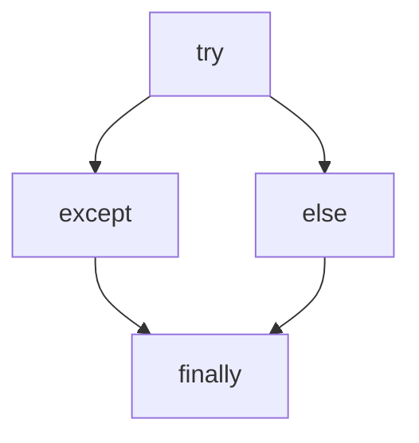

## 异常 ##

> 异常指程序运行过程中出现的非正常现象

所谓异常处理，就是指程序在出现问题时依然可以正确的执行剩余的程序，而不会因为异常而终止程序


```python
a = 3/0      # 简单的异常
```

### 处理异常的过程 ###

> Python  中一切都是对象，异常也是采用对象的方式处理。处理过程

1. 抛出异常：在执行一个方法中，如果发生异常则这个方法生成代表异常的一个对象，停止当前执行路径，并把异常对象提交给解释器
2. 捕获异常：解释器得到该异常后，寻找相应的代码来处理该异常

### try except  ###

> 注意： return 语句不要在 try except else  finally  块中，直接放在方法的最后

异常结构

```python
try:
	被监控的可能引发异常的语句块
except Exception [as e]:
	异常处理语句块
[else:]
	else 中语句块
[finally:]
	finally 中语句块
```

##### Just Test It  #####

```python
try:
    a = input("请输入一个被除数: ")
    b = input("请输入一个除数: ")
    c = float(a)/float(b)
    print(c)
except ZeroDivisionError as e:
    print("除数不能为零",e)
except ValueError as  e:
    print("异常，字符串不能转为数字",e)
except NameError as  e :
    print("异常。变量不存在",e)
except  BaseException as  e:
    print(e)
```

### else 语句 ###

> 当 try 语句块中没有发生异常，则执行 else 语句中的内容

```
#coding=utf-8
# 测试 try - except - else 语句

try:
    a = input("请输入一个被除数: ")
    b = input("请输入一个除数: ")
    c = float(a)/float(b)
except  Exception as  e:  # try 语句块发生异常，执行 except 中语句
    print(e)
else:  #没有异常，执行 else 语句
    print(c)
```

### finally 语句 ###

> finally 语句块无论是否发生异常都会被执行：通常用来释放  try 块中申请的资源



```python
# coding=utf-8
# 测试 try - except - else 语句

if __name__ == '__main__':
    try:
        a = input("请输入一个被除数: ")
        b = input("请输入一个除数: ")
        c = float(a) / float(b)
    except  Exception as  e:  # try 语句块发生异常，执行 except 中语句
        print(e)
    else:  # 没有异常，执行 else 语句
        print(c)
    finally:  # 无论是否发生异常， finally 块中代码都执行
        print("程序执行完毕 ...")

```

运行结果1 

```python
D:\python\python3\python.exe "F:/pythoWorkspaces/20190905 python-primary/03-exception/03-finally.py"
请输入一个被除数: 1
请输入一个除数: 1
1.0
程序执行完毕 ...
```

运行结果2

```python
D:\python\python3\python.exe "F:/pythoWorkspaces/20190905 python-primary/03-exception/03-finally.py"
请输入一个被除数: 1
请输入一个除数: 0
float division by zero
程序执行完毕 ...

Process finished with exit code 0

```

#### 文件操作 ####

```python
# coding=utf-8
# 读取文本文件资源

if __name__ == '__main__':
    try:
        f = open("text.txt")
        content = f.readline()
        print(content)
    except Exception as e:
        print(e)
    finally:
        try:
            f.close()
        except Exception as  e:
            print(e)
```

### 常见的异常错误 ###

|                   |                        |
| ----------------- | ---------------------- |
| SyntaxError       | 语法错误               |
| NameError         | 未声明指定的命名变量   |
| ZeroDivisionError | 除数为0 错误           |
| ValueError        | 数值错误               |
| TypeError         | 类型错误               |
| AttributeError    | 访问对象的不存在的属性 |
| IndexError        | 索引越界异常           |
| KeyError          | 字典的关键字不存在     |

#### 常见异常汇总 ####


### with 上下文管理 ###

> with 上下文管理可以自动管理资源，在 with 代码块执行完毕还原进入该代码之前的现场或上下文。不论何种原因跳出 with 块，不论是否有异常，总能保证资源正常释放。

#### 语法结构 ####

```python
with context_expr[as var]
	语句块
```

#### 文件操作 ####

```python
# coding=utf-8
# with 上下文管理器

if __name__ == '__main__':
    with open("text.txt") as f:
        content = f.readline()
        print(content)

```

注意：with 上下文管理并非取代 try-except-finally 

### trackback 模块 ###

> 打印异常信息

```python
# coding=utf-8
# 测试 trackback 异常日志处理
import traceback
import calendar
if __name__ == '__main__':

    # try:
    #     print("step1")
    #     i = 1 / 0
    # except:
    #     traceback.print_exc()

    try:
        print("step1")
        i = 1 / 0
    except:
        # 将异常信息写日志文件中
        with open("exception.log", 'a') as  f:
            traceback.print_exc(file=f)


    print("程序执行结束 ...")
```

### 自定义异常类 ###

> 自定义异常类一般是运行时异常，通常继承 Exception 类即可。

```python
# coding=utf-8
# 测试自定义异常

class AgeError(Exception):
    def __init__(self, errorInfo):
        super().__init__(self)  # 调用父类的 __init__ 方法
        self.__errorInfo = errorInfo

    def __str__(self):
        return str(self.__errorInfo) + "不在年龄在(0,200] 之间"


if __name__ == '__main__':
    age = int(input("请输入一个年龄:"))
    if age < 0 or age > 200:
        raise AgeError(age)
    else:
        print("年龄为:", age)

```

## IO 技术 ##

### 文本文件和二进制文件 ###

文本文件存储的是 字符，默认使用 unicode 字符集

二进制文件按字节存储

### 创建文件对象 open() ###

#### 语法格式 ####

```python
open(文件名[,打开方式])
```

#### 打开模式· ####

| 打开方法 | 说明                                       |
| -------- | ------------------------------------------ |
| r        | 读模式                                     |
| w        | 写模式                                     |
| a        | 追加模式                                   |
| b        | 以二进制方式操作文件（可以与其他模式组合） |
| +        | 读写模式（可以与其他模式组合）             |


### 文本文件的操作 ###

#### 中文乱码的解决 ####

> 乱码问题：由于编码和解码时所使用的字符集不一致造成的


```python
# coding=utf-8
# 测试写入文本文件

if __name__ == '__main__':
    with open("a.txt", 'a', encoding='utf-8') as f:
        s = "Hello World Python！ 您好"
        f.write(s)
    # f.close()  # 使用 with 语句可以省略该语句
```

#### write()/writelines() 写入 ####

```python
if __name__ == '__main__':
    try:
        f = open('my.txt', 'a')
        f.write("iiiii")
        f.writelines('1234556\t')
    except Exception as e:
        print(e)
    finally:
        f.close()
    print('程序结束 运行.....')
```

#### close()  关闭流 ####

### 文件读取 ###

| 方法         | 作用                                                         |
| ------------ | ------------------------------------------------------------ |
| read([size]) | 若不给定参数，则读取全部文本内容<br/>若给定参数 size，则读取 size 个字符 |
| readline     | 文本文件中，读取一行内容作为结果返回。读取文件的末尾，会返回空字符串 |
| realines     | 文本文件中，每一行作为一个字符串存入列表中，返回该列表       |

```python
if __name__ == '__main__':
    # 读取文本文件内容
    with open(r'a.txt', 'r', encoding='utf-8') as f:
        result = f.read(5)  # 读取该文本文件前 5 个字符
        print(result)

    print("{:*^30}".format("华丽的分割线"))

    with open(r'a.txt', 'r', encoding='utf-8') as f:
        line = f.readline()  # 读取一整行
        print(line)

    print("{:*^30}".format("华丽的分割线"))

    with open(r'a.txt', 'r', encoding='utf-8') as f:
        list = f.readlines()  # 读取全部，并放入列表中
        print(list)
        for i in range(list.__len__()):
            print(list[i], end="")

```

#### 为文本文件添加行号 ####

```python
if __name__ == '__main__':
    '''
         为文本文件添加行号
    '''
    with open('a.txt', 'r', encoding='utf-8') as f:
        myList = f.readlines()
        print(myList)
        '''列表推导式'''
        txt = [line.rstrip()+"#" + str(index) + "\n" for index, line in list(enumerate(myList))]
        print(txt)
    with open('a.txt', 'w', encoding='utf-8') as f:
        f.writelines(txt)
    print("over")
```

### 二进制文件的读取和写入 ###

```python
f = open(r"file.txt",'wb')  #可写的、重写模式的二进制文件
f = open(r"file.txt",'ab')  #可写的、追加模式的二进制文件
f = open(r"file.txt",'rb')  #可读的二进制文件
```

### 文件对象的常用操作方法 ###


#### Test it  ####

```python
if __name__ == '__main__':
    '''
        tell 返回当前文本指针的位置
        seek(offset[,whence])   
        offset 表示偏移量
        whence = 0，表示相对于文件头开始计算偏移量
        whence = 1，表示从当前位置开始计算偏移量
        whence = 2，表示从文件末尾开始计算偏移量
    '''
    with open(r'a.txt', 'r', encoding='utf-8') as f:
        print("当前文件的文件名:{}".format(f.name))
        print("当前文件指针的位置:{}".format(f.tell()))
        print("读取一行:{}".format(f.readline().rstrip()))
        f.seek(5, 0)
        print("当前文件指针的位置:{}".format(f.tell()))
        print("读取一行:{}".format(f.readline().rstrip()))
        print("当前文件指针的位置:{}".format(f.tell()))


```

### 序列化与反序列 ###

> 使用 pickle 模块

```python
import pickle

pickle.dump(obj,file)  	  #obj 就是要被序列化的对象， file 指的是存储的文件
pickle.load(file)         #从 file 读取数据，反序列化成对象
```

#### Just Test It  ####

```python
import pickle

'''
 将 Student 对象序列化保存到 stu.dat 文件中
 再读取 stu.data 文件，反序列化到 Student 对象
'''


class Student(object):

    def __init__(self, name, age, sex):
        self.__name = name
        self.__age = age
        self.__sex = sex

    def __str__(self):
        return "Student[name:{0},age:{1},sex:{2}]".format(self.__name, self.__age, self.__sex)


if __name__ == '__main__':
    zhangsan = Student('张三', 20, 'male')
    print(zhangsan)
    with open('stu.dat', 'wb') as f:
        pickle.dump(zhangsan, f)

    with open(r'stu.dat', 'rb') as f:
        zhangsan2 = pickle.load(f)
    print(zhangsan2)
    
    print("zhangsan:{0},zhangsan2:{1}".format(id(zhangsan), id(zhangsan2)))

```

### CSV 文件操作 ###

```python
import csv  # 导入 csv 模块

'''
 读写 csv 文件
'''
if __name__ == '__main__':
    # 写入 csv 文件
    with open('cc.csv', 'w', encoding='utf-8') as f:
        csv_writer = csv.writer(f)  # 获取 csv 写入器
        csv_writer.writerow(["ID", "name", "age"])
        csv_writer.writerow(["0111", "张三", "49"])

    # 读取 csv 文件
    with open('cc.csv', 'r', encoding='utf-8') as f:
        csv_reader = csv.reader(f)
        csv_list = list(csv_reader)
        for line in range(csv_list.__len__()):
            print(csv_list[line])
```

### os  模块 和 os.path 模块 ###

os 调用操作文件文件和命令

- `os.system()`  调用操作系统中程序

```python
import os 

# 调用记事本
os.system("notepad.exe")

os.system("ping www.baidu.com")

# 查询网络配置
os.system("ipconfig") 

# 打开 cms 命令行窗口
os.system("cmd")

# 直接调用可执行的文件
os.startfile(r"")
os.startfile(r"D:\software\Navicat for MySQL\navicat.exe")
```

### os 模块-文件和目录操作 ###


```python
# coding=utf-8
import os

if __name__ == '__main__':
    with open('text.txt','w',encoding='utf-8') as f:
        f.write("Hello RM")

    # 删除文件
    # os.remove('text.txt')
    # 重命名文件
    # os.rename('text.txt','text-new.txt')
    # 列出当前目录的文件及文件夹
    print(os.listdir('.'))
    # 列出的文件的所有属性
    file_attrs = os.stat('../')
    print(file_attrs)
    # 创建一个目录
    # os.mkdir("test")
    # os.makedirs("test/t1/t2/t3")
    # 删除 t3 目录
    # os.rmdir("test/t1/t2/t3")
    # 删除 test/t1/t2 多级目录
    # os.removedirs("test/t1/t2")
    # 获取当前目录的全路径 F:\pythoWorkspaces\20190905 python-primary\05-dictory
    print(os.getcwd())
    # 创建 child 目录
    os.mkdir("child")
    # 切换到 child 目录下
    os.chdir("child")
    # 打印当前目录的全路径
    print(os.getcwd())
```


### os.path 模块 ###

P

```python
# coding:utf-8
from os import *
from os.path import *

'''
    递归遍历指定的文件夹
'''


# def listDir(path):
#     dir_tree  = list(walk(path))
#     for i in dir_tree:
#         print(i)


def listDir(path, count):
    dir = listdir(path)
    for file in dir:
        if isdir(join(path, file)):
            count += 1
            print("-" * count + file.__add__("目录"))
            listDir(join(path, file), count)
        else:
            if file.endswith(".css"):
                print("--" * count + file)


def listDir2(path):
    [print(file) for file in listdir(path) if isfile(file) and file.endswith(".py")]

if __name__ == '__main__':
    # listDir("F:\\workspaces\\20190721sxtTest\\Car",0)
    listDir2("F:\\pythoWorkspaces\\20190905 python-primary\\05-dictory")

```

#### walk() 递归遍历所有文件和目录 ####

os.walk 方法：

返回一个 3 个元素的元素,(dirpath，dirnames,filenames)

- dirpath: 要列出指定目录的路径
- dirnames: 目录下的所有文件夹
- filenames: 目录下的所有文件

```python
# coding:utf-8
'''
  使用 walk 遍历子文件夹和子目录
'''
from os import getcwd, chdir, walk
from os.path import join

if __name__ == '__main__':
    chdir("F:/pythoWorkspaces/20190905 python-primary")
    cur_path = getcwd()
    for dirpath, dirnames, filenames in  walk(cur_path):
        for filename in filenames:
            print(join(dirpath, filename))
        for dirname in dirnames:
            print(join(dirpath,dirname))

```

### shutil 模块和 zipfile 模块 ###

> 提供了了移动、复制、压缩、解压缩等操作

```python
# coding:utf-8

'''
    shutil  库提供了文件和文件夹的移动、复制等操作
'''
import shutil
import zipfile

if __name__ == '__main__':
    # 拷贝文件
    # shutil.copyfile("java\Thread.java", "Thread.java")
    # 拷贝目录
    # shutil.copytree("Java\IO", "IO")
    # 拷贝目录，增加过滤条件
    # shutil.copytree("Java\IO","IO",ignore=shutil.ignore_patterns("*.java", "*.html"))

    '''
        第一个参数：压缩后的文件名
        第二个参数：表示压缩的格式(zip ,tar 类型)
        第三个参数：表示被压缩的文件夹或文件
    '''
    # shutil.make_archive("java", "tar", "Java")

    # 压缩文件夹
    # z1 = zipfile.ZipFile("IO.zip", "w")
    # z1.write("text.txt")
    # z1.write("text-new.txt")
    # z1.write("java.zip")
    # z1.close()

    # with zipfile.ZipFile("python.zip", "w") as  zp:
    #     zp.write("01-os.py")

    # 解压缩文件
    try:
        with zipfile.ZipFile("python.zip", 'r') as  zp:
            zp.extractall("python")
    except FileNotFoundError as e:
        print("请检查压缩包是否存在")
    finally:
        print("over")

```

### 递归算法 ###

> 自己调用自己

```python
# coding:utf-8

def factorial(n):
    '''计算阶乘'''
    if n == 1:
        return 1
    else:
        return n * factorial(n - 1)


if __name__ == '__main__':
    result = factorial(5)
    print(result)

```

## 模块(module) ##

> "量变引起质变" 是哲学中一个重要的理论。量变为什么会引起质变呢？本质上理解，随着数量的增加，管理方式会发生本质的变化；旧的管理方式完全不适合，必须采用新的管理方式
>

###  标椎库模块（standard libary） ###

> 模块（module）分为标准库模块和用户自定义模块
>
> 模块化编程（Model Programming ）将一个任务分解成多个模块

### 模块化编程的流程 ###

1. 设计 API，进行功能描述
2. 编码实现 API 中描述的功能
3. 在模块中编写测试代码，并笑出全局代码
4. 使用私有函数实现不被外部客户端调用的模块函数

- Salary.py

```python
'''计算薪水'''

def yearSalary(monthSalay):
    '''计算年薪'''

def monthSalry(daySalary):
    '''计算月薪'''

if __name__ == '__main__':
    print(__name__)
```

- Salary.

```python
import Salary

if __name__ == '__main__':
    print(Salary.__name__)  #当模块被其他模块调用 __name__ ,为当前文件名

    print(Salary.__doc__)
    print(Salary.yearSalary.__doc__)
```

### import 语句 ###

> 导入的对象是实例是单例的

#### 语法格式 ####

```python
import 模块名
import 模块名,模块名2
import 模块名 as 别名

from 模块名 as  函数名
```

#### `__import__(moubleName)` 动态导入 ####

> 不推荐

### importlib 库 ###

```python
import importlib

a = importlib.import_mouble('模块名')  # 模块名使用字符串格式

importlib.reload(a)  # 重新加载被导入的模块
```

#### 测试 ####

```python
import  importlib


if __name__ == '__main__':
    '''
        测试 importlib
    '''
    print(id(importlib),type(importlib),importlib)
    print('{:*^30}'.format("华丽的分割线"))
    sal = importlib.import_module('Salary')
    result = sal.monthSalry(10)
    print(result)
    print('{:*^30}'.format("华丽的分割线"))
    sal2 = importlib.reload(sal)

    print(sal2)

```

### 包 package ###

> “包”就是一个必须有  `__init__.py`的文件


`__init__`.py 文件的作用：

1. 作为包的标识，不能删除
2. 是来实现模糊导入
3. 导入包实质是执行 `__init__.py` 文件，可以在 `__init__.py`文件中这个包的初始化、以及需要统一执行代码


### sys.path 和模块搜索路径 ###

1. 内置模块
2. 当前目录
3. 3程序的主目录
4. pythonpath 目录
5. 标准链接库目录
6. 第三方库目录
7. .pth 文件的内容
8. sys.path.append()   临时添加的模块

### 模块发布和安装 ###

### 模块的本地发布 ###

setup.py 文件

> 位置在要对外发布模块的文件名或包的同级目录

```python
from distutils.core import setup

setup(
    name='demo',  # 对外模块的名字
    version='1.0',
    description='发布测试',
    author='zwz',
    author_email='13@qq.com',
    py_modules=['demo.demo01', 'demo.demo02']  # 要发布的模块
)

```

构建一个发布文件.通过终端，cd 到模块文件夹 c 下面，再键入 命令：

```python
python setup.py sdist
```

安装发布的模块

```python
python setup.py install
```

### 上传模块到 PyPI ###

https://segmentfault.com/a/1190000012621842

```python
# 方式1
python setup.py register  #然后输入用户名和密码

# 方式2 在用户家目录下创建  .pypirc 文件，文件内容为
[distutils]
index-servers=pypi

[pypi]
repository=https://upload.pypi.org/legacy
username = 账户名
password = 密码
```

#### 上传并远程发布 ####

```shell
python setup.py sdist upload
```

#### 下载模块 ####

```python
pip install package-name
```

## GUI编程 ##

- 开始

```
from tkinter import *
from tkinter import messagebox
```


注意：`if __name__ == '__main__':     ''' 导入的第三库与下面代码差两个空行'''`
- 通过类 Tk 的无参构造函数

```python
root = Tk()
```

- 在主窗口中，添加各种 Button 按钮

```python
btn01 = Button(root)
btn01["text"] = "点我就送花"
```

- 通过几何布局管理器，管理组件的大小和位置

```python
btn01.pack()  # 垂直布局当前窗口大小
```

- 事件处理   

```
 def postflower(e):
        messagebox.showinfo("Message", "送你一朵玫瑰花，请你爱上我")
        print("我要送你九九朵玫瑰花")
```


    ### 事件绑定
<Button-1>  表示鼠标左键单击

```python
btn01.bind("<Button-1>", postflower)
root.mainloop()  # 调用组件的 mainloop 方法，进入事件循环
```

### tkinter 主窗口 ###

#### 定义窗口的大小和位置 ####

```python
from tkinter import *
from tkinter import messagebox

if __name__ == '__main__':
    root = Tk()
    root.title("第一个 tkinter 的 gui 小程序")
    # root
    # .geometry('x轴(水平轴)x(小写英文字母x)y轴(垂直轴)+距离左边边框的距离+距离右边边框的距离')
    root.geometry('500x350+150+100')
    root.mainloop()
```


#### Button 组件继承结构图 ####


### 组件整体结构图 ###


### 常用组件 ###


### GUI 应用程序类的经典写法 ###

> 通过类 Application 组织整个 GUI 程序，继承 Frame 类，作为容器

```python
'''GUI 应用程序经典写法，使用面向对象的方式'''
from tkinter import *
from tkinter import messagebox


class Application(Frame):  # 继承 Frame 类，用于创建容器

    def __init__(self, master=None):  # master 的默认值为 None，即为空
        super().__init__(master)  # super() 表示父类的定义，不表示父类的对象
        self.__master = master
        self.createWidget()  # 调用组件

    def createWidget(self):  # 创建组件
        self.btn01 = Button(self.__master)
        self.btn01["text"] = "点我送花"
        self.btn01.pack()  # 将当前组件添加到窗口中
        self.btn01["command"] = self.postToFlower

        # 创建退出按钮
        self.btnQuit = Button(self.__master, text="退出", command=root.destroy)
        self.btnQuit.pack()

    def postToFlower(self):
        messagebox.showinfo("送花", "我要送你 99 朵玫瑰花")


if __name__ == '__main__':
    root = Tk()
    root.title("GUI 应用程序经典写法，使用面向对象的方式")
    root.geometry('500x400+200+100')
    app = Application(master=root)
    root.mainloop()

```

### Label 标签 ###

```python
'''GUI 应用程序经典写法，使用面向对象的方式'''
from tkinter import *
from tkinter import messagebox


class Application(Frame):  # 继承 Frame 类，用于创建容器

    def __init__(self, master=None):  # master 的默认值为 None，即为空
        super().__init__(master)  # super() 表示父类的定义，不表示父类的对象
        self.__master = master
        self.pack()
        self.createWidget()  # 调用组件

    def createWidget(self):  # 创建组件
        self.label01 = Label(self, text="我是标签"
                             , width=15, height=5, font=30
                             , justify="left"
                             , bg="black", fg="red")
        self.label01.pack()
        self.lable02 = Label(self, text="我是标签2", width=20, height=5
                             , font=("黑体", 15))
        self.lable02.pack()

        global photo  # 声明全局变量
        photo = PhotoImage(file="cute.gif")
        self.lable03 = Label(self, image=photo)
        self.lable03.pack()


if __name__ == '__main__':
    root = Tk()
    root.title("GUI 应用程序经典写法，使用面向对象的方式")
    root.geometry('500x400+200+100')
    app = Application(master=root)
    root.mainloop()

```

**效果**


### Button 按钮 ###

> 设置的按钮可以是文字或者图片，注意图片 必须是 `.gif` 格式

```python
'''GUI 应用程序经典写法，使用面向对象的方式'''
from tkinter import *
from tkinter import messagebox


class Application(Frame):  # 继承 Frame 类，用于创建容器

    def __init__(self, master=None):  # master 的默认值为 None，即为空
        super().__init__(master)  # super() 表示父类的定义，不表示父类的对象
        self.__master = master
        self.pack()
        self.createWidget()  # 调用组件

    def createWidget(self):
        '''创建组件'''
        self.btn1 = Button(self, text="电脑", command=self.mycomputer)
        self.btn1.pack()

        global  photo
        photo = PhotoImage(file="cute.gif")
        self.btn2 = Button(self, image=photo, state=DISABLED, command=self.mycomputer)
        self.btn2.pack()


    def mycomputer(self):
        messagebox.showinfo("信息", "CPU:i5 8265u, RAM:16G, Hardware:1T")

if __name__ == '__main__':
    root = Tk()
    root.title("GUI 应用程序经典写法，使用面向对象的方式")
    root.geometry('500x400+200+100')
    app = Application(master=root)
    root.mainloop()

```

**效果**


### Entry 单行文本框 ###

> Entry 用来一行字符串的控件，输入多行文本，使用 Test 控件

``` python
'''GUI 应用程序经典写法，使用面向对象的方式'''
from tkinter import *
from tkinter import messagebox


class Application(Frame):  # 继承 Frame 类，用于创建容器

    def __init__(self, master=None):  # master 的默认值为 None，即为空
        super().__init__(master)  # super() 表示父类的定义，不表示父类的对象
        self.__master = master
        self.pack()
        self.createWidget()  # 调用组件

    def createWidget(self):
        '''创建组件'''
        Label(self, text='用户名', height=2).pack()

        # 将 username 绑定 Entry 组件上
        username = StringVar(self)
        self.uEntry = Entry(self, textvariable=username)
        self.uEntry.pack()
        # username.set("admin")

        Label(self, text='密码', height=2).pack()
        password = StringVar(self)
        self.pEntry = Entry(self, textvariable=password, show="*")
        self.pEntry.pack()

        Button(self, text='登录', command=self.login).pack()

    def login(self):
        username = self.uEntry.get()
        password = self.pEntry.get()
        # 查询数据库，判断用户名是否正确
        if username == "admin" and password == "123":
            messagebox.showinfo('登录', '登录成功...')
        else:
            messagebox.showinfo('登录', '登录失败')

    def mycomputer(self):
        messagebox.showinfo("信息", "CPU:i5 8265u, RAM:16G, Hardware:1T")


if __name__ == '__main__':
    root = Tk()
    root.title("用户登录")
    root.geometry('200x200+200+100')
    app = Application(master=root)
    root.mainloop()

```

**效果**


#### 接收 Entry 组件的 value ####


### Text  组件 ###

```python
"""测试 Text 多行文本框组件的基本用法，使用面向对象的方式"""
from tkinter import *
import webbrowser


class Application(Frame):

    def __init__(self, master=None):
        super().__init__(master)  # super()代表的是父类的定义，而不是父类 对象
        self.master = master
        self.pack()
        self.createWidget()

    def createWidget(self):
        # 宽度 20 个字母(10 个汉字)，高度一个行高
        self.w1 = Text(root, width=40, height=12, bg="gray")
        self.w1.pack()
        self.w1.insert(1.0, "0123456789\nabcdefg")
        self.w1.insert(2.3, "锄禾日当午，汗滴禾下土。谁知盘中餐，粒粒皆辛苦\n")
        Button(self, text="重复插入文本 ", command=self.insertText).pack(side="left")
        Button(self, text="返回文本", command=self.returnText).pack(side="left")
        Button(self, text="添加图片", command=self.addImage).pack(side="left")
        Button(self, text="添加组件", command=self.addWidget).pack(side="left")
        Button(self, text="通过 tag 精确控制文本 ", command=self.testTag).pack(side="left")

    def insertText(self):  # INSERT 索引表示在光标处插入
        self.w1.insert(INSERT, ' Gaoqi ')
        # END 索引号表示在最后插入
        self.w1.insert(END, '[sxt]')
        self.w1.insert(1.8, "gaoqi")

    def returnText(self):
        # Indexes(索引)是用来指向 Text 组件中文本的位置，Text 的组件索引也是对应 实际字符之间的位置。
        # 核心：行号以 1 开始 列号以 0 开始
        print(self.w1.get(1.2, 1.6))
        print("所有文本内容：\n" + self.w1.get(1.0, END))

    def addImage(self):
        # global photo
        self.photo = PhotoImage(file="imgs/logo.gif")
        self.w1.image_create(END, image=self.photo)

    def addWidget(self):
        b1 = Button(self.w1, text='爱尚学堂')
        # 在 text 创建组件的命令
        self.w1.window_create(INSERT, window=b1)

    def testTag(self):
        self.w1.delete(1.0, END)
        self.w1.insert(INSERT, "good good study,day day up!\n 北京尚学堂\n 百战 程序员\n 百度，搜一下就知道")
        self.w1.tag_add("good", 1.0, 1.9)
        self.w1.tag_config("good", background="yellow", foreground="red")
        self.w1.tag_add("baidu", 4.0, 4.2)
        self.w1.tag_config("baidu", underline=True)
        self.w1.tag_bind("baidu", "<Button-1>", self.webshow)

    def webshow(self, event):
        webbrowser.open("http://www.baidu.com")


if __name__ == '__main__':
    root = Tk()
    root.geometry("450x300+200+300")
    app = Application(master=root)
    root.mainloop()

```

### Checkbox 复选框 ###

```python
# coding:utf-8

'''GUI 应用程序经典写法，使用面向对象的方式'''
from tkinter import *
from tkinter import messagebox


class Application(Frame):  # 继承 Frame 类，用于创建容器

    def __init__(self, master=None):  # master 的默认值为 None，即为空
        super().__init__(master)  # super() 表示父类的定义，不表示父类的对象
        self.__master = master
        self.pack()
        self.createWidget()  # 调用组件

    def createWidget(self):
        '''创建组件'''
        Label(self, text='复选框').pack(side='left')
        self.game_var = IntVar(self)
        self.code_var = IntVar(self)
        game_checkbox_radio = Checkbutton(self, text='打游戏'
                                          , variable=self.game_var
                                          , offvalue=1
                                          , onvalue=2
                                          , command=self.select_checkbox).pack(side='left')
        code_checkbox_radio = Checkbutton(self, text='敲代码'
                                          , variable=self.code_var
                                          , offvalue=1
                                          , onvalue=2
                                          , command=self.select_checkbox).pack(side='left')

    def select_checkbox(self):
        print(self.game_var.get(), self.code_var.get())


if __name__ == '__main__':
    root = Tk()
    root.title("单选和多选测试")
    root.geometry('300x200+200+100')
    app = Application(master=root)
    root.mainloop()

```

### canvas 画布 ###

> canvas  画布是一个矩形区域， 可以方盒子图形、图形、组件等

```python
# coding:utf-8

'''GUI 应用程序经典写法，使用面向对象的方式'''
from tkinter import *
from tkinter import messagebox


class Application(Frame):  # 继承 Frame 类，用于创建容器

    def __init__(self, master=None):  # master 的默认值为 None，即为空
        super().__init__(master)  # super() 表示父类的定义，不表示父类的对象
        self.__master = master
        self.pack()
        self.createWidget()  # 调用组件

    def createWidget(self):
        '''创建组件'''
        Label(self, text='画布学习', font=("宋体", 20)).pack()
        # 创建画布
        self.can = Canvas(self, bg='red', width=400, height=200)
        self.can.pack()
        # 画折线
        line = self.can.create_line(10, 10, 150, 150)
        # 画矩形
        ran = self.can.create_rectangle(20, 20, 200, 200)
        # 画圆
        ran = self.can.create_oval(20, 20, 200, 200)


if __name__ == '__main__':
    root = Tk()
    root.title("单选和多选测试")
    root.geometry('500x400+200+100')
    app = Application(master=root)
    root.mainloop()

```

### 布局管理器 ###

> pack、grid、place

### grid 布局 ###

```python
'''GUI 应用程序经典写法，使用面向对象的方式'''
from tkinter import *
from tkinter import messagebox


class Application(Frame):  # 继承 Frame 类，用于创建容器

    def __init__(self, master=None):  # master 的默认值为 None，即为空
        super().__init__(master)  # super() 表示父类的定义，不表示父类的对象
        self.__master = master
        self.pack()
        self.createWidget()  # 调用组件

    def createWidget(self):
        '''创建组件'''
        Label(self, text='用户登录', height=3, font=("黑体", 18)).grid(row=0, columnspan=2)
        Label(self, text='用户名  ').grid(row=1, column=0, sticky=W)

        # 将 username 绑定 Entry 组件上
        self.username = StringVar(self)
        self.uEntry = Entry(self, textvariable=self.username)
        self.uEntry.grid(row=1, column=1)
        # username.set("admin")

        Label(self, text='密码', height=2).grid(row=2, column=0)
        self.password = StringVar(self)
        self.pEntry = Entry(self, textvariable=self.password, show="*")
        self.pEntry.grid(row=2, column=1)

        Button(self, text='登录', command=self.login).grid(row=3, column=0, sticky=S)
        Button(self, text='重置', command=self.reset).grid(row=3, column=1)

    def login(self):
        username = self.uEntry.get()
        password = self.pEntry.get()
        # 查询数据库，判断用户名是否正确
        if username == "admin" and password == "123":
            messagebox.showinfo('登录', '登录成功...')
        else:
            messagebox.showinfo('登录', '登录失败')

    def reset(self):
        self.username.set("")
        self.password.set("")


if __name__ == '__main__':
    root = Tk()
    root.title("用户登录")
    root.geometry('300x200+200+100')
    app = Application(master=root)
    root.mainloop()
```

**效果**


#### 使用 Grid 布局实现计算器 ####

```python
'''
    计算器页面
'''

'''GUI 应用程序经典写法，使用面向对象的方式'''
from tkinter import *
from tkinter import messagebox


class Application(Frame):  # 继承 Frame 类，用于创建容器

    def __init__(self, master=None):  # master 的默认值为 None，即为空
        super().__init__(master)  # super() 表示父类的定义，不表示父类的对象
        self.__master = master
        self.pack()
        self.createWidget()  # 调用组件

    def createWidget(self):
        '''创建组件'''
        cal_key = (
            ('MC', 'M+', 'M-', 'MR'),
            ('C', '-', '+', 'x'),
            ('7', '8', '9', '-'),
            ('4', '5', '6', '+'),
            ('1', '2', '3', '='),
            ('0', '.')
        )
        Entry(self).grid(row=0, columnspan=4)

        for rindex, row in enumerate(cal_key):
            for cindex, c in enumerate(row):
                if c == '0':
                    Button(self, text=c, width=4).grid(row=rindex+1, column=cindex, columnspan=2, sticky=NSEW)
                elif c == '.':
                    Button(self, text=c, width=4).grid(row=rindex+1, column=cindex+1, sticky=NSEW)
                elif c == '=':
                    Button(self, text=c, width=4).grid(row=rindex+1, column=cindex, rowspan=2, sticky=NSEW)
                else:
                    Button(self, text=c, width=4).grid(row=rindex+1, column=cindex, sticky=NSEW)


if __name__ == '__main__':
    root = Tk()
    root.title("用户登录")
    root.geometry('300x200+200+100')
    app = Application(master=root)
    root.mainloop()

```

**效果**


### pack 布局管理器 ###

> 按照垂直或者水平的方向自然排 布。如果不指定任何选项，默认在父组件中自顶向下垂直添加组件。


```python
'''
    测试
'''

from tkinter import *
from tkinter import messagebox

root = Tk()
root.title('pack')
root.geometry("500x200+900+300")
f1 = Frame(root)
f1.pack()
f2 = Frame(root)
f2.pack()

music_category = ('轻音乐', '重金属', '流行', '摇滚')

for category in music_category:
    Button(f1, text=category).pack(side='left', padx=10)

for index in range(1, 20):
    Label(f2, height=8, bg='black' if index % 2 == 0 else 'white').pack(side='left', ipadx=10)

# 启动
root.mainloop()

```

**效果**：

### place 坐标 ###

place 布局管理器可以通过坐标精确控制组件的位置，适用于一些布局更加灵活的场景。

```python
# coding=utf-8
from tkinter import *

root = Tk();
root.geometry("500x300")
root.title("布局管理place");
root["bg"] = "white"

f1 = Frame(root, width=200, height=200, bg="green")
f1.place(x=30, y=30)

Button(root, text="尚学堂").place(relx=0.2, x=100, y=20, relwidth=0.2, relheight=0.5)
Button(f1, text="百战程序员").place(relx=0.6, rely=0.7)
Button(f1, text="高淇老师").place(relx=0.5, rely=0.2)
root.mainloop()

```

**效果**


### 事件处理 ###

```python
widget.bind(event,hander) # 将 事件绑定到函数上
```

#### 鼠标和键盘事件 ####


#### event 对象属性 ####


#### 测试 ####

```python
# coding=utf-8
# 测试键盘和鼠标事件

from tkinter import *

root = Tk();
root.geometry("530x300")

c1 = Canvas(root, width=200, height=200, bg="green")
c1.pack()


def mouseTest(event):
    print("鼠标左键单击位置(相对于父容器)：{0},{1}".format(event.x, event.y))
    print("鼠标左键单击位置(相对于屏幕)：{0},{1}".format(event.x_root, event.y_root))
    print("事件绑定的组件：{0}".format(event.widget))


def testDrag(event):
    c1.create_oval(event.x, event.y, event.x + 1, event.y + 1)


def keyboardTest(event):
    print("键的keycode:{0},键的char:{1},键的keysym:{2}"
          .format(event.keycode, event.char, event.keysym))


def press_a_test(event):
    print("press a")


def release_a_test(event):
    print("release a")


c1.bind("<Button-1>", mouseTest)
c1.bind("<B1-Motion>", testDrag)

root.bind("<KeyPress>", keyboardTest)
root.bind("<KeyPress-a>", press_a_test)  # 只针对小写的a，大写的A不管用
root.bind("<KeyRelease-a>", release_a_test)

root.mainloop()

```

### 事件传参 ###

#### lambda 表达式的语法格式 ####

```python
lambda 参数值列表: 表达式
```

测试

```python
root.bind("<Double-Button-1>",          
	lambda event: messagebox.showinfo("提示", "这是鼠标双击事件哦！"))
```

#### 使用  lambda   表达式传参 ####

```python
# coding:utf-8

from tkinter import *

if __name__ == '__main__':
    root = Tk()
    root.geometry('500x400+300+400')
    root.title('lambda 表达式传参')

    f = Frame(root, width=400, height=200, bg='red')
    f.pack()


    def click_btn(a, b):
        print('a:{},b:{}'.format(a, b))


    Button(root, text='点击', 
    	command=lambda: click_btn('小黑', '小白')).place(x=280, y=100)

    root.mainloop()  # 开启主循环

```

### 事件汇总 ###

- 直接绑定

  ```python
  # bind方式绑定事件
  b1.bind(触发事件, func)
  ```

- 使用 command 绑定事件

  ```python
  # command属性直接绑定事件
  b2 = Button(root,command=lambda: func)
  b2 = Button(root,command=func)
  ```

- 使用 widget 绑定组件

  ```python
  b1.bind_class(组件widget,触发事件event, func)
  ```

#### 鼠标事件 ####

| 鼠标事件类型 | 说明     |
| ------------ | -------- |
| `<Button-1>` | 鼠标左击 |
| `<Button-2>` | 鼠标中键 |
| `<Button-3>` | 鼠标右击 |

#### 测试 ####

```python
# coding=utf-8
# 多种事件绑定方式汇总
from tkinter import *

root = Tk();
root.geometry("270x30")


def mouseTest1(event):
    print("bind()方式绑定，可以获取event对象")
    print(event.widget)


def mouseTest2(a, b):
    print("a={0},b={1}".format(a, b))
    print("command方式绑定，不能直接获取event对象")


def mouseTest3(event):
    print("右键单击事件，绑定给所有按钮啦！！")
    print(event.widget)


b1 = Button(root, text="测试bind()绑定")
b1.pack(side="left")
# bind方式绑定事件
b1.bind("<Button-1>", mouseTest1)

# command属性直接绑定事件
b2 = Button(root, text="测试command2",
            command=lambda: mouseTest2("gaoqi", "xixi"))
b2.pack(side="left")

# 给所有Button按钮都绑定右键单击事件<Button-3>
b1.bind_class("Button", "<Button-3>", mouseTest3)

root.mainloop()

```

### 其他组件 ###

#### OoptionMenu 选择框
```python
from tkinter import *

if __name__ == '__main__':
    root = Tk()
    root.geometry('500x400+100+200')
    root.title('optionMenu')

    var = StringVar()
    var.set('请选择数字')
    om = OptionMenu(root, var, '1111', '2222', '33333')
    om.pack(side='left')

    Button(root, text='确定'
           , command=lambda: print('var:{}'.format(var.get()))).pack(side='left')

    root.mainloop()

```

#### 效果 ####


####  Scanle 滑块

```python
from tkinter import *

if __name__ == '__main__':
    root = Tk()
    root.geometry('500x400+100+200')
    root.title('optionMenu')


    def test1(value):
        print('滑块的值:', value)
        newFont = ('宋体', value)
        lab.config(font=newFont)


    Scale(root, from_=10, to=50, length=200
          , tickinterval=5, orient=HORIZONTAL, command=test1).pack()

    lab = Label(root, text='凡事有因必有果', width=14, height=1, bg='yellow')
    lab.pack()

    root.mainloop()

```

#### 效果 ####


#### 颜色选择框 ####
```python
"""askcolor颜色选择框的测试，改变背景色"""

from tkinter import *
from tkinter.colorchooser import *


if __name__ == '__main__':
    root = Tk();
    root.geometry("400x150")


    def test1():
        s1 = askcolor(color="red", title="选择背景色")
        print(s1)
        # s1的值是：((0.0, 0.0, 255.99609375), '#0000ff')
        root.config(bg=s1[1])


    Button(root, text="选择背景色", command=test1).pack()

    root.mainloop()

```

#### 上传文件
```python
"""文件对话框获取文件"""

from tkinter import *
from tkinter.filedialog import *

if __name__ == '__main__':
    root = Tk();
    root.geometry("400x100")


    def test1():
        f = askopenfilename(title="上传文件"
                            , initialdir="d:"
                            , filetypes=[
                                	("视频文件", ".mp4"), 
                                	("音频文件", ".mp3")])
        # print(f)
        show["text"] = f


    Button(root, text="选择编辑的视频文件或音频文件", command=test1).pack()

    show = Label(root, width=40, height=3, bg="green")
    show.pack()

    root.mainloop()

```

### 记事本程序 ###

```python
# coding=utf-8
# 记事本软件,练习主菜单的设计
from tkinter.colorchooser import askcolor
from tkinter.filedialog import *
from tkinter.simpledialog import askinteger

'''GUI 应用程序经典写法，使用面向对象的方式'''
from tkinter import *
from tkinter import messagebox


class Application(Frame):  # 继承 Frame 类，用于创建容器

    def __init__(self, master=None):  # master 的默认值为 None，即为空
        super().__init__(master)  # super() 表示父类的定义，不表示父类的对象
        self.__master = master
        self.pack()
        self.createWidget()  # 调用组件
        self.filename = ""

    def createWidget(self):
        '''创建组件'''

        # 创建主菜单栏
        menubar = Menu(self.master)

        # 创建子菜单
        menuFile = Menu(menubar)
        menuEdit = Menu(menubar)
        menuHelp = Menu(menubar)

        # 将子菜单加入到主菜单栏
        menubar.add_cascade(label="文件(F)", menu=menuFile)
        menubar.add_cascade(label="编辑(E)", menu=menuEdit)
        menubar.add_cascade(label="帮助(H)", menu=menuHelp)

        # 添加菜单项
        menuFile.add_command(label="新建", accelerator="ctrl+N", command=self.newfile)
        menuFile.add_command(label="打开", accelerator="ctrl+O", command=self.openfile)
        menuFile.add_command(label="保存", accelerator="ctrl+S", command=self.savefile)
        menuFile.add_separator()  # 添加分割线
        menuFile.add_command(label="退出", accelerator="ctrl+Q", command=self.exit)

        menuEdit.add_command(label='背景色', command=self.change_bg_color)
        menuEdit.add_command(label='字体', command=self.change_font_size)


        menuHelp.add_command(label='关于', command=self.aboutme)


        # 将主菜单栏加到根窗口
        root["menu"] = menubar

        # text 文本区域
        self.textpad = Text(self.master, width=150, height=100)
        self.textpad.pack()

        # 绑定快捷键
        root.bind('<Control-n>', lambda event: self.newfile())
        root.bind('<Control-o>', lambda event: self.openfile())
        root.bind('<Control-s>', lambda event: self.savefile())
        root.bind('<Control-q>', lambda event: self.exit())
        root.bind('<Button-3>', lambda event: self.show_right_click_menu(event))

        # 右击菜单
        self.right_click_menubar = Menu(self.master)
        self.right_click_menubar.add_command(label='背景色', command=self.change_bg_color)
        self.right_click_menubar.add_command(label='字体大小', command=self.change_font_size)


    # 新建文件
    def newfile(self):
        self.filename = asksaveasfilename(title='另存为'
                                          , filetypes=[('文本文件', '.txt')]
                                          , initialfile='未命名.txt'
                                          , defaultextension='.txt')
        self.savefile()

    # 打开文件
    def openfile(self):
        self.textpad.delete('1.0', 'end')  # 先把Text控件中的内容清空
        with askopenfile(title="打开文件", filetypes=[('文本文件', '.txt')]) as f:
            content = f.read()
            self.textpad.insert(INSERT, content)  # INSERT 表示从光标当前位置插入
            self.filename = f.name

    # 保存文件
    def savefile(self):
        if not self.filename.__eq__(None) or not self.filename == '':
            with open(self.filename, "w", encoding='utf-8') as f:
                content = self.textpad.get(1.0, END)
                if content == '':
                    messagebox.showinfo('警告', '请输入内容')
                else:
                    f.write(content)
        else:
            messagebox.showinfo('信息', '请先新建文件')

    # 退出
    def exit(self):
        self.master.quit()

    # 右击显示快捷菜单
    def show_right_click_menu(self, event):
        self.right_click_menubar.post(event.x_root, event.y_root)

    # 修改背景颜色
    def change_bg_color(self):
        s1 = askcolor(color="red", title="选择背景色")
        # s1 的值是：((0.0, 0.0, 255.99609375), '#0000ff')
        self.textpad.config(bg=s1[1])

    # 修改字体大小
    def change_font_size(self):
        font_size = askinteger(title='修改字体大小', prompt='修改字体大小'
                               , initialvalue=15, minvalue=5, maxvalue=60)
        print(font_size)
        self.textpad.config(font=font_size)

    # 关于我
    def aboutme(self):
        messagebox.showinfo('关于','本软件属于学习 Python 测试软件，软件难免有 Bug， 比如不能读取中文文件')


if __name__ == '__main__':
    root = Tk()
    root.title("我的记事本")
    root.geometry('600x400+200+100')
    app = Application(master=root)
    root.mainloop()

```

#### 将 Python 打包成 exe 文件 ####

```python
# 下载 pyinstaller 库，打开 cmd 命令控制台，输入
pip install pyinstaller
# 使用 pyinstaller 打包
pyinstaller -F  xxx.py
```

### 画图软件 ###

```python
# coding=utf-8
'''编写简单的画图软件'''
from tkinter.colorchooser import askcolor
from tkinter.filedialog import *
from tkinter.simpledialog import askinteger
from tkinter import messagebox

# 定义全局的窗口的宽度
WIN_WIDTH = 900
# 定义全局的窗口的高度
WIN_HEIGHT = 500


class Application(Frame):  # 继承 Frame 类，用于创建容器

    def __init__(self, master=None, bgcolor='#000000'):  # master 的默认值为 None，即为空
        super().__init__(master)  # super() 表示父类的定义，不表示父类的对象
        self.__master = master
        self.pack()
        self.bgcolor = bgcolor

        self.x = 0  # (x,y) 表示画直线的起始坐标
        self.y = 0
        self.slinecolor = '#ff0000'  # 画笔颜色
        self.startDrawFlag = False
        self.lastdraw = 0  # 最后一次画直线的 对象 ID

        self.createWidget()  # 调用组件

    def createWidget(self):
        '''创建组件'''
        # 创建画布
        self.drawPad = Canvas(self, width=WIN_WIDTH, height=WIN_HEIGHT * 0.9, bg=self.bgcolor)
        self.drawPad.pack()

        start = Button(self, text='开始', name='start')
        start.pack(side='left', padx='10')
        pen = Button(self, text='画笔', name='pen')
        pen.pack(side='left', padx='10')
        rect = Button(self, text='矩形', name='rect')
        rect.pack(side='left', padx='10')
        clear = Button(self, text='清屏', name='clear')
        clear.pack(side='left', padx='10')
        eraser = Button(self, text='橡皮擦', name='eraser')
        eraser.pack(side='left', padx='10')
        straight_line = Button(self, text='直线', name='straight_line')
        straight_line.pack(side='left', padx='10')
        straight_line_head = Button(self, text='直线(箭头)', name='straight_line_head')
        straight_line_head.pack(side='left', padx='10')
        color = Button(self, text='颜色', name='color')
        color.pack(side='left', padx='10')
        fade_color = Button(self, text='渐变色', name='fade_color')
        fade_color.pack(side='left', padx='10')

        # 绑定事件
        pen.bind_class("Button", "<1>", self.eventManager)
        self.drawPad.bind("<ButtonRelease-1>", self.stopdraw)

        root.bind("<KeyPress-a>", self.about_me)
        root.bind("<KeyPress-r>", self.change_pen_red)
        root.bind("<KeyPress-y>", self.change_pen_yellow)
        root.bind("<KeyPress-b>", self.change_pen_blue)

    def eventManager(self, event):
        btn_name = event.widget.winfo_name()
        print(btn_name)
        if btn_name == 'straight_line':
            self.drawPad.bind("<B1-Motion>", self.straight_line)
        elif btn_name == 'straight_line_head':
            self.drawPad.bind("<B1-Motion>", self.straight_line_head)
        elif btn_name == 'rect':
            self.drawPad.bind("<B1-Motion>", self.rect)
        elif btn_name == 'pen':
            self.drawPad.bind("<B1-Motion>", self.pen)
        elif btn_name == 'eraser':
            self.drawPad.bind("<B1-Motion>", self.eraser)
        elif btn_name == 'color':
            s1 = askcolor(color="red", title="选择画笔颜色", initialcolor=self.slinecolor)
            # s1 的值是：((0.0, 0.0, 255.99609375), '#0000ff')
            self.slinecolor = s1[1]
        elif btn_name == 'clear':
            self.drawPad.delete("all")  # 清屏
        elif btn_name == 'fade_color':
            self.drawPad.bind("<B1-Motion>", self.fadepen)

    def start(self):
        pass

    # 画笔
    def pen(self, event):
        self.startdraw(event)
        #self.fade_color(event)
        self.drawPad.create_line(self.x, self.y, event.x, event.y, fill=self.slinecolor)
        self.x = event.x
        self.y = event.y

    # 矩形
    def rect(self, event):
        self.startdraw(event)
        self.lastdraw = self.drawPad.create_rectangle(self.x, self.y
                                                      , event.x, event.y
                                                      , outline=self.slinecolor)

    # 橡皮擦
    def eraser(self, event):
        self.startdraw(event)
        self.drawPad.create_rectangle(self.x - 3, self.y - 3
                                      , event.x + 3, event.y + 3
                                      , fill=self.bgcolor)

    # 画直线
    def straight_line(self, event):
        self.startdraw(event)
        self.lastdraw = self.drawPad.create_line(self.x, self.y
                                                 , event.x, event.y
                                                 , fill=self.slinecolor)

    # 画带有箭头的直线
    def straight_line_head(self, event):
        self.startdraw(event)
        self.lastdraw = \
            self.drawPad.create_line(self.x, self.y, event.x, event.y
                                     , arrow=LAST, fill=self.slinecolor)

    # 开始绘制
    def startdraw(self, event):
        self.drawPad.delete(self.lastdraw)

        if not self.startDrawFlag:
            self.startDrawFlag = True
            self.x = event.x
            self.y = event.y

    # 结束绘制
    def stopdraw(self, event):
        self.startDrawFlag = False
        self.lastdraw = 0

    # 关于我
    def about_me(self, event):
        messagebox.showinfo('信息', '本软件利用 Python 中 tkinter 库开发的简易画图软件，开发时间 2019年9月16日')

    # 快捷键 r，更换画笔颜色为红色
    def change_pen_red(self, event):
        self.slinecolor = 'red'

    # 快捷键 y，更换画笔颜色为黄色
    def change_pen_yellow(self, event):
        self.slinecolor = 'yellow'

    # 快捷键 b，更换画笔颜色为蓝色
    def change_pen_blue(self, event):
        self.slinecolor = 'blue'

    # 渐变画笔
    def fade_color(self, event):
        #self.slinecolor = (abs(self.x - event.x) % 256, abs(self.y - event.y) % 256, abs(self.x - event.x) % 256)
        self.slinecolor = '#ff00ff'


if __name__ == '__main__':
    root = Tk()
    root.title("我的记事本")
    root.geometry('{width}x{height}+200+100'.format(width=WIN_WIDTH, height=WIN_HEIGHT))
    app = Application(master=root)
    root.mainloop()

```


#### python 模块的安装
> 打开 cmd 命令控制台
```console
pip install  xxx 模块名

# 这个 whl 文件需要自己手动到网上下载下来，然后执行下面的命令安装
pip install xxx.whl 文件

pip unstaill xxx 模块名
```

### 

