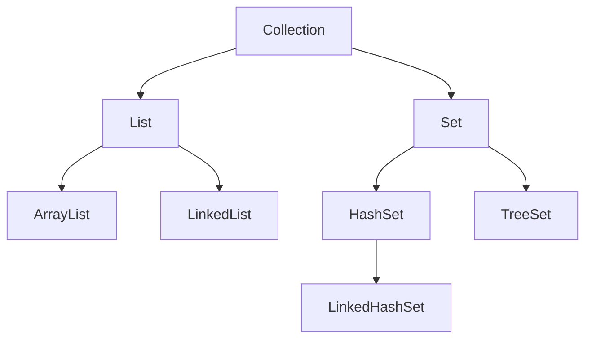
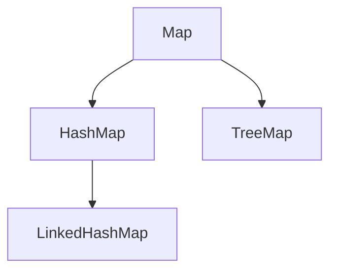

# Java SE #

### Java 语言的类型 ###

JAVA 语言是一种编译型-解释型语言，同时具备编译特性和解释特性（其实，确切的说 java 就是解释型语言，其所谓的编译过程只是将.java 文件编程成平台无关的字节码.class 文件，并不是向 C 一样编译成可执行的机器语言，在此请读者注意 Java 中所谓的“编译”和传统的“编译”的区别）。作为编译型语言，JAVA 程序要被统一编译成字节码文件——文件后缀是class。此种文件在 java 中又称为类文件。java 类文件不能再计算机上直接执行，它需要被 java 虚拟机翻译成本地的机器码后才能执行，而 **java 虚拟机的翻译过程则是解释性的**。java 字节码文件首先被加载到计算机内存中，然后读出一条指令，翻译一条指令，执行一条指令，该过程被称为 java 语言的**解释执行**，是由 java 虚拟机完成的。


### 基础概念 ###

#### java 的数据类型 ####

1. 基本数据类型 primitive type

   整型：byte、short、int、lang

   浮点型：float、double

   字符型：char

   布尔型：boolean

2. 引用数据类型  reference type

   **对于引用数据类型的对象/数组，变量名存在栈中，变量值存储的是对象的地址，并不是对象的实际内容。**

3. 枚举类型 enumeration type

**注意：**

1. String  类型不是基本数据类型，整型默认是 int 类型，浮点型默认是 double 类型
2. 引用数据类型默认值为 null ，例如：String 类型的数组 String[] s = new String[10],每个元素初始值都为 null

#### 实例方法与类方法的区别 ####

- 实例方法：通过实例对象（new ）调用类中的方法

- 类方法：被 static 关键字修改的方法

Java 的实例方法、类方法和构造方法 https://blog.csdn.net/xusheng_Mr/article/details/51617415


#### **Static 关键字** ####

static 得方法在装载 class 得时候首先完成，比 构造方法早，此时非 static 得属性和方法还没有完成初始化所以不能调用。

**成员变量用 static 修饰和不用 static 修饰有什么区别？**

| 区别                   | 解释                                                         |
| ---------------------- | ------------------------------------------------------------ |
| 两个变量的生命周期不同 | 成员变量随着对象的创建而存在，随着对象的被回收而释放。<br/>静态变量随着类的加载而存在，随着类的消失而消失。 |
| 调用方式不同           | 成员变量只能被对象调用。<br/>静态变量可以被对象调用，还可以被类名调用。 |
| 别名不同               | 成员变量也称为实例变量。<br/>静态变量称为类变量。            |
| 数据存储位置不同       | 成员变量数据存储在**堆内存**的对象中，所以也叫对象的特有数据<br/>静态变量数据存储在方法区(共享数据区)的静态区，所以也叫对象的共享数据. |

#### final 关键字的用法 ####

- 修饰类：表示该类不能被继承
- 修饰方法：表示该方法 不能被子类重写但时允许重载
- 修饰变量：表示变量只能赋一次值以后不能被修改（常量）
- 修饰对象：对象的引用地址不能变，但是对象的初始值可以变

#### abstract 关键字的用法 ####

- 修饰类：表示该类不能实例化，允许有 abstract 方法
- 修饰方法：表示该方法为抽象方法

#### interface 关键字 ####

- 修饰类：表示该类为接口，并且该类只能被  public 、default 访问权限修饰符修饰

#### String 类型 ####

```java
String s=new String(“abc”); //创建了几个 String 对象。
```

分析：两个或一个，”abc”对应一个对象，这个对象放在字符串常量缓冲区，常 量”abc”不管出现多少遍，都是缓冲区中的那一个。**New String 每写一遍， 就创建一个新的对象**，它一句那个常量”abc”对象的内容来创建出一个新 

String 对象。如果以前就用过’abc’，这句代表就不会创建”abc”自己 了，直接从缓冲区拿。<br/>

**String 操作：** 给定一个字符串 s ,再给定一个字符串 t 判断字符串 t 是否是字符串 s 的重组词

> 注：字符串中都为英文小写字母

```java
/**
 * 给定一个字符串 s ,再给定一个字符串 t 
 * 判断字符串 t 是否是字符串 s 的重组词
 * 注：字符串中都为英文小写字母
 */
public class StrDemo {
	public static boolean test(String s,String t){	
		if(t.length() != s.length()){
			return false;
		}
		//创建 int 类型数组，存放每个小写字母出现的次数
		int[] bit = new int[26];
		//遍历 字符串 t，统计字符串 t 中小写字母出现的次数
		//然后将其放入 int 类型数组
		for(int i=0;i < t.length();i++){
			bit[t.charAt(i)-'a']++;
		}
		//遍历字符串 s ，每取出一个字符，则在对应 int 类型数组的元素的值减一
		//若 对应int 类型数组的元素的值小于 0，则表示字符串 s 不是字符串 t 的重组词
		for(int i=0;i < t.length();i++){
			if(--bit[s.charAt(i)-'a'] < 0){
				return false;
			}
		}
		// 表示字符串 s 是字符串 t 的重组词
		return true;	
	}
}
```

**String 类型比较**

```java
public class smallT {
	public static void main(String[] args) {
		String s1 = "Hello World";
		String s2 = new String("Hello World");
		String s3 = "Hello "+"World";
		System.out.println(s1 == s2); 
		System.out.println(s1 == s3 );
		System.out.println(s1.equals(s2));
		System.out.println(s1.equals(s3));		
		// intern 方法：对于任意两个字符串 s 和 t，当且仅当 s.equals(t)
	    // 为 true 时，s.intern() == t.intern() 才为 true。
		System.out.println(s1.intern() == s2.intern());
	}
}
```

结果：

 false true true true true

**String 连接**

```java
public class StrLink {
	public static void main(String[] args) {
		String s1 = "a";
		String s2 = s1+"b"; 
		String s3 = "a"+"b"; // javac 编译在编译期间对字符串常量相加优化
		System.out.println(s2 == "ab");
		System.out.println(s3 == "ab");
		/**
		 * 第一条语句打印的结果为 false，第二条语句打印的结果为 true，这说明
		 * javac 编译可以对字符串常量直接相加的表达式进行优化，不必要等到运行
		 * 期去进行加法运算处理，而是在编译时去掉其中的加号，直接将其编译成一
	     * 个这些常量相连的结果。
		 */
		String s4 = "a"+"b"+"c"+"d";//只创建一个对象
		System.out.println(s4); 
	}
}

```

```java
// 下面语句创建几个对象
String str = "a"+"b"+"c"+"d"
```

#### 内部类与外部类 ####

- 内部类引用外部类的成员的限制

  一个内部类对象可以访问创建它的外部类对象的成员，包括私有成员。 如果要访问外部类的局部变量，此时局部变量必须使用 final 修饰，否则无 法访问。 

#### 静态代码块与构造方法的优先级 ####

静态代码块的优先级 >  构造方法的优先级

#### 值传递* ####

> 在方法被调用时，实参通过形参把它的内容副本传入方法内部，此时形参接收到的内容是实参值的一个拷贝，因此在方法内对形参的任何操作，都仅仅是对这个副本的操作，不影响原始值的内容。


简言之：**在Java中进行方法的参数传递时，无论传递的是原生数据类型还是引用类型，参数传递方式统一是传值（pass by value）。Java中没有传引用（pass by reference）的概念**。

**栗子 1：**

```java
public class Demo {
    //字符串是常量,它们的值不能被创建后改变
	String str = new String("good");
	char[] c = {'a','b','c'};
	
	public String change(String str,char[] c){
		str = "test Good!";
		c[0] = 'g';
		return str;
	}
	
	public static void main(String[] args) {
		Demo demo = new Demo();
		String str = demo.change(demo.str, demo.c);
		System.out.println(str);     //test Good！
		System.out.println(demo.str);//good
		System.out.println(demo.c);  //gbc
		
	}
}

/** 结果 **/
//good
//gbc

```

**分析：**在方法调用时，在 change 方法中对 str 的值进行修改，是将 str 指 向了常量江池中的”test ok”，而主方法中的 ex.str 仍然指向的是常量池 中的”good”。字符型数组在方法调用时，将主方法中 ex.ch 的引用传递 给 change 方法中的 ch，指向是堆中的同一堆空间，所以修改 ch[0]的时 候,ex.ch 可以看到相同的修改后的结果。 

**栗子 2：**

```java
package com.szxy.passbyvalue;

public class Person {
	private String name;
	private int age;
	/*** 省略 setter、getter 以及 toString 方法 **/
	public static void personCrossTest(Person person){
		System.out.println("传入的person的name："+person.getName()); 
		// 创建 Person 对象，并赋值给 person 变量
		// 相当于 person 变量指向新的内存地址，即形参的值与实参的值不一致
		person = new Person();
		person.setName("我是张小龙"); 
		System.out.println("方法内重新赋值后的name："+person.getName());
	}

	/**
	 * 测试
	 * @param args
	 */
	public static void main(String[] args) {
		Person p = new Person();
		p.setName("张三");
		p.setAge(28);
		System.out.println("方法执行前的  p 对象："+p);
		personCrossTest(p);
		System.out.println("方法执行后的  p 对象："+p);
	}
}
```


在Java中所有的参数传递，不管基本类型还是引用类型，都是值传递，或者说是副本传递。
只是在传递过程中：

**如果是对基本数据类型的数据进行操作，由于原始内容和副本都是存储实际值，并且是在不同的栈区，因此形参的操作，不影响原始内容。**

**如果是对引用类型的数据进行操作，分两种情况，一种是形参和实参保持指向同一个对象地址，则形参的操作，会影响实参指向的对象的内容。一种是形参被改动指向新的对象地址（如重新赋值引用），则形参的操作，不会影响实参指向的对象的内容。**

文章链接： https://juejin.im/post/5bce68226fb9a05ce46a0476

#### 面向对象的特征 ####

1. 抽象：抽象是将一类对象的共同特征总结出来构造类的过程，包括数据抽象和行为抽象两方面。抽象只关注对象有哪些属性和行为，并不关注这些行为的细节是什么。
2. 继承：继承是从已有类得到继承信息创建新类的过程。提供继承信息的类被称为父类（超类、基类）；得到继承信息的类被称为子类（派生类）。继承让变化中的软件系统有了一定的延续性，同时继承也是封装程序中可变
   因素的重要手段（如果不能理解请阅读阎宏博士的《Java 与模式》或《设计模式精解》中关于桥梁模式的部分）。
3. 封装：通常认为封装是把数据和操作数据的方法绑定起来，对数据的访问只能通过已定义的接口。面向对象的本质就是将现实世界描绘成一系列完全自治、封闭的对象。我们在类中编写的方法就是对实现细节的一种封装；我们编写一个类就是对数据和数据操作的封装。可以说，封装就是隐藏一切可隐藏的东西，只向外界提供最简单的编程接口（可以想想普通洗衣机和全自动洗衣机的差别，明显全自动洗衣机封装更好因此操作起来更简单；我们现在使用的智能手机也是封装得足够好的，因为几个按键就搞定了所有的事情）。
4. 多态性：多态性是指允许不同子类型的对象对同一消息作出不同的响应。简单的说就是用同样的对象引用调用同样的方法但是做了不同的事情。多态性分为编译时的多态性和运行时的多态性。如果将对象的方法视为对象向外
   界提供的服务，那么运行时的多态性可以解释为：当 A 系统访问 B 系统提供的服务时，B 系统有多种提供服务的方式，但一切对 A 系统来说都是透明（就像电动剃须刀是 A 系统，它的供电系统是 B 系统，B 系统可以使用电池供电或者用交流电，甚至还有可能是太阳能，A 系统只会通过 B 类对象调用供电的方法，但并不知道供电系统的底层实现是什么，究竟通过何种方式获得了动力）。方法重载（overload）实现的是编译时的多态性（也称为前绑定），而方法重写（override）实现的是运行时的多态性（也称为后绑定）。**运行时的多态是面向对象最精髓的东西**，要实现多态需要做两件事：1. 方法重写（子类继承父类并重写父类中已有的或抽象的方法）；2. 对象造型（用父类型引用引用子类型对象，这样同样的引用调用同样的方法就会根据子类对象的不同而表现出不同的行为）。

#### Java 中实现多态 ####

- 继承的存在
- 子类重写父类的方法（多态下调用子类重写 @Override 的方法）
- 父类引用变量指向子类对象
- 父类引用变量调用子类重写的方法即可实现多态

#### Java 中重载与重写的区别 ####

- 重载 overload

  重载是发生在一个类中，允许相同的名称方法，但**参数的类型或者参数个数不同**。

  作用：为类的行为提供了多种实现方式，也提高代码的可读性

- 重写 override

  重写是发生在子类与父类之间，父类的方法无法满足子类的需求，子类重写父类中方法。


- 栗子

```java
public static void example(int m){
		System.out.println("TryTest.example()");
}

/*private  void example(long m){
		System.out.println("TryTest.example()");
}*/

//类方法，使用 static 修改,方法重载与修饰符无关
public static int example(int m){ //不能使用这个 *********
    System.out.println("TryTest.example()");
    return m;
}

public static void example(int m,float f){
    System.out.println("TryTest.example()"+m+" "+f);
}
```

#### 包装类与基础数据类型 ####

```java
public class IntegerTest {
	public static void main(String[] args) {
		Integer a1=100,a2=100,a3=150,a4=150,a6=128;
		/**
		 *  Integer 自动装箱底层是调用 valueOf 方法
		 *  当调用 valueOf 方法时，会对传入的 int 类型的变量做判断
		 *  若该 int 变量大于 -128 而小于 127
		 *  则直接从 Integer 数组中取出该 int 变量对应的 Integer 对象实例
		 *  反之则新创建一个 Integer 对象
		 */
		Integer a5 = Integer.valueOf(128);
		System.out.println((a1 == a2) +" "+ (a6 == a5));
		System.out.println(a3 == a4);
	}
}
```

#### 最有效计算 2乘以 8 ####

采用位运算，左移一位相当于乘2，右移一位相当于除2

```java
//2*2  2*2*2  2*2*2*2
System.out.println((2<<1)+" "+(2<<2)+" "+(2<<3));
```

注意：位运算的箭头指向那边，便是向那边移

#### 注意： ####

- 当实例化子类时会递归调用父类中的构造方法
- 整型中默认的基本数据类型为 int ，浮点型默认的基本数据类型为 double


### Collection  ###




#### 向哈希表中添加数据的原理 ####

​		当向集合 Set 中增加对象时，首先集合计算要增加对象的 hashCode 码，根据该值来得到一个位置用来存放当前对象，如在该位置没有一个对象存在的话，那么集合 Set 认为该对象在集合中不存在，直接增加进去。如果在该位置有一个对象存在的话，接着将准备增加到集合中的对象与该位置上的对象进行 equals 方法比较，如果该 equals 方法返回 false,那么集合认为集合中不存在该对象，再进行一次散列，将该对象放到散列后计算出的新地址里。如果 equals 方法返回 true，那么 集合认为集合中已经存在该对象了，不会再将该对象增加到集合中了。

#### 单链表转置 ####

```java
	/**
	 *   单链表转置----> 使用递归
	 *   分析： 
	 *   	将单链表的指向下一个节点的方向改变，箭头从尾部指向头部方向
	 *   	将原来的头部的 next 设为 null，原来的尾部节点为现在的头部节点。 
	 *   思路：
	 *  	利用递归，从单链表的头部遍历到尾部(next == null)，将原先的尾部作为头部，
	 *   指向下一个节点为原来的上一个节点，并将原来的上一个节点的 next 赋 null，如此循环往复。
	 */
	public static ListNode reverseList(ListNode head){
		if(head == null || head.next == null){ // 递归出口
			return head;
		}
		ListNode prev = reverseList(head.next);
		head.next.next = head;
		head.next = null;
		return prev;
	}

```

#### TreeSet 排序和 Collections 工具类 ####

```java
package com.szxy.set;

import java.util.ArrayList;
import java.util.Collections;
import java.util.Comparator;
import java.util.List;
import java.util.Set;
import java.util.TreeSet;

/*
 *  测试 TreeSet
 */
public class TreeSetTest {
	/**
	 * @param args
	 */
	/**
	 * @param args
	 */
	public static void main(String[] args) {
		// JDK7 钻石语法， TreeSet 后面不需要加泛型 T
		Set<Student> tset = new TreeSet<>();
	
		List<Student> stuList = new ArrayList<>();
		Student xiaoming = new Student("血纯茗雅", 24);
		stuList.add(xiaoming);
		stuList.add(xiaoming);
		stuList.add(new Student("店小二", 25));
		stuList.add(new Student("小张", 27));
		stuList.add(new Student("小李子", 19));
		for (Student stu : stuList) {
			System.out.println(stu);
		}
        /*****
        Student [name=血纯茗雅, age=24]
        Student [name=血纯茗雅, age=24]
        Student [name=店小二, age=25]
        Student [name=小张, age=27]
        Student [name=小李子, age=19]
        ****/
		System.out.println("====================");
		// 去掉 stuList 中重复元素，包括年龄相同的，也不添加
		// 按照年龄降序升序 
		tset.addAll(stuList);
		for (Student stu : tset) {
			System.out.println(stu);
		}
        /****************************************
        Student [name=小李子, age=19]
        Student [name=血纯茗雅, age=24]
        Student [name=店小二, age=25]
        Student [name=小张, age=27]
        *****************************************/
		/***
		 *   使用 Collections 排序，按照名字升序排列
		 */
		System.out.println("====================");
		Collections.sort(stuList, new Comparator<Student>() {

			@Override
			public int compare(Student o1, Student o2) {
				return o1.getName().compareTo(o2.getName());
			}
			
		});
		for (Student stu : stuList) {
			System.out.println(stu);
		}
        /**************************************
        Student [name=小张, age=27]
        Student [name=小李子, age=19]
        Student [name=店小二, age=25]
        Student [name=血纯茗雅, age=24]
        Student [name=血纯茗雅, age=24]
        **************************************/
	}
}

```


### Map  ###



- HashMap 是有无序的，LinkedHashMap 和 TreeMap 都是有序的 

  LinkedHashMap记录了添加数据的顺序；TreeMap默认是自然升序

-  LinkedHashMap 底层存储结构是哈希表+链表，链表记录了添加数据的顺序 

-  TreeMap 底层存储结构是二叉树，二叉树的中序遍历保证了数据的有序性 

-  LinkedHashMap 有序性能比较高，因为底层数据存储结构采用的哈希表


### Collection 和 Map 总结图 ###

、


### 多线程 ###

#### 创建线程的方式 ####

1. 继承 Thread 父类
2. 实现 Runnable 接口

3. 实现 Callable 接口

#### ThreadLocal 使用的原理 ####

ThreadLocal 内部使用 Map 集合，用于存储本地变量

#### 悲观锁与乐观锁 ####

悲观锁：每次访问资源前都会加锁，适用于写操作比较频繁的场景

乐观锁：每次访问资源前不加锁，但会检测数据是否一致，适用于读操作比较频繁的场景

#### 线程的五种状态 ####

- 新建 (new 关键字创建线程对象)
- 就绪（调用 start 方法）
- 运行（线程获取 CPU 资源，正在执行 run 方法）
- 死亡（线程执行结束，或被终止）
- 阻塞（让出 CPU并暂停自己的执行）


#### 线程间通信


#### 线程中的方法 ####

| 方法    | 作用             |
| ------- | ---------------- |
| wait    | 线程等待         |
| stop    | 线程暂停         |
| suspend | 线程挂起         |
| sleep   | 线程休眠         |
| notify  | 线程回到就绪状态 |
| yield   | 线程回到就绪状态 |

#### 线程中 sleep 与 wait 比较 ####

|      | sleep                                                        | wait                                                         |
| ---- | ------------------------------------------------------------ | ------------------------------------------------------------ |
|      | sleep 是线程类(Thread)的方法 导致此线程暂停执行指定时间，给执行机会给其他线程，但是监控状态依然保持，到时后会自动恢复；调用 sleep() **不会释放对象锁** | wait 是 Object类的方法，对此对象调用 wait 方法**导致本线程放弃对象锁，进入等待此对象的等待锁定池**。只有针对此对象发出 notify 方法（或 notifyAll）后本线程才进入对象锁定池，准备获得对象锁进行运行状态 |

#### sleep 与 yield 比较 ####

|          | sleep                                                        | yield                                          |
| -------- | ------------------------------------------------------------ | ---------------------------------------------- |
| 优先级   | 给其他线程运行机会时不考虑线程的优先级，因此会给低优先级的线程以运行的机会 | 只会给相同优先级或更高优先级的线程以运行的机会 |
| 线程状态 | 线程执行 sleep() 方法后转入阻塞（blocked）状态               | 线程执行 yield 方法后转入就绪（ready）状态     |
| 异常     | sleep()方法声明抛出 InterruptedException                     | yield()方法没有声明任 何异常；                 |
| 移植性   | 好                                                           | 差                                             |

### IO 流

#### IO 与 NIO 实现文件拷贝

1. 第一种方式

   ```java
   public static void copyFileIO(String source, String target) {
   		InputStream bis = null;
   		OutputStream bos = null;
   		try {
   			bis = new BufferedInputStream(new FileInputStream(source));
   			bos = new BufferedOutputStream(new FileOutputStream(target));
   			byte[] buf = new byte[1024];
   			int len = 0;
   			while ((len = bis.read(buf)) != -1) {
   				bos.write(buf, 0, len);
   				bos.flush();
   			}
   		} catch (Exception e) {
   			e.printStackTrace();
   		} finally {
   			if (bis != null) {
   				try {
   					bis.close();
   				} catch (IOException e) {
   					e.printStackTrace();
   				}
   			}
   			if (bos != null) {
   				try {
   					bos.close();
   				} catch (IOException e) {
   					e.printStackTrace();
   				}
   			}
   		}
   	}
   ```

2. 第二种方式

   ```java
   public static void copyFileNIO(String source, String target) {
   		FileInputStream fis = null;
   		FileOutputStream fos = null;
   		try {
   			fis = new FileInputStream(source);
   			fos = new FileOutputStream(target);
   			int len = 0;
   			FileChannel inChannel = fis.getChannel();
   			FileChannel outChannel = fos.getChannel();
   			ByteBuffer buffer = ByteBuffer.allocate(4096);
   			while(inChannel.read(buffer) != -1){
   				buffer.flip();
   				outChannel.write(buffer);
   				buffer.clear();
   			}
   		} catch (Exception e) {
   			e.printStackTrace();
   		} 
   	}
   ```

   

### 面试题 ###

#### 在 Java 中，如何跳出多层循环 ####

在最外层循环前加一个标记如 A，然后用 break A;可以跳出多重循环。

#### 两个对象值相同(x.equals(y) == true)，但却可有不同的hash code，这句话对不对？ ####

不对，如果两个对象 x 和 y 满足 x.equals(y) == true，它们的哈希码（hash code）应当相同。

Java 对于 eqauls 方法和 hashCode 方法是这样规定的：

(1)如果两个对象相同（equals 方法返回 true），那么它们的hashCode 值一定要相同；

(2)如果两个对象的 hashCode 相同，它们并不一定相同。当然，你未必要按照要求去做，但是如果你违背了上述原则就会发现在使用容器时，相同的对象可以出现在 Set 集合中，同时增加新元素的效率会大大下降（对于使用哈希存储的系统，如果哈希码频繁的冲突将会造成存取性能急剧下降）。


## `JVM`、`JRE`、`JDK` 的区别与联系 ##

JDK 是 Java Development  KIt，Java 开发工具包，包括 JRE

JRE 是 Java Runtime Environment ，Java 运行环境，是用来运行 Java 程序的


## 尾部 ##

> 学习不是记忆， 知识不是信息

