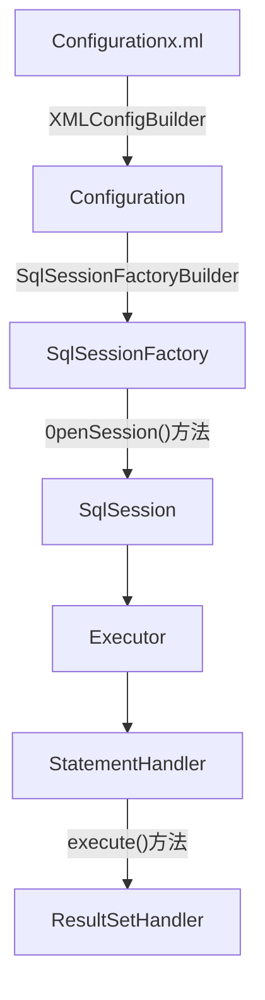

源码分析—先看主干，再看分支

看源码，先看主干，把握主干，然后再看你自己关心的分支。

切记不要沿着源码一直一直点下来，这样很自己容易看蒙。

小技巧：

- 在源码中设置断点，然后按 F5 (进入方法中) 和 F6（向下执行）执行程序
- 在开源框架中，名字一般都是见名知意的，通过名字，可以大概知道方法的作用，从而选择是否跟进读


##  Servlet 源码分析 ##

> 小技巧：使用 Maven 技术可以轻松查看源代码

创建 Maven  的 war 工程，修改 pom.xml  配置文件

```java
<!-- https://mvnrepository.com/artifact/javax.servlet/servlet-api -->
<!-- Servlet API 标准版 2.5-->
<dependency>
    <groupId>javax.servlet</groupId>
    <artifactId>servlet-api</artifactId>
    <version>2.5</version>
    <scope>provided</scope>
</dependency>
```

### Servlet 结构图 ###


### Servlet 接口 ###

在 Servlet 接口中，init 、service 、destory 方法涵盖了 Servlet 整个生命周期，init  方法在 Servlet 初始化调

用，service 方法在客户端请求到服务器处理调用，destory 方法在 Servlet 被销毁时调用。

其中 init 、destory 方法在 Servlet 生命周期中只调用一次，而 service 可以被调用多次。

| 抽象方法                                                     | 作用                                                         |
| ------------------------------------------------------------ | ------------------------------------------------------------ |
| public void init(ServletConfig config)                       | 初始化                                                       |
| public ServletConfig getServletConfig()                      | 获取在 web.xml 配置的初始化信息，注意每个 Servlet 都有自己的 ServletConfig，不共享 |
| public void service(ServletRequest req, ServletResponse res) |                                                              |
| public String getServletInfo();                              | 获取 Servlet 的创建者、版本等信息                            |
| public void destroy();                                       | 销毁                                                         |

Servlet.java:  

```java
package javax.servlet;
import java.io.IOException;


/**
 * Defines methods that all servlets must implement.
 *
 * <p>A servlet is a small Java program that runs within a Web server.
 * Servlets receive and respond to requests from Web clients,
 * usually across HTTP, the HyperText Transfer Protocol. 
 *
 * <p>To implement this interface, you can write a generic servlet
 * that extends
 * <code>javax.servlet.GenericServlet</code> or an HTTP servlet that
 * extends <code>javax.servlet.http.HttpServlet</code>.
 *
 * <p>This interface defines methods to initialize a servlet,
 * to service requests, and to remove a servlet from the server.
 * These are known as life-cycle methods and are called in the
 * following sequence:
 * <ol>
 * <li>The servlet is constructed, then initialized with the <code>init</code> method.
 * <li>Any calls from clients to the <code>service</code> method are handled.
 * <li>The servlet is taken out of service, then destroyed with the 
 * <code>destroy</code> method, then garbage collected and finalized.
 * </ol>
 *
 * <p>In addition to the life-cycle methods, this interface
 * provides the <code>getServletConfig</code> method, which the servlet 
 * can use to get any startup information, and the <code>getServletInfo</code>
 * method, which allows the servlet to return basic information about itself,
 * such as author, version, and copyright.
 *
 * @author 	Various
 *
 * @see 	GenericServlet
 * @see 	javax.servlet.http.HttpServlet
 *
 */


public interface Servlet {

    /**
     * Called by the servlet container to indicate to a servlet that the 
     * servlet is being placed into service.
     *
     * <p>The servlet container calls the <code>init</code>
     * method exactly once after instantiating the servlet.
     * The <code>init</code> method must complete successfully
     * before the servlet can receive any requests.
     *
     * <p>The servlet container cannot place the servlet into service
     * if the <code>init</code> method
     * <ol>
     * <li>Throws a <code>ServletException</code>
     * <li>Does not return within a time period defined by the Web server
     * </ol>
     *
     *
     * @param config			a <code>ServletConfig</code> object 
     *					containing the servlet's
     * 					configuration and initialization parameters
     *
     * @exception ServletException 	if an exception has occurred that
     *					interferes with the servlet's normal
     *					operation
     *
     * @see 				UnavailableException
     * @see 				#getServletConfig
     *
     */

    public void init(ServletConfig config) throws ServletException;
    
    

    /**
     *
     * Returns a {@link ServletConfig} object, which contains
     * initialization and startup parameters for this servlet.
     * The <code>ServletConfig</code> object returned is the one 
     * passed to the <code>init</code> method. 
     *
     * <p>Implementations of this interface are responsible for storing the 
     * <code>ServletConfig</code> object so that this 
     * method can return it. The {@link GenericServlet}
     * class, which implements this interface, already does this.
     *
     * @return		the <code>ServletConfig</code> object
     *			that initializes this servlet
     *
     * @see 		#init
     *
     */

    public ServletConfig getServletConfig();
    
    

    /**
     * Called by the servlet container to allow the servlet to respond to 
     * a request.
     *
     * <p>This method is only called after the servlet's <code>init()</code>
     * method has completed successfully.
     * 
     * <p>  The status code of the response always should be set for a servlet 
     * that throws or sends an error.
     *
     * 
     * <p>Servlets typically run inside multithreaded servlet containers
     * that can handle multiple requests concurrently. Developers must 
     * be aware to synchronize access to any shared resources such as files,
     * network connections, and as well as the servlet's class and instance 
     * variables. 
     * More information on multithreaded programming in Java is available in 
     * <a href="http://java.sun.com/Series/Tutorial/java/threads/multithreaded.html">
     * the Java tutorial on multi-threaded programming</a>.
     *
     *
     * @param req 	the <code>ServletRequest</code> object that contains
     *			the client's request
     *
     * @param res 	the <code>ServletResponse</code> object that contains
     *			the servlet's response
     *
     * @exception ServletException 	if an exception occurs that interferes
     *					with the servlet's normal operation 
     *
     * @exception IOException 		if an input or output exception occurs
     *
     */

    public void service(ServletRequest req, ServletResponse res)
	throws ServletException, IOException;
	
	

    /**
     * Returns information about the servlet, such
     * as author, version, and copyright.
     * 
     * <p>The string that this method returns should
     * be plain text and not markup of any kind (such as HTML, XML,
     * etc.).
     *
     * @return 		a <code>String</code> containing servlet information
     *
     */

    public String getServletInfo();
    
    

    /**
     *
     * Called by the servlet container to indicate to a servlet that the
     * servlet is being taken out of service.  This method is
     * only called once all threads within the servlet's
     * <code>service</code> method have exited or after a timeout
     * period has passed. After the servlet container calls this 
     * method, it will not call the <code>service</code> method again
     * on this servlet.
     *
     * <p>This method gives the servlet an opportunity 
     * to clean up any resources that are being held (for example, memory,
     * file handles, threads) and make sure that any persistent state is
     * synchronized with the servlet's current state in memory.
     *
     */

    public void destroy();
}

```

### ServletConfig 接口 ###

| 抽象方法                                     | 作用                                                         |
| -------------------------------------------- | ------------------------------------------------------------ |
| public String getServletName();              | 返回当前 Servlet 实例的名字<br/>web.xml 中定义的 servlet-name |
| public ServletContext getServletContext();   | 返回 ServletContext 对象<br/>通过 ServletContext 对象，**获取上下文对象**<br/> |
| public String getInitParameter(String name); | 返回 String 类型的*命名初始化参数*的值，<br/>若不存在，返回 null<br/>获取 init-param 中的配置参数 |
| public Enumeration getInitParameterNames();  | 获取配置的所有 init-param 名字集合                           |

注意：ServletConfig 针对是特定的 Servlet ，而 ServletContext 是全局的

```java
package javax.servlet;

import java.util.Enumeration;


/**
 * 
 * A servlet configuration object used by a servlet container
 * to pass information to a servlet during initialization. 
 *
 */
 
public interface ServletConfig {
    

    /**
     * Returns the name of this servlet instance.
     * The name may be provided via server administration, assigned in the 
     * web application deployment descriptor, or for an unregistered (and thus
     * unnamed) servlet instance it will be the servlet's class name.
     *
     * @return		the name of the servlet instance
     *
     *
     *
     */

    public String getServletName();

    /**
     * Returns a reference to the {@link ServletContext} in which the caller
     * is executing.
     *
     *
     * @return		a {@link ServletContext} object, used
     *			by the caller to interact with its servlet 
     *                  container
     * 
     * @see		ServletContext
     *
     */

    public ServletContext getServletContext();
    
    /**
     * Returns a <code>String</code> containing the value of the 
     * named initialization parameter, or <code>null</code> if 
     * the parameter does not exist.
     *
     * @param name	a <code>String</code> specifying the name
     *			of the initialization parameter
     *
     * @return		a <code>String</code> containing the value 
     *			of the initialization parameter
     *
     */

    public String getInitParameter(String name);


    /**
     * Returns the names of the servlet's initialization parameters
     * as an <code>Enumeration</code> of <code>String</code> objects, 
     * or an empty <code>Enumeration</code> if the servlet has
     * no initialization parameters.
     *
     * @return		an <code>Enumeration</code> of <code>String</code> 
     *			objects containing the names of the servlet's 
     *			initialization parameters
     *
     *
     *
     */

    public Enumeration getInitParameterNames();


}

```

### GenericServlet 抽象类 ###

GenericServlet 是 Servlet 默认实现，是与具体协议无关(protocol-independent)。为了后面的扩展方便。

| 方法                                                         | 作用                        |
| ------------------------------------------------------------ | --------------------------- |
| public GenericServlet()                                      | 对象 初始化                 |
| public void destroy()                                        | 销毁                        |
| public String getInitParameter(String name)                  |                             |
| public Enumeration getInitParameterNames()                   |                             |
| public ServletConfig getServletConfig()                      | 获取 ServletConfig 配置信息 |
| public ServletContext getServletContext()                    | 获取 ServletContext 上下文  |
| String getServletName()                                      | 获取当前 Servlet 的名字     |
| public abstract void service(ServletRequest req, ServletResponse res) | 针对具体协议，让子类实现    |


```java
package javax.servlet;

import java.io.IOException;
import java.util.Enumeration;
import java.util.ResourceBundle;

/**
 *
 * Defines a generic, protocol-independent
 * servlet. To write an HTTP servlet for use on the
 * Web, extend {@link javax.servlet.http.HttpServlet} instead.
 *
 * <p><code>GenericServlet</code> implements the <code>Servlet</code>
 * and <code>ServletConfig</code> interfaces. <code>GenericServlet</code>
 * may be directly extended by a servlet, although it's more common to extend
 * a protocol-specific subclass such as <code>HttpServlet</code>.
 *
 * <p><code>GenericServlet</code> makes writing servlets
 * easier. It provides simple versions of the lifecycle methods 
 * <code>init</code> and <code>destroy</code> and of the methods 
 * in the <code>ServletConfig</code> interface. <code>GenericServlet</code>
 * also implements the <code>log</code> method, declared in the
 * <code>ServletContext</code> interface. 
 *
 * <p>To write a generic servlet, you need only
 * override the abstract <code>service</code> method. 
 *
 *
 * @author 	Various
 */

 
public abstract class GenericServlet 
    implements Servlet, ServletConfig, java.io.Serializable
{
    private static final String LSTRING_FILE = "javax.servlet.LocalStrings";
    private static ResourceBundle lStrings =
        ResourceBundle.getBundle(LSTRING_FILE);

    private transient ServletConfig config;
    

    /**
     *
     * Does nothing. All of the servlet initialization
     * is done by one of the <code>init</code> methods.
     *
     */

    public GenericServlet() { }
    
    
    
   /**
     * Called by the servlet container to indicate to a servlet that the
     * servlet is being taken out of service.  See {@link Servlet#destroy}.
     *
     * 
     */

    public void destroy() {
    }
    
    
    
    /**
     * Returns a <code>String</code> containing the value of the named
     * initialization parameter, or <code>null</code> if the parameter does
     * not exist.  See {@link ServletConfig#getInitParameter}.
     *
     * <p>This method is supplied for convenience. It gets the 
     * value of the named parameter from the servlet's 
     * <code>ServletConfig</code> object.
     *
     * @param name 		a <code>String</code> specifying the name 
     *				of the initialization parameter
     *
     * @return String 		a <code>String</code> containing the value
     *				of the initialization parameter
     *
     */ 

    public String getInitParameter(String name) {
        ServletConfig sc = getServletConfig();
        if (sc == null) {
            throw new IllegalStateException(
                lStrings.getString("err.servlet_config_not_initialized"));
        }

        return sc.getInitParameter(name);
    }
    
    

   /**
    * Returns the names of the servlet's initialization parameters 
    * as an <code>Enumeration</code> of <code>String</code> objects,
    * or an empty <code>Enumeration</code> if the servlet has no
    * initialization parameters.  See {@link
    * ServletConfig#getInitParameterNames}.
    *
    * <p>This method is supplied for convenience. It gets the 
    * parameter names from the servlet's <code>ServletConfig</code> object. 
    *
    *
    * @return Enumeration 	an enumeration of <code>String</code>
    *				objects containing the names of 
    *				the servlet's initialization parameters
    *
    */

    public Enumeration getInitParameterNames() {
        ServletConfig sc = getServletConfig();
        if (sc == null) {
            throw new IllegalStateException(
                lStrings.getString("err.servlet_config_not_initialized"));
        }

        return sc.getInitParameterNames();
    }   
    
     
 
     

    /**
     * Returns this servlet's {@link ServletConfig} object.
     *
     * @return ServletConfig 	the <code>ServletConfig</code> object
     *				that initialized this servlet
     *
     */
    
    public ServletConfig getServletConfig() {
	return config;
    }
    
    
 
    
    /**
     * Returns a reference to the {@link ServletContext} in which this servlet
     * is running.  See {@link ServletConfig#getServletContext}.
     *
     * <p>This method is supplied for convenience. It gets the 
     * context from the servlet's <code>ServletConfig</code> object.
     *
     *
     * @return ServletContext 	the <code>ServletContext</code> object
     *				passed to this servlet by the <code>init</code>
     *				method
     *
     */

    public ServletContext getServletContext() {
        ServletConfig sc = getServletConfig();
        if (sc == null) {
            throw new IllegalStateException(
                lStrings.getString("err.servlet_config_not_initialized"));
        }

        return sc.getServletContext();
    }


 

    /**
     * Returns information about the servlet, such as 
     * author, version, and copyright. 
     * By default, this method returns an empty string.  Override this method
     * to have it return a meaningful value.  See {@link
     * Servlet#getServletInfo}.
     *
     *
     * @return String 		information about this servlet, by default an
     * 				empty string
     *
     */
    
    public String getServletInfo() {
	return "";
    }


    /**
     *
     * Called by the servlet container to indicate to a servlet that the
     * servlet is being placed into service.  See {@link Servlet#init}.
     *
     * <p>This implementation stores the {@link ServletConfig}
     * object it receives from the servlet container for later use.
     * When overriding this form of the method, call 
     * <code>super.init(config)</code>.
     *
     * @param config 			the <code>ServletConfig</code> object
     *					that contains configutation
     *					information for this servlet
     *
     * @exception ServletException 	if an exception occurs that
     *					interrupts the servlet's normal
     *					operation
     *
     * 
     * @see 				UnavailableException
     *
     */

    public void init(ServletConfig config) throws ServletException {
	this.config = config;
	this.init();
    }


    /**
     *
     * A convenience method which can be overridden so that there's no need
     * to call <code>super.init(config)</code>.
     *
     * <p>Instead of overriding {@link #init(ServletConfig)}, simply override
     * this method and it will be called by
     * <code>GenericServlet.init(ServletConfig config)</code>.
     * The <code>ServletConfig</code> object can still be retrieved via {@link
     * #getServletConfig}. 
     *
     * @exception ServletException 	if an exception occurs that
     *					interrupts the servlet's
     *					normal operation
     *
     */
    
    public void init() throws ServletException {

    }
    


    /**
     * 
     * Writes the specified message to a servlet log file, prepended by the
     * servlet's name.  See {@link ServletContext#log(String)}.
     *
     * @param msg 	a <code>String</code> specifying
     *			the message to be written to the log file
     *
     */
     
    public void log(String msg) {
	getServletContext().log(getServletName() + ": "+ msg);
    }
   
   
   
   
    /**
     * Writes an explanatory message and a stack trace
     * for a given <code>Throwable</code> exception
     * to the servlet log file, prepended by the servlet's name.
     * See {@link ServletContext#log(String, Throwable)}.
     *
     *
     * @param message 		a <code>String</code> that describes
     *				the error or exception
     *
     * @param t			the <code>java.lang.Throwable</code> error
     * 				or exception
     *
     *
     */
   
    public void log(String message, Throwable t) {
	getServletContext().log(getServletName() + ": " + message, t);
    }
    
    
    
    /**
     * Called by the servlet container to allow the servlet to respond to
     * a request.  See {@link Servlet#service}.
     * 
     * <p>This method is declared abstract so subclasses, such as 
     * <code>HttpServlet</code>, must override it.
     *
     *
     *
     * @param req 	the <code>ServletRequest</code> object
     *			that contains the client's request
     *
     * @param res 	the <code>ServletResponse</code> object
     *			that will contain the servlet's response
     *
     * @exception ServletException 	if an exception occurs that
     *					interferes with the servlet's
     *					normal operation occurred
     *
     * @exception IOException 		if an input or output
     *					exception occurs
     *
     */

    public abstract void service(ServletRequest req, ServletResponse res)
	throws ServletException, IOException;
    


    /**
     * Returns the name of this servlet instance.
     * See {@link ServletConfig#getServletName}.
     *
     * @return          the name of this servlet instance
     *
     *
     *
     */

    public String getServletName() {
        ServletConfig sc = getServletConfig();
        if (sc == null) {
            throw new IllegalStateException(
                lStrings.getString("err.servlet_config_not_initialized"));
        }

        return sc.getServletName();
    }
}

```

### 基于协议 HttpServlet ###

HttpServlet 是**抽象类**，可以有构造方法，但是不能被实例化。

HttpServlet 中有两个 service 方法，这里用到 Java 的方法的重载，一个 service 方法用于将 ServletRequest 对象和 ServletResponse 对象向下转型为 HttpServletRequest 对象和 HttpServletResponse 对象。别一个 service 方法用于调用子类的 doXXX 方法，而不是调用自己的 doXXX 方法，这里用到的 Java 的多态。

```java
public abstract class HttpServlet extends GenericServlet
implements java.io.Serializable
{
    private static final String METHOD_GET = "GET";
    private static final String METHOD_POST = "POST";
......
/*** Does nothing, because this is an abstract class. * 抽象类 HttpServlet 有一个构造函数，但是空的，什么都没有
*/
public HttpServlet() { }
/*分别执行 doGet,doPost,doOpitions,doHead,doPut,doTrace 方法
在请求响应服务方法 service()中，根据请求类型，分别调用这些 doXXXX 方法
所以自己写的 Servlet 只需要根据请求类型覆盖响应的 doXXX 方法即可。
*/
//doXXXX 方法开始
protected void doGet(HttpServletRequest req, HttpServletResponse resp)
throws ServletException, IOException
{
    String protocol = req.getProtocol();
    String msg = lStrings.getString("http.method_get_not_supported");
	if (protocol.endsWith("1.1")) {
	resp.sendError(HttpServletResponse.SC_METHOD_NOT_ALLOWEDmsg);
	} else {
	resp.sendError(HttpServletResponse.SC_BAD_REQUEST, msg)}
}

protected void doHead(HttpServletRequest req, HttpServletResponse resp)
throws ServletException, IOException
{....... }

protected void doPost(HttpServletRequest req, HttpServletResponse resp)
throws ServletException, IOException
{
    String protocol = req.getProtocol();
    String msg = lStrings.getString("http.method_post_not_supported");
    if (protocol.endsWith("1.1")) {
    resp.sendError(HttpServletResponse.SC_METHOD_NOT_ALLOWEDmsg);
    } else {
    resp.sendError(HttpServletResponse.SC_BAD_REQUEST, msg)}
    }protected void doPut(HttpServletRequest req, HttpServletResponse resp)
    throws ServletException, IOException {
    //todo
}

protected void doOptions(HttpServletRequest req, HttpServletResponse resp)
throws ServletException, IOException {
	//todo
}

protected void doTrace(HttpServletRequest req, HttpServletResponse resp)
throws ServletException, IOException {
	//todo
}

protected void doDelete(HttpServletRequest req, HttpServletResponse resp)
throws ServletException, IOException {
	//todo
}
//doXXXX 方法结束

//重载的 service(args0,args1)方法
protected void service(HttpServletRequest req, HttpServletResponse resp)
throws ServletException, IOException
{
    String method = req.getMethod();
    if (method.equals(METHOD_GET)) {
    long lastModified = getLastModified(req);
    if (lastModified == -1) {
        // servlet doesn't support if-modified-since, no reason
        // to go through further expensive logic
        doGet(req, resp);
    } else {
    long ifModifiedSince = req.getDateHeader(HEADER_IFMODSINCE);
    if (ifModifiedSince < (lastModified / 1000 * 1000)) {
        // If the servlet mod time is later, call doGet()
        // Round down to the nearest second for a proper compare
        // A ifModifiedSince of -1 will always be less
        maybeSetLastModified(resp, lastModified);
   		 doGet(req, resp);
    } else {resp.setStatus(HttpServletResponse.SC_NOT_MODIFIED);
    }
    }
    } else if (method.equals(METHOD_HEAD)) {
        long lastModified = getLastModified(req);
        maybeSetLastModified(resp, lastModified);
        doHead(req, resp);
    } else if (method.equals(METHOD_POST)) {
	    doPost(req, resp);
    } else if (method.equals(METHOD_PUT)) {
  	  doPut(req, resp);
    } else if (method.equals(METHOD_DELETE)) {
    doDelete(req, resp);
    } else if (method.equals(METHOD_OPTIONS)) {
    doOptions(req,resp);
    } else if (method.equals(METHOD_TRACE)) {
    doTrace(req,resp);
    } else {
        //
        // Note that this means NO servlet supports whatever
        // method was requested, anywhere on this server. //
        String errMsg = lStrings.getString("http.method_not_implemented");
        Object[] errArgs = new Object[1];
        errArgs[0] = method;
        errMsg = MessageFormat.format(errMsg, errArgs);
        resp.sendError(HttpServletResponse.SC_NOT_IMPLEMENTED, errMsg)}
}

//实现父类的 service(ServletRequest req,ServletResponse res)方法
// 通 过 参 数 的 向 下 转 型 ， 然 后 调 用 重 载 的
//service(HttpservletRequest,HttpServletResponse)方法
public void service(ServletRequest req, ServletResponse res)
throws ServletException, IOException
{
    HttpServletRequest request;
    HttpServletResponse response;
    try {
    request = (HttpServletRequest) req; //向下转型
    response = (HttpServletResponse) res; //参数向下转型
    } catch (ClassCastException e) {
    throw new ServletException("non-HTTP request or response");
}
service(request, response); //调用重载的 service()方法
}
......//其他方法
}
```

## Tomcat 源码分析 ##

### tomcat 架构图 ###


```xml
<?xml version="1.0" encoding="UTF-8"?>
<Server port="8005" shutdown="SHUTDOWN">
    
 <Listener SSLEngine="on" className="org.apache.catalina.core.AprLifecycleListener"/>

  <Listener className="org.apache.catalina.core.JasperListener"/>
  <Listener className="org.apache.catalina.core.JreMemoryLeakPreventionListener"/>
  <Listener className="org.apache.catalina.mbeans.GlobalResourcesLifecycleListener"/>
  <Listener className="org.apache.catalina.core.ThreadLocalLeakPreventionListener"/>

  <GlobalNamingResources>
  
 <Resource auth="Container" description="User database that can be updated and saved" factory="org.apache.catalina.users.MemoryUserDatabaseFactory" name="UserDatabase" pathname="conf/tomcat-users.xml" type="org.apache.catalina.UserDatabase"/>
  </GlobalNamingResources>

  <Service name="Catalina">

 
<Connector connectionTimeout="20000" port="8888" protocol="HTTP/1.1" redirectPort="8443" URIEncoding="UTF-8"/>
  
    <Connector port="8009" protocol="AJP/1.3" redirectPort="8443"/>
  
    <Engine defaultHost="localhost" name="Catalina">
 
      <Realm className="org.apache.catalina.realm.LockOutRealm">
      <Realm className="org.apache.catalina.realm.UserDatabaseRealm" resourceName="UserDatabase"/>
      </Realm>

      <Host appBase="webapps" autoDeploy="true" name="localhost" unpackWARs="true">
       
     <Valve className="org.apache.catalina.valves.AccessLogValve" directory="logs" pattern="%h %l %u %t &quot;%r&quot; %s %b" prefix="localhost_access_log." suffix=".txt"/>

</Host>
    </Engine>
  </Service>
</Server>
```

### 启动文件 ###

#### startup.bat ####

rem  表示注释

echo 用于控制台输出

set 用于设置变量的值

goto 跳转指令，跳转到  以 ：开头的位置，继续往下执行

```bat
@echo off
rem Licensed to the Apache Software Foundation (ASF) under one or more
rem contributor license agreements.  See the NOTICE file distributed with
rem this work for additional information regarding copyright ownership.
rem The ASF licenses this file to You under the Apache License, Version 2.0
rem (the "License"); you may not use this file except in compliance with
rem the License.  You may obtain a copy of the License at
rem
rem     http://www.apache.org/licenses/LICENSE-2.0
rem
rem Unless required by applicable law or agreed to in writing, software
rem distributed under the License is distributed on an "AS IS" BASIS,
rem WITHOUT WARRANTIES OR CONDITIONS OF ANY KIND, either express or implied.
rem See the License for the specific language governing permissions and
rem limitations under the License.

rem ---------------------------------------------------------------------------
rem Start script for the CATALINA Server
rem ---------------------------------------------------------------------------

setlocal

rem Guess CATALINA_HOME if not defined
set "CURRENT_DIR=%cd%"
if not "%CATALINA_HOME%" == "" goto gotHome
set "CATALINA_HOME=%CURRENT_DIR%"
if exist "%CATALINA_HOME%\bin\catalina.bat" goto okHome
cd ..
set "CATALINA_HOME=%cd%"
cd "%CURRENT_DIR%"
:gotHome
if exist "%CATALINA_HOME%\bin\catalina.bat" goto okHome
echo The CATALINA_HOME environment variable is not defined correctly
echo This environment variable is needed to run this program
goto end
:okHome

set "EXECUTABLE=%CATALINA_HOME%\bin\catalina.bat"

rem Check that target executable exists
if exist "%EXECUTABLE%" goto okExec
echo Cannot find "%EXECUTABLE%"
echo This file is needed to run this program
goto end
:okExec

rem Get remaining unshifted command line arguments and save them in the
set CMD_LINE_ARGS=
:setArgs
if ""%1""=="""" goto doneSetArgs
set CMD_LINE_ARGS=%CMD_LINE_ARGS% %1
shift
goto setArgs
:doneSetArgs

call "%EXECUTABLE%" start %CMD_LINE_ARGS%

:end

```

通过执行 startup.bat  批处理脚本，调用 catalina.bat 并携带参数 start 启动。

#### catalina.bat ####

del /Q  文件名      静默删除文件

```bat
@echo off
rem Licensed to the Apache Software Foundation (ASF) under one or more
rem contributor license agreements.  See the NOTICE file distributed with
rem this work for additional information regarding copyright ownership.
rem The ASF licenses this file to You under the Apache License, Version 2.0
rem (the "License"); you may not use this file except in compliance with
rem the License.  You may obtain a copy of the License at
rem
rem     http://www.apache.org/licenses/LICENSE-2.0
rem
rem Unless required by applicable law or agreed to in writing, software
rem distributed under the License is distributed on an "AS IS" BASIS,
rem WITHOUT WARRANTIES OR CONDITIONS OF ANY KIND, either express or implied.
rem See the License for the specific language governing permissions and
rem limitations under the License.

rem ---------------------------------------------------------------------------
rem Start/Stop Script for the CATALINA Server
rem
rem Environment Variable Prerequisites
rem
rem   Do not set the variables in this script. Instead put them into a script
rem   setenv.bat in CATALINA_BASE/bin to keep your customizations separate.
rem
rem   CATALINA_HOME   May point at your Catalina "build" directory.
rem
rem   CATALINA_BASE   (Optional) Base directory for resolving dynamic portions
rem                   of a Catalina installation.  If not present, resolves to
rem                   the same directory that CATALINA_HOME points to.
rem
rem   CATALINA_OPTS   (Optional) Java runtime options used when the "start",
rem                   "run" or "debug" command is executed.
rem                   Include here and not in JAVA_OPTS all options, that should
rem                   only be used by Tomcat itself, not by the stop process,
rem                   the version command etc.
rem                   Examples are heap size, GC logging, JMX ports etc.
rem
rem   CATALINA_TMPDIR (Optional) Directory path location of temporary directory
rem                   the JVM should use (java.io.tmpdir).  Defaults to
rem                   %CATALINA_BASE%\temp.
rem
rem   JAVA_HOME       Must point at your Java Development Kit installation.
rem                   Required to run the with the "debug" argument.
rem
rem   JRE_HOME        Must point at your Java Runtime installation.
rem                   Defaults to JAVA_HOME if empty. If JRE_HOME and JAVA_HOME
rem                   are both set, JRE_HOME is used.
rem
rem   JAVA_OPTS       (Optional) Java runtime options used when any command
rem                   is executed.
rem                   Include here and not in CATALINA_OPTS all options, that
rem                   should be used by Tomcat and also by the stop process,
rem                   the version command etc.
rem                   Most options should go into CATALINA_OPTS.
rem
rem   JAVA_ENDORSED_DIRS (Optional) Lists of of semi-colon separated directories
rem                   containing some jars in order to allow replacement of APIs
rem                   created outside of the JCP (i.e. DOM and SAX from W3C).
rem                   It can also be used to update the XML parser implementation.
rem                   Defaults to $CATALINA_HOME/endorsed.
rem
rem   JPDA_TRANSPORT  (Optional) JPDA transport used when the "jpda start"
rem                   command is executed. The default is "dt_socket".
rem
rem   JPDA_ADDRESS    (Optional) Java runtime options used when the "jpda start"
rem                   command is executed. The default is 8000.
rem
rem   JPDA_SUSPEND    (Optional) Java runtime options used when the "jpda start"
rem                   command is executed. Specifies whether JVM should suspend
rem                   execution immediately after startup. Default is "n".
rem
rem   JPDA_OPTS       (Optional) Java runtime options used when the "jpda start"
rem                   command is executed. If used, JPDA_TRANSPORT, JPDA_ADDRESS,
rem                   and JPDA_SUSPEND are ignored. Thus, all required jpda
rem                   options MUST be specified. The default is:
rem
rem                   -agentlib:jdwp=transport=%JPDA_TRANSPORT%,
rem                       address=%JPDA_ADDRESS%,server=y,suspend=%JPDA_SUSPEND%
rem
rem   LOGGING_CONFIG  (Optional) Override Tomcat's logging config file
rem                   Example (all one line)
rem                   set LOGGING_CONFIG="-Djava.util.logging.config.file=%CATALINA_BASE%\conf\logging.properties"
rem
rem   LOGGING_MANAGER (Optional) Override Tomcat's logging manager
rem                   Example (all one line)
rem                   set LOGGING_MANAGER="-Djava.util.logging.manager=org.apache.juli.ClassLoaderLogManager"
rem
rem   TITLE           (Optional) Specify the title of Tomcat window. The default
rem                   TITLE is Tomcat if it's not specified.
rem                   Example (all one line)
rem                   set TITLE=Tomcat.Cluster#1.Server#1 [%DATE% %TIME%]
rem ---------------------------------------------------------------------------

setlocal

rem Suppress Terminate batch job on CTRL+C
if not ""%1"" == ""run"" goto mainEntry
if "%TEMP%" == "" goto mainEntry
if exist "%TEMP%\%~nx0.run" goto mainEntry
echo Y>"%TEMP%\%~nx0.run"
if not exist "%TEMP%\%~nx0.run" goto mainEntry
echo Y>"%TEMP%\%~nx0.Y"
call "%~f0" %* <"%TEMP%\%~nx0.Y"
rem Use provided errorlevel
set RETVAL=%ERRORLEVEL%
del /Q "%TEMP%\%~nx0.Y" >NUL 2>&1
exit /B %RETVAL%
:mainEntry
del /Q "%TEMP%\%~nx0.run" >NUL 2>&1

rem Guess CATALINA_HOME if not defined
set "CURRENT_DIR=%cd%"
if not "%CATALINA_HOME%" == "" goto gotHome
set "CATALINA_HOME=%CURRENT_DIR%"
if exist "%CATALINA_HOME%\bin\catalina.bat" goto okHome
cd ..
set "CATALINA_HOME=%cd%"
cd "%CURRENT_DIR%"
:gotHome

if exist "%CATALINA_HOME%\bin\catalina.bat" goto okHome
echo The CATALINA_HOME environment variable is not defined correctly
echo This environment variable is needed to run this program
goto end
:okHome

rem Copy CATALINA_BASE from CATALINA_HOME if not defined
if not "%CATALINA_BASE%" == "" goto gotBase
set "CATALINA_BASE=%CATALINA_HOME%"
:gotBase

rem Ensure that any user defined CLASSPATH variables are not used on startup,
rem but allow them to be specified in setenv.bat, in rare case when it is needed.
set CLASSPATH=

rem Get standard environment variables
if not exist "%CATALINA_BASE%\bin\setenv.bat" goto checkSetenvHome
call "%CATALINA_BASE%\bin\setenv.bat"
goto setenvDone
:checkSetenvHome
if exist "%CATALINA_HOME%\bin\setenv.bat" call "%CATALINA_HOME%\bin\setenv.bat"
:setenvDone

rem Get standard Java environment variables
if exist "%CATALINA_HOME%\bin\setclasspath.bat" goto okSetclasspath
echo Cannot find "%CATALINA_HOME%\bin\setclasspath.bat"
echo This file is needed to run this program
goto end
:okSetclasspath
call "%CATALINA_HOME%\bin\setclasspath.bat" %1
if errorlevel 1 goto end

rem Add on extra jar file to CLASSPATH
rem Note that there are no quotes as we do not want to introduce random
rem quotes into the CLASSPATH
if "%CLASSPATH%" == "" goto emptyClasspath
set "CLASSPATH=%CLASSPATH%;"
:emptyClasspath
set "CLASSPATH=%CLASSPATH%%CATALINA_HOME%\bin\bootstrap.jar"

if not "%CATALINA_TMPDIR%" == "" goto gotTmpdir
set "CATALINA_TMPDIR=%CATALINA_BASE%\temp"
:gotTmpdir

rem Add tomcat-juli.jar to classpath
rem tomcat-juli.jar can be over-ridden per instance
if not exist "%CATALINA_BASE%\bin\tomcat-juli.jar" goto juliClasspathHome
set "CLASSPATH=%CLASSPATH%;%CATALINA_BASE%\bin\tomcat-juli.jar"
goto juliClasspathDone
:juliClasspathHome
set "CLASSPATH=%CLASSPATH%;%CATALINA_HOME%\bin\tomcat-juli.jar"
:juliClasspathDone

if not "%LOGGING_CONFIG%" == "" goto noJuliConfig
set LOGGING_CONFIG=-Dnop
if not exist "%CATALINA_BASE%\conf\logging.properties" goto noJuliConfig
set LOGGING_CONFIG=-Djava.util.logging.config.file="%CATALINA_BASE%\conf\logging.properties"
:noJuliConfig
set JAVA_OPTS=%JAVA_OPTS% %LOGGING_CONFIG%

if not "%LOGGING_MANAGER%" == "" goto noJuliManager
set LOGGING_MANAGER=-Djava.util.logging.manager=org.apache.juli.ClassLoaderLogManager
:noJuliManager
set JAVA_OPTS=%JAVA_OPTS% %LOGGING_MANAGER%

rem ----- Execute The Requested Command ---------------------------------------

echo Using CATALINA_BASE:   "%CATALINA_BASE%"
echo Using CATALINA_HOME:   "%CATALINA_HOME%"
echo Using CATALINA_TMPDIR: "%CATALINA_TMPDIR%"
if ""%1"" == ""debug"" goto use_jdk
echo Using JRE_HOME:        "%JRE_HOME%"
goto java_dir_displayed
:use_jdk
echo Using JAVA_HOME:       "%JAVA_HOME%"
:java_dir_displayed
echo Using CLASSPATH:       "%CLASSPATH%"

set _EXECJAVA=%_RUNJAVA%
set MAINCLASS=org.apache.catalina.startup.Bootstrap
set ACTION=start
set SECURITY_POLICY_FILE=
set DEBUG_OPTS=
set JPDA=

if not ""%1"" == ""jpda"" goto noJpda
set JPDA=jpda
if not "%JPDA_TRANSPORT%" == "" goto gotJpdaTransport
set JPDA_TRANSPORT=dt_socket
:gotJpdaTransport
if not "%JPDA_ADDRESS%" == "" goto gotJpdaAddress
set JPDA_ADDRESS=8000
:gotJpdaAddress
if not "%JPDA_SUSPEND%" == "" goto gotJpdaSuspend
set JPDA_SUSPEND=n
:gotJpdaSuspend
if not "%JPDA_OPTS%" == "" goto gotJpdaOpts
set JPDA_OPTS=-agentlib:jdwp=transport=%JPDA_TRANSPORT%,address=%JPDA_ADDRESS%,server=y,suspend=%JPDA_SUSPEND%n 
:gotJpdaOpts
shift
:noJpda

if ""%1"" == ""debug"" goto doDebug
if ""%1"" == ""run"" goto doRun
if ""%1"" == ""start"" goto doStart
if ""%1"" == ""stop"" goto doStop
if ""%1"" == ""configtest"" goto doConfigTest
if ""%1"" == ""version"" goto doVersion

echo Usage:  catalina ( commands ... )
echo commands:
echo   debug             Start Catalina in a debugger
echo   debug -security   Debug Catalina with a security manager
echo   jpda start        Start Catalina under JPDA debugger
echo   run               Start Catalina in the current window
echo   run -security     Start in the current window with security manager
echo   start             Start Catalina in a separate window
echo   start -security   Start in a separate window with security manager
echo   stop              Stop Catalina
echo   configtest        Run a basic syntax check on server.xml
echo   version           What version of tomcat are you running?
goto end

:doDebug
shift
set _EXECJAVA=%_RUNJDB%
set DEBUG_OPTS=-sourcepath "%CATALINA_HOME%\..\..\java"
if not ""%1"" == ""-security"" goto execCmd
shift
echo Using Security Manager
set "SECURITY_POLICY_FILE=%CATALINA_BASE%\conf\catalina.policy"
goto execCmd

:doRun
shift
if not ""%1"" == ""-security"" goto execCmd
shift
echo Using Security Manager
set "SECURITY_POLICY_FILE=%CATALINA_BASE%\conf\catalina.policy"
goto execCmd

:doStart
shift
if "%TITLE%" == "" set TITLE=Tomcat
set _EXECJAVA=start "%TITLE%" %_RUNJAVA%
if not ""%1"" == ""-security"" goto execCmd
shift
echo Using Security Manager
set "SECURITY_POLICY_FILE=%CATALINA_BASE%\conf\catalina.policy"
goto execCmd

:doStop
shift
set ACTION=stop
set CATALINA_OPTS=
goto execCmd

:doConfigTest
shift
set ACTION=configtest
set CATALINA_OPTS=
goto execCmd

:doVersion
%_EXECJAVA% -classpath "%CATALINA_HOME%\lib\catalina.jar" org.apache.catalina.util.ServerInfo
goto end


:execCmd
rem Get remaining unshifted command line arguments and save them in the
set CMD_LINE_ARGS=
:setArgs
if ""%1""=="""" goto doneSetArgs
set CMD_LINE_ARGS=%CMD_LINE_ARGS% %1
shift
goto setArgs
:doneSetArgs

rem Execute Java with the applicable properties
if not "%JPDA%" == "" goto doJpda
if not "%SECURITY_POLICY_FILE%" == "" goto doSecurity
%_EXECJAVA% %JAVA_OPTS% %CATALINA_OPTS% %DEBUG_OPTS% -Djava.endorsed.dirs="%JAVA_ENDORSED_DIRS%" -classpath "%CLASSPATH%" -Dcatalina.base="%CATALINA_BASE%" -Dcatalina.home="%CATALINA_HOME%" -Djava.io.tmpdir="%CATALINA_TMPDIR%" %MAINCLASS% %CMD_LINE_ARGS% %ACTION%
goto end
:doSecurity
%_EXECJAVA% %JAVA_OPTS% %CATALINA_OPTS% %DEBUG_OPTS% -Djava.endorsed.dirs="%JAVA_ENDORSED_DIRS%" -classpath "%CLASSPATH%" -Djava.security.manager -Djava.security.policy=="%SECURITY_POLICY_FILE%" -Dcatalina.base="%CATALINA_BASE%" -Dcatalina.home="%CATALINA_HOME%" -Djava.io.tmpdir="%CATALINA_TMPDIR%" %MAINCLASS% %CMD_LINE_ARGS% %ACTION%
goto end
:doJpda
if not "%SECURITY_POLICY_FILE%" == "" goto doSecurityJpda
%_EXECJAVA% %JAVA_OPTS% %CATALINA_OPTS% %JPDA_OPTS% %DEBUG_OPTS% -Djava.endorsed.dirs="%JAVA_ENDORSED_DIRS%" -classpath "%CLASSPATH%" -Dcatalina.base="%CATALINA_BASE%" -Dcatalina.home="%CATALINA_HOME%" -Djava.io.tmpdir="%CATALINA_TMPDIR%" %MAINCLASS% %CMD_LINE_ARGS% %ACTION%
goto end
:doSecurityJpda
%_EXECJAVA% %JAVA_OPTS% %CATALINA_OPTS% %JPDA_OPTS% %DEBUG_OPTS% -Djava.endorsed.dirs="%JAVA_ENDORSED_DIRS%" -classpath "%CLASSPATH%" -Djava.security.manager -Djava.security.policy=="%SECURITY_POLICY_FILE%" -Dcatalina.base="%CATALINA_BASE%" -Dcatalina.home="%CATALINA_HOME%" -Djava.io.tmpdir="%CATALINA_TMPDIR%" %MAINCLASS% %CMD_LINE_ARGS% %ACTION%
goto end

:end

```

找到 `BootStrap.jar`,并启动 ` org.apache.catalina.startup.Bootstrap `类的 main 方法

```bat
set "CLASSPATH=%CLASSPATH%%CATALINA_HOME%\bin\bootstrap.jar"
set MAINCLASS=org.apache.catalina.startup.Bootstrap
set ACTION=start
```


### `BootStrap.java` ###

**导入 Tomcat 源码到 Eclipse 中**

- 新建一个 Java 项目
- 右击项目名选择 import -> general -> File System -> 选择解压后的 tomcat 源码包
- 点击OK，tomcat 源码就被导入 Eclipse 中 。

##### **main() 方法** #####

```java
 /**
     * Main method, used for testing only.
     *
     * @param args Command line arguments to be processed
     */
    public static void main(String args[]) {

        if (daemon == null) {
            daemon = new Bootstrap();
            try {
                daemon.init();
            } catch (Throwable t) {
                t.printStackTrace();
                return;
            }
        }

        try {
            String command = "start";
            if (args.length > 0) {
                command = args[args.length - 1];
            }

            if (command.equals("startd")) {
                args[0] = "start";
                daemon.load(args);
                daemon.start();
            } else if (command.equals("stopd")) {
                args[0] = "stop";
                daemon.stop();
            } else if (command.equals("start")) {
                daemon.setAwait(true);
                daemon.load(args);
                daemon.start();
            } else if (command.equals("stop")) {
                daemon.stopServer(args);
            } else {
                log.warn("Bootstrap: command \"" + command + "\" does not exist.");
            }
        } catch (Throwable t) {
            t.printStackTrace();
        }

    }
```

##### **`init() `方法** #####

类加载器：用于加载 `.class` 字节码文件到 Java 虚拟机中，并将其转为` java.lang.Class` 类的一个实例（表示一个 Java 对象），通过此实例的  `newInstance`  方法获取该类的对象。

通过 `ClassLoader` 类加载器获取  Catalina 类的Class 类型的对象，通过该对象创建 Catalina 对象实例

```java
    /**
     * Initialize daemon.
     */
    public void init()
        throws Exception
    {

        // Set Catalina path
        setCatalinaHome();
        setCatalinaBase();

        initClassLoaders();

        Thread.currentThread().setContextClassLoader(catalinaLoader);

        SecurityClassLoad.securityClassLoad(catalinaLoader);

        // Load our startup class and call its process() method
        if (log.isDebugEnabled())
            log.debug("Loading startup class");
        Class startupClass =
            catalinaLoader.loadClass
            ("org.apache.catalina.startup.Catalina");
        Object startupInstance = startupClass.newInstance();

        // Set the shared extensions class loader
        if (log.isDebugEnabled())
            log.debug("Setting startup class properties");
        String methodName = "setParentClassLoader";
        Class paramTypes[] = new Class[1];
        paramTypes[0] = Class.forName("java.lang.ClassLoader");
        Object paramValues[] = new Object[1];
        paramValues[0] = sharedLoader;
        Method method =
            startupInstance.getClass().getMethod(methodName, paramTypes);
        method.invoke(startupInstance, paramValues);

        catalinaDaemon = startupInstance;

    }
```

##### load() 方法 #####

```java
 /**
     * Load daemon.
     */
private void load(String[] arguments)
    throws Exception {

    // Call the load() method
    String methodName = "load";
    Object param[];
    Class paramTypes[];
    if (arguments==null || arguments.length==0) {
        paramTypes = null;
        param = null;
    } else {
        paramTypes = new Class[1];
        paramTypes[0] = arguments.getClass();
        param = new Object[1];
        param[0] = arguments;
    }
    Method method = 
        catalinaDaemon.getClass().getMethod(methodName, paramTypes);
    if (log.isDebugEnabled())
        log.debug("Calling startup class " + method);
    method.invoke(catalinaDaemon, param);

}
```

##### start()  方法 #####

```java
 /**
     * Start the Catalina daemon.
     */
    public void start()
        throws Exception {
        if( catalinaDaemon==null ) init();

  Method method = catalinaDaemon.getClass().getMethod("start", (Class [] )null);
        method.invoke(catalinaDaemon, (Object [])null);

    }
```

### `Catalina.java` ###

##### start() 方法 #####

`demon.start()` 方法会调用 Catalina 的 start 方法 

Catalina 实例执行 start 方法。这里有两个点，一个是 load()加载 `server.xml` 配置、初始化 Server 的过程，一个是 `getServer().start()`开启服务、初始化并开启一系列组件、子容器的 过程 

```java
 /**
     * Start a new server instance.
     */
    public void start() {

        if (server == null) {
            load();
        }

        long t1 = System.currentTimeMillis();

        // Start the new server
        if (server instanceof Lifecycle) {
            try {
                ((Lifecycle) server).start();
            } catch (LifecycleException e) {
                log.error("Catalina.start: ", e);
            }
        }

        long t2 = System.currentTimeMillis();
        if(log.isInfoEnabled())
            log.info("Server startup in " + (t2 - t1) + " ms");

        try {
            // Register shutdown hook
            if (useShutdownHook) {
                if (shutdownHook == null) {
                    shutdownHook = new CatalinaShutdownHook();
                }
                Runtime.getRuntime().addShutdownHook(shutdownHook);
            }
        } catch (Throwable t) {
            // This will fail on JDK 1.2. Ignoring, as Tomcat can run
            // fine without the shutdown hook.
        }

        if (await) {
            await();
            stop();
        }

    }

```

##### load()  方法 #####

```java
 /**
     * Start a new server instance.
     */
    public void load() {

        initDirs();

        // Before digester - it may be needed

        initNaming();

        // Create and execute our Digester
        Digester digester = createStartDigester();
        long t1 = System.currentTimeMillis();

        Exception ex = null;
        InputSource inputSource = null;
        InputStream inputStream = null;
        File file = null;
        try {
            file = configFile();
            inputStream = new FileInputStream(file);
            inputSource = new InputSource("file://" + file.getAbsolutePath());
        } catch (Exception e) {
            ;
        }
        if (inputStream == null) {
            try {
                inputStream = getClass().getClassLoader()
                    .getResourceAsStream(getConfigFile());
                inputSource = new InputSource
                    (getClass().getClassLoader()
                     .getResource(getConfigFile()).toString());
            } catch (Exception e) {
                ;
            }
        }

        // This should be included in catalina.jar
        // Alternative: don't bother with xml, just create it manually.
        if( inputStream==null ) {
            try {
                inputStream = getClass().getClassLoader()
                .getResourceAsStream("server-embed.xml");
                inputSource = new InputSource
                (getClass().getClassLoader()
                        .getResource("server-embed.xml").toString());
            } catch (Exception e) {
                ;
            }
        }
        

        if ((inputStream == null) && (file != null)) {
            log.warn("Can't load server.xml from " + file.getAbsolutePath());
            return;
        }

        try {
            inputSource.setByteStream(inputStream);
            digester.push(this);
            digester.parse(inputSource);
            inputStream.close();
        } catch (Exception e) {
            log.warn("Catalina.start using "
                               + getConfigFile() + ": " , e);
            return;
        }

        // Stream redirection
        initStreams();

        // Start the new server
        if (server instanceof Lifecycle) {
            try {
                server.initialize();
            } catch (LifecycleException e) {
                log.error("Catalina.start", e);
            }
        }

        long t2 = System.currentTimeMillis();
        if(log.isInfoEnabled())
            log.info("Initialization processed in " + (t2 - t1) + " ms");

    }

```

##### `createStartDigester()` 方法 #####

读取 `server.xml `，获取配置信息，创建  Server 对象。

```java
    /**
     * Create and configure the Digester we will be using for startup.
     */
    protected Digester createStartDigester() {
        long t1=System.currentTimeMillis();
        // Initialize the digester
        Digester digester = new Digester();
        digester.setValidating(false);
        digester.setClassLoader(StandardServer.class.getClassLoader());

        // Configure the actions we will be using
        digester.addObjectCreate("Server",
                                 "org.apache.catalina.core.StandardServer",
                                 "className");
        digester.addSetProperties("Server");
        digester.addSetNext("Server",
                            "setServer",
                            "org.apache.catalina.Server");

        digester.addObjectCreate("Server/GlobalNamingResources",
                                 "org.apache.catalina.deploy.NamingResources");
        digester.addSetProperties("Server/GlobalNamingResources");
        digester.addSetNext("Server/GlobalNamingResources",
                            "setGlobalNamingResources",
                            "org.apache.catalina.deploy.NamingResources");

        digester.addObjectCreate("Server/Listener",
                                 null, // MUST be specified in the element
                                 "className");
        digester.addSetProperties("Server/Listener");
        digester.addSetNext("Server/Listener",
                            "addLifecycleListener",
                            "org.apache.catalina.LifecycleListener");

        digester.addObjectCreate("Server/Service",
                                 "org.apache.catalina.core.StandardService",
                                 "className");
        digester.addSetProperties("Server/Service");
        digester.addSetNext("Server/Service",
                            "addService",
                            "org.apache.catalina.Service");

        digester.addObjectCreate("Server/Service/Listener",
                                 null, // MUST be specified in the element
                                 "className");
        digester.addSetProperties("Server/Service/Listener");
        digester.addSetNext("Server/Service/Listener",
                            "addLifecycleListener",
                            "org.apache.catalina.LifecycleListener");

        digester.addRule("Server/Service/Connector",
                         new ConnectorCreateRule());
        digester.addRule("Server/Service/Connector", 
                         new SetAllPropertiesRule());
        digester.addSetNext("Server/Service/Connector",
                            "addConnector",
                            "org.apache.catalina.connector.Connector");

        digester.addObjectCreate("Server/Service/Connector/Listener",
                                 null, // MUST be specified in the element
                                 "className");
        digester.addSetProperties("Server/Service/Connector/Listener");
        digester.addSetNext("Server/Service/Connector/Listener",
                            "addLifecycleListener",
                            "org.apache.catalina.LifecycleListener");

        // Add RuleSets for nested elements
        digester.addRuleSet(new NamingRuleSet("Server/GlobalNamingResources/"));
        digester.addRuleSet(new EngineRuleSet("Server/Service/"));
        digester.addRuleSet(new HostRuleSet("Server/Service/Engine/"));
        digester.addRuleSet(new ContextRuleSet("Server/Service/Engine/Host/"));
        digester.addRuleSet(ClusterRuleSetFactory.getClusterRuleSet("Server/Service/Engine/Host/Cluster/"));
        digester.addRuleSet(new NamingRuleSet("Server/Service/Engine/Host/Context/"));

        // When the 'engine' is found, set the parentClassLoader.
        digester.addRule("Server/Service/Engine",
                         new SetParentClassLoaderRule(parentClassLoader));
        digester.addRuleSet(ClusterRuleSetFactory.getClusterRuleSet("Server/Service/Engine/Cluster/"));

        long t2=System.currentTimeMillis();
        if (log.isDebugEnabled())
            log.debug("Digester for server.xml created " + ( t2-t1 ));
        return (digester);

    }
```

#### `StandardServer.java4` ####

##### `service.initalize()` #####

然后拿到 StandardServer 实例调用 initialize()方法初始化 Tomcat 容器的一系列组件。一 些容器初始化的的时候，都会调用其子容器的 initialize()方法，初始化它的子容器。顺序是 StandardServer、StandardService、StandardEngine、Connector。每个容器都在初始化自身相 关设置的同时，将子容器初始化。


## `Mybatis `源码分析 ##

 当 MyBatis 运行开始时, 先要通过 Resources 加载核心配置文件, 之后使 XMLConfigBuilder

对配置文件进行解析, 将解析结果封装为 Configuration 对象, 接着, 使用Configuration 对象构建

一个DefaultSqlSessionFactory 对象, 至此, SqlSession 工厂构建完成.

 接下来, 通过工厂对象调用 openSession 方法创建 SqlSession 对 象 . 在 这 个 过 程 中 , 需

要 通 过TransactionFactory 生成 Transaction 对象, 并且, 还需要创建核心执行器 Executor 对

象, 之后, 通过这些对象来创建DefaultSqlSession 对象, 至此, SqlSession 对象创建成功.

 之后, 通过 SqlSession 对象执行相应的操作, 如果执行成功, 调用 commit 方法提交事务; 如

果失败, 调用rollback 方法事务回滚. 最后, 调用 close 方法关闭session 资源. 以上, 就是 MyBatis

的运行原理.

### 执行流程 ###



### Configuration.xml ###

该配置文件是 MyBatis 的全局配置文件，在这个文件中可以配置诸多项目。

常用的内容是别名设置，拦截器设置等。

**Properties（属性）**
将数据库连接参数单独配置在 db.properties 中，放在类路径下。这样只需要在SqlMapConfig.xml 中加载 

db.properties 的属性值。这样在 SqlMapConfig.xml 中就不需要对数据库连接参数硬编码。

将数据库连接参数只配置在 db.properties 中，原因：方便对参数进行统一管理

**Settings（全局配置参数）**

Mybatis 全局配置参数，全局参数将会影响 mybatis 的运行行为。比如：开启二级缓存、开启延迟加载

**TypeAliases（类型别名）**

类型别名是为 Java 类型命名一个短的名字。它只和 XML 配置有关, 只用来减少类完全限定名的多余部分

**Plugins（插件）**MyBatis 允许你在某一点拦截已映射语句执行的调用。默认情况下,MyBatis 允许使用插件来拦截方法调用

**Environments（环境集合属性对象）**

MyBatis 可以配置多种环境。这会帮助你将 SQL 映射应用于多种数据库之中。

但是要记得一个很重要的问题：你可以配置多种环境，但每个数据库对应一个 SqlSessionFactory。所以，如果你想连接两个数据库，你需要创建两个 SqlSessionFactory 实例，每个数据库对应一个。

 **Environment（环境子属性对象）**

**TransactionManager（事务管理）**

在 MyBatis 中有两种事务管理器类型(也就是 type=”[JDBC|MANAGED]”)

**DataSource（数据源）**

UNPOOLED|POOLED|JNDI

| 数据源类型 | 作用                                   |
| ---------- | -------------------------------------- |
| UPLOOED    | 数据库连接对象使用完毕后，关闭         |
| POOLED     | 数据库连接对象使用完毕后，放回线程池中 |
| JNDI       |                                        |

**Mappers（映射器）**
指定映射配置文件位置

```xml
<mapper resource="org/mybatis/builder/AuthorMapper.xml"/>
<mapper url="file:///var/mappers/AuthorMapper.xml"/>
<mapper class="org.mybatis.builder.AuthorMapper"/>
<package name="org.mybatis.builder"/>
```

### Mapper.xml ###

Mapper.xml 映射文件中定义了操作数据库的 sql，每个 sql 是一个 statement，映射文件是 mybatis 的核心

**ResultMap**

Mybatis 中可以使用 resultMap 完成高级输出结果映射。如果查询出来的列名和定义的pojo 属性名不一致，就可

以通过定义一个 resultMap 对列名和 pojo 属性名之间作一个映射关系。

**Cache**
开启二级缓存

**Select**
查询语句

**Insert**
插入语句

**Update**
更新语句

**Delete**
删除语句

**Sql**
可以重用的 SQL 块,也可以被其他语句引用


### Resource  ###

```java
public static InputStream getResourceAsStream(String resource) throws IOException {
    return getResourceAsStream(null, resource);
  }


public static InputStream getResourceAsStream(ClassLoader loader, String resource) throws IOException {
    InputStream in = classLoaderWrapper.getResourceAsStream(resource, loader);
    if (in == null) throw new IOException("Could not find resource " + resource);
    return in;
 }
```

ClassLoaderWrapper.java:

```java
public InputStream getResourceAsStream(String resource, ClassLoader classLoader) {
    return getResourceAsStream(resource, getClassLoaders(classLoader));
}

ClassLoader[] getClassLoaders(ClassLoader classLoader) {
    return new ClassLoader[]{
        classLoader, 
        defaultClassLoader, 
        Thread.currentThread().getContextClassLoader(), 
        getClass().getClassLoader(), 
        systemClassLoader}; 
}

InputStream getResourceAsStream(String resource, ClassLoader[] classLoader) {
    for (ClassLoader cl : classLoader) {
      if (null != cl) {

        // try to find the resource as passed
        InputStream returnValue = cl.getResourceAsStream(resource);

        // now, some class loaders want this leading "/", so we'll add it and try again if we didn't find the resource
        if (null == returnValue) returnValue = cl.getResourceAsStream("/" + resource);

        if (null != returnValue) return returnValue;
      }
    }
    return null;
  }

```

### `SqlSessionFactoryBuilder` ###

该类是 `SqlSessionFactory` (会话工厂)的构建者类，之前描述的操作其实全是从这里面开启的，首先就是调用 

`XMLConfigBuilder` 类的构造器来创建一个 XML 配置构建器对象， 利用这个构建器对象来调用其解析方法 

parse()来完成 Configuration 对象的创建，之后以这 个配置对象为参数调用会话工厂构建者类中的 

`build(Configuration config)`方法来完成`SqlSessionFactory`（会话工厂）对象的构建。 

```java
// 分析
//SqlSessionFactory sqlSessionFactory = 
//new SqlSessionFactoryBuilder().build(inputStream);

public SqlSessionFactory build(InputStream inputStream) {
    return build(inputStream, null, null);
}

public SqlSessionFactory build(InputStream inputStream, String environment, Properties properties) {
    try {
      //通过 XMLConfigBuilder 类的构造器创建一个 XML  配置对象
      //接收 InputStream ，创建 Configuration 对象
      XMLConfigBuilder parser =
          new XMLConfigBuilder(inputStream, environment, properties);
      // 调用 XML 配置对象,逐个解析 mybatis 配置文件，并解析结果放入 Configuration对象的中
      return build(parser.parse());
    } catch (Exception e) {
      throw ExceptionFactory.wrapException("Error building SqlSession.", e);
    } finally {
      ErrorContext.instance().reset();
      try {
        inputStream.close();
      } catch (IOException e) {
        // Intentionally ignore. Prefer previous error.
      }
    }
}


 public SqlSessionFactory build(Configuration config) {
    return new DefaultSqlSessionFactory(config);
  }

```

### XMLConfigBuilder ###

该类是 XML 配置构建者类，是用来通过 XML 配置文件来构建 Configuration 对象实例，构建的过程就是解析 

Configuration.xml 配置文件的过程，期间会将从配置文件中获取到的指定标签的值**逐个添加到之前创建好的默认** 

**Configuration 对象实例中**。

```java
public XMLConfigBuilder(InputStream inputStream, String environment, Properties props) {
    this(new XPathParser(inputStream, true, props, new XMLMapperEntityResolver()), environment, props);
}

private XMLConfigBuilder(XPathParser parser, String environment, Properties props) {
    super(new Configuration());//创建 Configuration 对象
    ErrorContext.instance().resource("SQL Mapper Configuration");
    this.configuration.setVariables(props);
    this.parsed = false;
    this.environment = environment;
    this.parser = parser;
}

//BaseBuilder.java
//super(new Configuration()) 调用父类的构造方法
public BaseBuilder(Configuration configuration) {
    this.configuration = configuration;
    this.typeAliasRegistry = this.configuration.getTypeAliasRegistry();
    this.typeHandlerRegistry = this.configuration.getTypeHandlerRegistry();
}

// build(parser.parse())
public Configuration parse() {
    if (parsed) {
      throw new BuilderException("Each XMLConfigBuilder can only be used once.");
    }
    parsed = true;
    parseConfiguration(parser.evalNode("/configuration"));
    return configuration;
  }

private void parseConfiguration(XNode root) {
    try {
        //issue #117 read properties first
      propertiesElement(root.evalNode("properties")); 
      typeAliasesElement(root.evalNode("typeAliases"));
      pluginElement(root.evalNode("plugins"));
      objectFactoryElement(root.evalNode("objectFactory"));
      objectWrapperFactoryElement(root.evalNode("objectWrapperFactory"));
      settingsElement(root.evalNode("settings"));
        // read it after objectFactory and objectWrapperFactory issue #631
      environmentsElement(root.evalNode("environments"));  
      databaseIdProviderElement(root.evalNode("databaseIdProvider"));
      typeHandlerElement(root.evalNode("typeHandlers"));
      mapperElement(root.evalNode("mappers"));
    } catch (Exception e) {
throw new BuilderException("Error parsing SQL Mapper Configuration. Cause: " + e, e);
    }
  }
```

### Configuration  ###

> Mybatis 上下文对象，保存 Mybatis  配置文件信息，注意：一个框架中只有一个上下文对象

该对象是` Mybatis` 的上下文对象，实例化这个类的目的就是为了使用其对象作为项目全局配置对象，这样通过配置文件配置的信息可以保存在这个配置对象中，而这个配置对象在 创建好之后是保存在 JVM 的 Heap 内存中的，方便随时读取。不然每次需要配置信息的时 候都要临时从磁盘配置文件中获取，代码复用性差的同时，也不利于开发 

### DefaultSqlSessionFactory ###

SqlsessionFactory 该 接 口 是 会 话 工 厂 ， 是 用 来 生 产 会 话 的 工 厂 接 口 ，DefaultSqlSessionFactory 是其实现类，是真正生产会话的工厂类，这个类的实例的生命周期是全局的，它只会在首次调用时生成一个实例（单例模式），就一直存在直到服务器关闭。

```java
// DefaultSqlSessionFactory
public SqlSession openSession() {
    return openSessionFromDataSource(configuration.getDefaultExecutorType(), null, false);
  }

private SqlSession openSessionFromDataSource(ExecutorType execType, TransactionIsolationLevel level, boolean autoCommit) {
    Transaction tx = null;
    try {
      final Environment environment = configuration.getEnvironment();
      final TransactionFactory transactionFactory = getTransactionFactoryFromEnvironment(environment);
      tx = transactionFactory.newTransaction(environment.getDataSource(), level, autoCommit);
      final Executor executor = configuration.newExecutor(tx, execType);
       //返回 DefaultSqlSession 对象
      return new DefaultSqlSession(configuration, executor, autoCommit);
    } catch (Exception e) {
      closeTransaction(tx); // may have fetched a connection so lets call close()
      throw ExceptionFactory.wrapException("Error opening session.  Cause: " + e, e);
    } finally {
      ErrorContext.instance().reset();
    }
  }
```

### Executor ###

执行器接口，SqlSession 会话是面向程序员的，而内部真正执行数据库操作的却是  Executor 执行器，可以将 Executor 看作是面向 MyBatis 执行环境的，SqlSession 就是门面货， Executor 才是实干家。通过 SqlSession 产生的数据库操作，全部是通过调用 Executor 执行器 来完成的。Executor 是跟 SqlSession 绑定在一起的，每一个 SqlSession 都拥有一个新的 Executor 对 象，由 Configuration 创建。


#### **BaseExecutor** ####

SimpleExecutor：每执行一次 update 或 select，就开启一个 Statement 对象，用完立刻关闭 Statement 对象。（可以是 Statement 或 PrepareStatement 对象）

ReuseExecutor：执行 update 或 select，以 sql 作为 key 查找 Statement 对象，存在就使用，
不存在就创建，用完后，不关闭 Statement 对象，而是放置于 Map内，供下一次使用。（可以是 Statement 或 PrepareStatement 对象）

BatchExecutor：执行 update（没有 select，JDBC 批处理不支持 select），将所有 sql 都
添加到批处理中（addBatch()），等待统一执行（executeBatch()），它缓存了多个 Statement
对象，每个 Statement 对象都是 addBatch()完毕后，等待逐一执行

#### CachingExecutor ####

先从缓存中获取查询结果，存在就返回，不存在，再委托给 Executor delegate 去数据库取，delegate 可以是上面任一的 SimpleExecutor、ReuseExecutor、BatchExecutor。

```java
// sqlSession.selectOne(""); 为例
// DefaultSessionFactory 中的方法
public SqlSession openSession() {
    return openSessionFromDataSource(configuration.getDefaultExecutorType(), null, false);
  }
  
public ExecutorType getDefaultExecutorType() {
    return defaultExecutorType;
  }

protected ExecutorType defaultExecutorType = ExecutorType.SIMPLE;


private SqlSession openSessionFromDataSource(ExecutorType execType, TransactionIsolationLevel level, boolean autoCommit) {
    Transaction tx = null;
    try {
      final Environment environment = configuration.getEnvironment();
      final TransactionFactory transactionFactory = getTransactionFactoryFromEnvironment(environment);
      tx = transactionFactory.newTransaction(environment.getDataSource(), level, autoCommit);
      //创建   Executor 对象
      final Executor executor = configuration.newExecutor(tx, execType);
      return new DefaultSqlSession(configuration, executor, autoCommit);
    } catch (Exception e) {
      closeTransaction(tx); // may have fetched a connection so lets call close()
      throw ExceptionFactory.wrapException("Error opening session.  Cause: " + e, e);
    } finally {
      ErrorContext.instance().reset();
    }
  }

// Configuration 类的方法
public Executor newExecutor(Transaction transaction, ExecutorType executorType) {
    executorType = executorType == null ? defaultExecutorType : executorType;
    executorType = executorType == null ? ExecutorType.SIMPLE : executorType;
    Executor executor;
    if (ExecutorType.BATCH == executorType) {
      executor = new BatchExecutor(this, transaction);
    } else if (ExecutorType.REUSE == executorType) {
      executor = new ReuseExecutor(this, transaction);
    } else {
        //创建 SimpleExecutor 对象
      executor = new SimpleExecutor(this, transaction);
    }
    if (cacheEnabled) {
      executor = new CachingExecutor(executor);
    }
    executor = (Executor) interceptorChain.pluginAll(executor);
    return executor;
  }

//SimpleExecutor 的构造方法
  public SimpleExecutor(Configuration configuration, Transaction transaction) {
    super(configuration, transaction);
  }

// 调用父类的构造方法
protected BaseExecutor(Configuration configuration, Transaction transaction) {
    this.transaction = transaction;
    this.deferredLoads = new ConcurrentLinkedQueue<DeferredLoad>();
    this.localCache = new PerpetualCache("LocalCache");
    this.localOutputParameterCache = new PerpetualCache("LocalOutputParameterCache");
    this.closed = false;
    this.configuration = configuration;
    this.wrapper = this;
  }
```

```java
// DefaultSqlSession 
public <T> T selectOne(String statement) {
    return this.<T>selectOne(statement, null);
  }

 public <T> T selectOne(String statement, Object parameter) {
    // Popular vote was to return null on 0 results and throw exception on too many.
    List<T> list = this.<T>selectList(statement, parameter);
    if (list.size() == 1) {
      return list.get(0);
    } else if (list.size() > 1) {
      throw new TooManyResultsException("Expected one result (or null) to be returned by selectOne(), but found: " + list.size());
    } else {
      return null;
    }
  }

  public <E> List<E> selectList(String statement, Object parameter) {
    return this.selectList(statement, parameter, RowBounds.DEFAULT);
  }

 public <E> List<E> selectList(String statement, Object parameter, RowBounds rowBounds) {
    try {
      MappedStatement ms = configuration.getMappedStatement(statement);
      List<E> result = executor.query(ms, wrapCollection(parameter), rowBounds, Executor.NO_RESULT_HANDLER);
      return result;
    } catch (Exception e) {
      throw ExceptionFactory.wrapException("Error querying database.  Cause: " + e, e);
    } finally {
      ErrorContext.instance().reset();
    }
  }

//  BaseExecute 类的 query 方法
 public <E> List<E> query(MappedStatement ms, Object parameter, RowBounds rowBounds, ResultHandler resultHandler) throws SQLException {
    BoundSql boundSql = ms.getBoundSql(parameter);
    CacheKey key = createCacheKey(ms, parameter, rowBounds, boundSql);
    return query(ms, parameter, rowBounds, resultHandler, key, boundSql);
 }

 @SuppressWarnings("unchecked")
  public <E> List<E> query(MappedStatement ms, Object parameter, RowBounds rowBounds, ResultHandler resultHandler, CacheKey key, BoundSql boundSql) throws SQLException {
    ErrorContext.instance().resource(ms.getResource()).activity("executing a query").object(ms.getId());
    if (closed) throw new ExecutorException("Executor was closed.");
    if (queryStack == 0 && ms.isFlushCacheRequired()) {
      clearLocalCache();
    }
    List<E> list;
    try {
      queryStack++;
      list = resultHandler == null ? (List<E>) localCache.getObject(key) : null;
      if (list != null) {
        handleLocallyCachedOutputParameters(ms, key, parameter, boundSql);
      } else {
          //查询
        list = queryFromDatabase(ms, parameter, rowBounds, resultHandler, key, boundSql);
      }
    } finally {
      queryStack--;
    }
    if (queryStack == 0) {
      for (DeferredLoad deferredLoad : deferredLoads) {
        deferredLoad.load();
      }
      deferredLoads.clear(); // issue #601
      if (configuration.getLocalCacheScope() == LocalCacheScope.STATEMENT) {
        clearLocalCache(); // issue #482
      }
    }
    return list;
  }

private <E> List<E> queryFromDatabase(MappedStatement ms, Object parameter, RowBounds rowBounds, ResultHandler resultHandler, CacheKey key, BoundSql boundSql) throws SQLException {
    List<E> list;
    localCache.putObject(key, EXECUTION_PLACEHOLDER);
    try {
      list = doQuery(ms, parameter, rowBounds, resultHandler, boundSql);
    } finally {
      localCache.removeObject(key);
    }
    localCache.putObject(key, list);
    if (ms.getStatementType() == StatementType.CALLABLE) {
      localOutputParameterCache.putObject(key, parameter);
    }
    return list;
  }

// SimpleExecutor方法
public <E> List<E> doQuery(MappedStatement ms, Object parameter, RowBounds rowBounds, ResultHandler resultHandler, BoundSql boundSql) throws SQLException {
    Statement stmt = null;
    try {
      Configuration configuration = ms.getConfiguration();
      StatementHandler handler = configuration.newStatementHandler(wrapper, ms, parameter, rowBounds, resultHandler, boundSql);
      stmt = prepareStatement(handler, ms.getStatementLog());
      return handler.<E>query(stmt, resultHandler);
    } finally {
      closeStatement(stmt);
    }
  }

//  Configuration 类的方法
public StatementHandler newStatementHandler(Executor executor, MappedStatement mappedStatement, Object parameterObject, RowBounds rowBounds, ResultHandler resultHandler, BoundSql boundSql) {
    StatementHandler statementHandler = 
    new RoutingStatementHandler(executor, mappedStatement, parameterObject, rowBounds, resultHandler, boundSql);
    statementHandler = 
        (StatementHandler) interceptorChain.pluginAll(statementHandler);
    return statementHandler;
  }

//RoutingStatementHandler 类的构造方法
 public RoutingStatementHandler(Executor executor, MappedStatement ms, Object parameter, RowBounds rowBounds, ResultHandler resultHandler, BoundSql boundSql) {

    switch (ms.getStatementType()) {
      case STATEMENT:
         // 这个
        delegate = new SimpleStatementHandler(executor, ms, parameter, rowBounds, resultHandler, boundSql);
        break;
      case PREPARED:
        delegate = new PreparedStatementHandler(executor, ms, parameter, rowBounds, resultHandler, boundSql);
        break;
      case CALLABLE:
        delegate = new CallableStatementHandler(executor, ms, parameter, rowBounds, resultHandler, boundSql);
        break;
      default:
        throw new ExecutorException("Unknown statement type: " + ms.getStatementType());
    }

  }

//SimpleStatementHandler 构造 方法
public SimpleStatementHandler(Executor executor, MappedStatement mappedStatement, Object parameter, RowBounds rowBounds, ResultHandler resultHandler, BoundSql boundSql) {
    super(executor, mappedStatement, parameter, rowBounds, resultHandler, boundSql);
  }

// SimpleExecutor 方法
 private Statement prepareStatement(StatementHandler handler, Log statementLog) throws SQLException {
    Statement stmt;
    Connection connection = getConnection(statementLog);
    stmt = handler.prepare(connection);
    handler.parameterize(stmt);
    return stmt;
  }

// RoutingstatementHandler 方法
  public void parameterize(Statement statement) throws SQLException {
    delegate.parameterize(statement);
  }


// SimpleStatement 类的方法
public <E> List<E> query(Statement statement, ResultHandler resultHandler)
      throws SQLException {
    String sql = boundSql.getSql();
    // 执行 Sql 语句
    statement.execute(sql);
    return resultSetHandler.<E>handleResultSets(statement);
  }
```

### `StatementHandler` ###

该类是 `Statement` 处理器，封装了  `Statement  `的各种数据库操作方法 execute()，可见 `MyBatis` 其实就是**将操作数据库的 `JDBC` 操作封装起来的一个框架，同时还实现了 `ORM` 罢了**。``RoutingStatementHandler`，这是一个封装类，它不提供具体的实现，只是根据 Executor的类型，创建不同的类型 `StatementHandler`。

### `ResultSetHandler` ###

结果集处理器，如果是查询操作，必定会有返回结果，针对返回结果的操作，就要使用 `ResultSetHandler `来进行

处理，这个是由 `StatementHandler` 来进行调用的。这个处理器的作用就是对返回结果进行处理。

```java
// 从 SimpleExuector 开始
public <E> List<E> doQuery(MappedStatement ms, Object parameter, RowBounds rowBounds, ResultHandler resultHandler, BoundSql boundSql) throws SQLException {
    Statement stmt = null;
    try {
      Configuration configuration = ms.getConfiguration();
      StatementHandler handler = configuration.newStatementHandler(wrapper, ms, parameter, rowBounds, resultHandler, boundSql);
      stmt = prepareStatement(handler, ms.getStatementLog());
       // 这个 query 是 RoutingStatementHandler 对象
      return handler.<E>query(stmt, resultHandler);
    } finally {
      closeStatement(stmt);
    }
  }

// RoutingStatementHandler 类的方法
  public <E> List<E> query(Statement statement, ResultHandler resultHandler) throws SQLException {
      // delegate 是 SimpleStatementHandler 对象
    return delegate.<E>query(statement, resultHandler);
  }

// DefaultResultSetHandler
public List<Object> handleResultSets(Statement stmt) throws SQLException {
    ErrorContext.instance().activity("handling results").object(mappedStatement.getId());
    
    final List<Object> multipleResults = new ArrayList<Object>();

    int resultSetCount = 0;
    ResultSetWrapper rsw = getFirstResultSet(stmt);

    List<ResultMap> resultMaps = mappedStatement.getResultMaps();
    int resultMapCount = resultMaps.size();
    validateResultMapsCount(rsw, resultMapCount);
    while (rsw != null && resultMapCount > resultSetCount) {
      ResultMap resultMap = resultMaps.get(resultSetCount);
      handleResultSet(rsw, resultMap, multipleResults, null);
      rsw = getNextResultSet(stmt);
      cleanUpAfterHandlingResultSet();
      resultSetCount++;
    }

    String[] resultSets = mappedStatement.getResulSets();
    if (resultSets != null) {
      while (rsw != null && resultSetCount < resultSets.length) {
        ResultMapping parentMapping = nextResultMaps.get(resultSets[resultSetCount]);
        if (parentMapping != null) {
          String nestedResultMapId = parentMapping.getNestedResultMapId();
          ResultMap resultMap = configuration.getResultMap(nestedResultMapId);
          handleResultSet(rsw, resultMap, null, parentMapping);
        }
        rsw = getNextResultSet(stmt);
        cleanUpAfterHandlingResultSet();
        resultSetCount++;
      }
    }

    return collapseSingleResultList(multipleResults);
  }

```

### 总结： ###

在看源码的时候，一个接口下面有很多实现类，而在选择方法的时候布吉岛应该看那个实现类的方法。这时就需要根据上下文的关系，理清那个实现类实现那个接口。


## Spring 源码分析 ##

### Spring 运行原理 ###

> Spring 启动时读取应用程序提供的 Bean 配置信息，并在 Spring 容器中生成一份相应的 Bean 配置注册表，然后根据这张注册表实例化 Bean，装配好 Bean 之间的依赖关系，为上层应用提供准备就绪的运行环境。


### ApplicationContext ###

> ApplicationContext 内部封装了一个BeanFactory对象，来实现对容器的操作，BeanFactory 封装了 bean 的信息，而 ApplicationContext 通过访问 BeanFactory 对象获取 bean 的对象信息 ApplicationContext 也 实 现 了 一 系 列 的 BeanFactory 接 口 ( 可 以 说 ApplicationContext 对 BeanFactory 对象实现一种代理)。

#### IOC 容器 ####

实现 BeanFactory 的简单容器

实现  ApplicationContext 的高级容器

```java
public interface ApplicationContext extends EnvironmentCapable, 
				ListableBeanFactory,    //继承 BeanFactory
				HierarchicalBeanFactory, //继承 BeanFactory
			    MessageSource, 
			    ApplicationEventPublisher, 
			    ResourcePatternResolver {
```

### `ClassPathXmlApplicationContext` ###

```java
//分析 ApplicationContext ac = 
//    new  ClassPathXmlApplicationContext("applicationContext.xml");


// ClassPathXmlApplicationContext 构造器
public ClassPathXmlApplicationContext(String configLocation) throws BeansException {
		this(new String[] {configLocation}, true, null);
}

public ClassPathXmlApplicationContext(String[] configLocations, boolean refresh, ApplicationContext parent)
			throws BeansException {
		super(parent);
		setConfigLocations(configLocations);
		if (refresh) {
            // Spring 启动的入口方法
			refresh();
		}
}

@Override
public void refresh() throws BeansException, IllegalStateException {
		synchronized (this.startupShutdownMonitor) {
			// Prepare this context for refreshing.
			prepareRefresh();

			// Tell the subclass to refresh the internal bean factory.
            // 创建 BeanFactory 对象 重点方法
			ConfigurableListableBeanFactory beanFactory = obtainFreshBeanFactory();

			// Prepare the bean factory for use in this context.
			prepareBeanFactory(beanFactory);

			try {
				// Allows post-processing of the bean factory in context subclasses.
				postProcessBeanFactory(beanFactory);

				// Invoke factory processors registered as beans in the context.
				invokeBeanFactoryPostProcessors(beanFactory);

				// Register bean processors that intercept bean creation.
				registerBeanPostProcessors(beanFactory);

				// Initialize message source for this context.
				initMessageSource();

				// Initialize event multicaster for this context.
				initApplicationEventMulticaster();

				// Initialize other special beans in specific context subclasses.
				onRefresh();

				// Check for listener beans and register them.
				registerListeners();

				// Instantiate all remaining (non-lazy-init) singletons.
				finishBeanFactoryInitialization(beanFactory);

				// Last step: publish corresponding event.
				finishRefresh();
			}

			catch (BeansException ex) {
				logger.warn("Exception encountered during context initialization - cancelling refresh attempt", ex);

				// Destroy already created singletons to avoid dangling resources.
				destroyBeans();

				// Reset 'active' flag.
				cancelRefresh(ex);

				// Propagate exception to caller.
				throw ex;
			}
		}
}
```


### 实例化 Bean 工厂 ###

#### `DefaultListableBeanFactory` ####

在` BeanFactory `子类中有一个` DefaultListableBeanFactory `类，它包含了基本` Spirng IoC` 容器所具有的重要功能，开发时不论是使用 `BeanFactory` 系列还是 `ApplicationContext `系列来创建容器基本都会使用到 `DefaultListableBeanFactory `类，可以这么说，在 spring 中实际上把它当成默认的` IoC` 容器来使用

```java
protected ConfigurableListableBeanFactory obtainFreshBeanFactory() {
		refreshBeanFactory();
		ConfigurableListableBeanFactory beanFactory = getBeanFactory();
		if (logger.isDebugEnabled()) {
	logger.debug("Bean factory for " + getDisplayName() + ": " + beanFactory);
		}
		return beanFactory;
	}


@Override
protected final void refreshBeanFactory() throws BeansException {
		if (hasBeanFactory()) {
			destroyBeans();
			closeBeanFactory();
		}
		try {
            // 创建容器
			DefaultListableBeanFactory beanFactory = createBeanFactory();
			beanFactory.setSerializationId(getId());
			customizeBeanFactory(beanFactory);
			loadBeanDefinitions(beanFactory);
			synchronized (this.beanFactoryMonitor) {
				this.beanFactory = beanFactory;
			}
		}
		catch (IOException ex) {
			throw new ApplicationContextException("I/O error parsing bean definition source for " + getDisplayName(), ex);
		}
}
```

### 解析配置文件 ###

#### XmlBeanDefinitionReader ####

```java
protected void parseBeanDefinitions(Element root, BeanDefinitionParserDelegate delegate) {
		if (delegate.isDefaultNamespace(root)) {
			NodeList nl = root.getChildNodes();
			for (int i = 0; i < nl.getLength(); i++) {
				Node node = nl.item(i);
				if (node instanceof Element) {
					Element ele = (Element) node;
					if (delegate.isDefaultNamespace(ele)) {
						parseDefaultElement(ele, delegate);
					}
					else {
						delegate.parseCustomElement(ele);
					}
				}
			}
		}
		else {
			delegate.parseCustomElement(root);
		}
	}

```

### 将 BeanDefinition 注册到容器 ###

```java
@Override
public void registerBeanDefinition(String beanName, BeanDefinition beanDefinition)
			throws BeanDefinitionStoreException {
    {	//省略 ..
		}
        //将 BeanDefinition 对象注册容器中
		this.beanDefinitionMap.put(beanName, beanDefinition);

		if (oldBeanDefinition != null || containsSingleton(beanName)) {
			resetBeanDefinition(beanName);
		}
	}
```

### Bean 对象的实例化 ###

```java
protected void finishBeanFactoryInitialization(ConfigurableListableBeanFactory beanFactory) {
		// Initialize conversion service for this context.
		if (beanFactory.containsBean(CONVERSION_SERVICE_BEAN_NAME) &&
				beanFactory.isTypeMatch(CONVERSION_SERVICE_BEAN_NAME, ConversionService.class)) {
			beanFactory.setConversionService(
					beanFactory.getBean(CONVERSION_SERVICE_BEAN_NAME, ConversionService.class));
		}

		// Initialize LoadTimeWeaverAware beans early to allow for registering their transformers early.
		String[] weaverAwareNames = beanFactory.getBeanNamesForType(LoadTimeWeaverAware.class, false, false);
		for (String weaverAwareName : weaverAwareNames) {
			getBean(weaverAwareName);
		}

		// Stop using the temporary ClassLoader for type matching.
		beanFactory.setTempClassLoader(null);

		// Allow for caching all bean definition metadata, not expecting further changes.
		beanFactory.freezeConfiguration();

		// Instantiate all remaining (non-lazy-init) singletons.
		beanFactory.preInstantiateSingletons();
	}

```

### GetBean ###

```java
protected <T> T doGetBean(
			final String name, final Class<T> requiredType, final Object[] args, boolean typeCheckOnly)
			throws BeansException {

		final String beanName = transformedBeanName(name);
		Object bean;

		// Eagerly check singleton cache for manually registered singletons.
		Object sharedInstance = getSingleton(beanName);
		if (sharedInstance != null && args == null) {
			if (logger.isDebugEnabled()) {
				if (isSingletonCurrentlyInCreation(beanName)) {
					logger.debug("Returning eagerly cached instance of singleton bean '" + beanName +
							"' that is not fully initialized yet - a consequence of a circular reference");
				}
				else {
					logger.debug("Returning cached instance of singleton bean '" + beanName + "'");
				}
			}
			bean = getObjectForBeanInstance(sharedInstance, name, beanName, null);
		}

		else {
			// Fail if we're already creating this bean instance:
			// We're assumably within a circular reference.
			if (isPrototypeCurrentlyInCreation(beanName)) {
				throw new BeanCurrentlyInCreationException(beanName);
			}

			// Check if bean definition exists in this factory.
			BeanFactory parentBeanFactory = getParentBeanFactory();
			if (parentBeanFactory != null && !containsBeanDefinition(beanName)) {
				// Not found -> check parent.
				String nameToLookup = originalBeanName(name);
				if (args != null) {
					// Delegation to parent with explicit args.
					return (T) parentBeanFactory.getBean(nameToLookup, args);
				}
				else {
					// No args -> delegate to standard getBean method.
					return parentBeanFactory.getBean(nameToLookup, requiredType);
				}
			}

			if (!typeCheckOnly) {
				markBeanAsCreated(beanName);
			}

			try {
				final RootBeanDefinition mbd = getMergedLocalBeanDefinition(beanName);
				checkMergedBeanDefinition(mbd, beanName, args);

				// Guarantee initialization of beans that the current bean depends on.
				String[] dependsOn = mbd.getDependsOn();
				if (dependsOn != null) {
					for (String dependsOnBean : dependsOn) {
						if (isDependent(beanName, dependsOnBean)) {
							throw new BeanCreationException(mbd.getResourceDescription(), beanName,
									"Circular depends-on relationship between '" + beanName + "' and '" + dependsOnBean + "'");
						}
						registerDependentBean(dependsOnBean, beanName);
						getBean(dependsOnBean);
					}
				}

				// Create bean instance.
				if (mbd.isSingleton()) {
					sharedInstance = getSingleton(beanName, new ObjectFactory<Object>() {
						@Override
						public Object getObject() throws BeansException {
							try {
								return createBean(beanName, mbd, args);
							}
							catch (BeansException ex) {
								// Explicitly remove instance from singleton cache: It might have been put there
								// eagerly by the creation process, to allow for circular reference resolution.
								// Also remove any beans that received a temporary reference to the bean.
								destroySingleton(beanName);
								throw ex;
							}
						}
					});
					bean = getObjectForBeanInstance(sharedInstance, name, beanName, mbd);
				}

				else if (mbd.isPrototype()) {
					// It's a prototype -> create a new instance.
					Object prototypeInstance = null;
					try {
						beforePrototypeCreation(beanName);
						prototypeInstance = createBean(beanName, mbd, args);
					}
					finally {
						afterPrototypeCreation(beanName);
					}
					bean = getObjectForBeanInstance(prototypeInstance, name, beanName, mbd);
				}

				else {
					String scopeName = mbd.getScope();
					final Scope scope = this.scopes.get(scopeName);
					if (scope == null) {
						throw new IllegalStateException("No Scope registered for scope '" + scopeName + "'");
					}
					try {
						Object scopedInstance = scope.get(beanName, new ObjectFactory<Object>() {
							@Override
							public Object getObject() throws BeansException {
								beforePrototypeCreation(beanName);
								try {
									return createBean(beanName, mbd, args);
								}
								finally {
									afterPrototypeCreation(beanName);
								}
							}
						});
						bean = getObjectForBeanInstance(scopedInstance, name, beanName, mbd);
					}
					catch (IllegalStateException ex) {
						throw new BeanCreationException(beanName,
								"Scope '" + scopeName + "' is not active for the current thread; " +
								"consider defining a scoped proxy for this bean if you intend to refer to it from a singleton",
								ex);
					}
				}
			}
			catch (BeansException ex) {
				cleanupAfterBeanCreationFailure(beanName);
				throw ex;
			}
}
```

## SpringMVC 底层源码分析 ##

### SpringMVC 运行原理图 ###


Springmvc.xml 

```xml
<?xml version="1.0" encoding="UTF-8"?>
<beans xmlns="http://www.springframework.org/schema/beans"
	xmlns:xsi="http://www.w3.org/2001/XMLSchema-instance" xmlns:p="http://www.springframework.org/schema/p"
	xmlns:context="http://www.springframework.org/schema/context"
	xmlns:mvc="http://www.springframework.org/schema/mvc"
	xsi:schemaLocation="http://www.springframework.org/schema/beans http://www.springframework.org/schema/beans/spring-beans.xsd
        http://www.springframework.org/schema/mvc http://www.springframework.org/schema/mvc/spring-mvc-4.0.xsd
        http://www.springframework.org/schema/context http://www.springframework.org/schema/context/spring-context.xsd">

	<context:component-scan base-package="com.bjsxt.web.controller" />

	<!-- 
	指定处理器 Handler 和 适配器 HandleAdapter ，支持 @RequestMapping 注解
	反之，
     若没有该 <mvc:annotation-driven/>  命名空间，
    则 SpringMVC 会选择默认的处理器 Handle 和 适配器 HandleAdapter 
	 -->
	<mvc:annotation-driven />

	<bean id="/add" class="com.bjsxt.web.controller.DemoController"></bean>
	
	<bean
		class="org.springframework.web.servlet.view.InternalResourceViewResolver">
		<property name="prefix" value="/WEB-INF/jsp/" />
		<property name="suffix" value=".jsp" />
	</bean>
	
</beans>
```


### `DispatcherServlet` ###

#### `DispatcherServlet` 继承结构图 ####


#### `HttpServletBean` ####

HttpServletBean 覆写了 init 方法，主要做一些初始化的工作，将 web.xml 中配置的参数设置到 Servlet 中。

比如 `servlet `标签的子标签` init-param `标签中配置的参数

```java
@Override
public final void init() throws ServletException {
		if (logger.isDebugEnabled()) {
			logger.debug("Initializing servlet '" + getServletName() + "'");
		}

		// Set bean properties from init parameters.
		try {
            
// ServletConfigPropertyValues 是 HttpServletBean 的静态内部类。在其构造方法中通过传递的 ServletConfig 对象对 web.xml 文件中的 DispatcherServlet 节点中的参数进行解析处理。
			PropertyValues pvs = 
      new ServletConfigPropertyValues(getServletConfig(), this.requiredProperties);
            
// 将 HttpServletBean 类型转换为 BeanWrapper 类型，从而能对 init-parameter 的值进行注入。
			BeanWrapper bw = PropertyAccessorFactory.forBeanPropertyAccess(this);

//注册自定义属性编辑器，遇到 Resource 类型的属性将会使用 ResourceEditor 进行解析
			ResourceLoader resourceLoader = 
      new ServletContextResourceLoader(getServletContext());
	        bw.registerCustomEditor(Resource.class, new ResourceEditor(resourceLoader, getEnvironment()));
//该方法并未做什么，为了留给子类覆盖。
			initBeanWrapper(bw);
//设置 DispatcherServlet 属性
			bw.setPropertyValues(pvs, true);
		}
		catch (BeansException ex) {
			logger.error("Failed to set bean properties on servlet '" + getServletName() + "'", ex);
			throw ex;
		}

		// Let subclasses do whatever initialization they like.
        //调用在 FrameworkServlet 中覆盖的该方法
		initServletBean();

		if (logger.isDebugEnabled()) {
			logger.debug("Servlet '" + getServletName() + "' configured successfully");
		}
	}


/**
	 * PropertyValues implementation created from ServletConfig init parameters.
	 */
	private static class ServletConfigPropertyValues extends MutablePropertyValues {

		/**
		 * Create new ServletConfigPropertyValues.
		 * @param config ServletConfig we'll use to take PropertyValues from
		 * @param requiredProperties set of property names we need, where
		 * we can't accept default values
		 * @throws ServletException if any required properties are missing
		 */
		public ServletConfigPropertyValues(ServletConfig config, Set<String> requiredProperties)
			throws ServletException {

			Set<String> missingProps = (requiredProperties != null && !requiredProperties.isEmpty()) ?
					new HashSet<String>(requiredProperties) : null;

			Enumeration<String> en = config.getInitParameterNames();
			while (en.hasMoreElements()) {
				String property = en.nextElement();
				Object value = config.getInitParameter(property);
				addPropertyValue(new PropertyValue(property, value));
				if (missingProps != null) {
					missingProps.remove(property);
				}
			}

			// Fail if we are still missing properties.
			if (missingProps != null && missingProps.size() > 0) {
				throw new ServletException(
					"Initialization from ServletConfig for servlet '" + config.getServletName() +
					"' failed; the following required properties were missing: " +
					StringUtils.collectionToDelimitedString(missingProps, ", "));
			}
		}
}

```


#### FrameworkServlet ####

> 将 `Servlet `上下文与 Spring 容器上下文关联。

其实也就是初始化` FrameworkServlet` 的属性``webApplicationContext` ，

 这 个 属 性 代 表 S`pringMVC` 上 下 文 对 象 ， 实 际 类 `ConfigurableWebApplicationContext`。

如果项目中用到 spring 了那么它有个父容器，

即 `web.xml `中配置的 `ContextLoaderListener `监听器初始化的容器上下文

```java
@Override
protected final void initServletBean() throws ServletException {
		getServletContext().log("Initializing Spring FrameworkServlet '" + getServletName() + "'");
		if (this.logger.isInfoEnabled()) {
			this.logger.info("FrameworkServlet '" + getServletName() + "': initialization started");
		}
		long startTime = System.currentTimeMillis();

		try {
//可以看到,最重要的就是 this.webApplicationContext = initWebApplicationContext();
//这段代码,这个方法的作用是创建或刷新 WebApplicationContext 实例。如果项目中使用
//到了 spring，则进行父子容器关联。
		this.webApplicationContext = initWebApplicationContext();
		initFrameworkServlet();
            
			//省略 ....
   }
    
    
protected WebApplicationContext initWebApplicationContext() {
// 获取 spring 框架的根容器
		WebApplicationContext rootContext =
				WebApplicationContextUtils.getWebApplicationContext(getServletContext());
		WebApplicationContext wac = null;

//如果项目中使用 spring 框架，并且在 web.xml 文件中配置了 Listener 来启动 spring。那
//么 在 监 听 器 中 spring 会 创 建 WebApplicationContext 容 器 。 此 时会将该容器转换为
//ConfigurableWebApplicationContext 即 SpringMVC 容器。
    
		if (this.webApplicationContext != null) {
			// A context instance was injected at construction time -> use it
			wac = this.webApplicationContext;
			if (wac instanceof ConfigurableWebApplicationContext) {
				ConfigurableWebApplicationContext cwac = (ConfigurableWebApplicationContext) wac;
				if (!cwac.isActive()) {
	// The context has not yet been refreshed -> provide services such as
	// setting the parent context, setting the application context id, etc
					if (cwac.getParent() == null) {
// The context instance was injected without an explicit parent -> set
// the root application context (if any; may be null) as the parent
						cwac.setParent(rootContext);
					}
					configureAndRefreshWebApplicationContext(cwac);
				}
			}
		}

// 如果没有在 web.mxl 文件中配置 Listener 那么此时 webApplicationContext
// 为 空 则 去 ServletContext 中 根 据 attrname 查 找 。
// 如 果 未 找 到 ， 执 行 createWebApplicationContext 方法来创建 SpringMVC 的容器
		if (wac == null) {
	// No context instance was injected at construction time -> see if one
	// has been registered in the servlet context. If one exists, it is assumed
	// that the parent context (if any) has already been set and that the
    // user has performed any initialization such as setting the context id
			wac = findWebApplicationContext();
		}
       
		if (wac == null) {
			// No context instance is defined for this servlet -> create a local one
			wac = createWebApplicationContext(rootContext);
		}

		if (!this.refreshEventReceived) {
			// Either the context is not a ConfigurableApplicationContext with refresh
			// support or the context injected at construction time had already been
			// refreshed -> trigger initial onRefresh manually here.
			onRefresh(wac);
		}

		if (this.publishContext) {
			// Publish the context as a servlet context attribute.
			String attrName = getServletContextAttributeName();
			getServletContext().setAttribute(attrName, wac);
			if (this.logger.isDebugEnabled()) {
				this.logger.debug("Published WebApplicationContext of servlet '" + getServletName() +
						"' as ServletContext attribute with name [" + attrName + "]");
			}
		}

		return wac;
}
    
    
// 创建 SpringMVC IOC 容器
protected WebApplicationContext createWebApplicationContext(
    WebApplicationContext parent) {
		return createWebApplicationContext((ApplicationContext) parent);
}
    
    
	protected WebApplicationContext createWebApplicationContext(ApplicationContext parent) {
		Class<?> contextClass = getContextClass();
		if (this.logger.isDebugEnabled()) {
			this.logger.debug("Servlet with name '" + getServletName() +
					"' will try to create custom WebApplicationContext context of class '" +
					contextClass.getName() + "'" + ", using parent context [" + parent + "]");
		}
		if (!ConfigurableWebApplicationContext.class.isAssignableFrom(contextClass)) {
			throw new ApplicationContextException(
					"Fatal initialization error in servlet with name '" + getServletName() +
					"': custom WebApplicationContext class [" + contextClass.getName() +
					"] is not of type ConfigurableWebApplicationContext");
		}
		ConfigurableWebApplicationContext wac =
				(ConfigurableWebApplicationContext) BeanUtils.instantiateClass(contextClass);

		wac.setEnvironment(getEnvironment());
		wac.setParent(parent);
		wac.setConfigLocation(getContextConfigLocation());

		configureAndRefreshWebApplicationContext(wac);

		return wac;
	}
    
protected void configureAndRefreshWebApplicationContext(ConfigurableWebApplicationContext wac) {
		if (ObjectUtils.identityToString(wac).equals(wac.getId())) {
			// The application context id is still set to its original default value
			// -> assign a more useful id based on available information
			if (this.contextId != null) {
				wac.setId(this.contextId);
			}
			else {
				// Generate default id...
				wac.setId(ConfigurableWebApplicationContext.APPLICATION_CONTEXT_ID_PREFIX +
						ObjectUtils.getDisplayString(getServletContext().getContextPath()) + "/" + getServletName());
			}
		}

		wac.setServletContext(getServletContext());
		wac.setServletConfig(getServletConfig());
		wac.setNamespace(getNamespace());
		wac.addApplicationListener(new SourceFilteringListener(wac, new ContextRefreshListener()));

		// The wac environment's #initPropertySources will be called in any case when the context
		// is refreshed; do it eagerly here to ensure servlet property sources are in place for
		// use in any post-processing or initialization that occurs below prior to #refresh
		ConfigurableEnvironment env = wac.getEnvironment();
		if (env instanceof ConfigurableWebEnvironment) {
			((ConfigurableWebEnvironment) env).initPropertySources(getServletContext(), getServletConfig());
		}

		postProcessWebApplicationContext(wac);
    
		applyInitializers(wac);
    	// 解析配置文件初始化 SpringMVC 的 IOC 容器环境
    	// 解析 SpringMVC 配置文件
		wac.refresh();
}

```

#### refresh 方法 ####

解析配置文件初始化 SpringMVC 的 IOC 容器环境。

解析 ` springmvc ` 配置文件：

```java
@Override
	public void refresh() throws BeansException, IllegalStateException {
		synchronized (this.startupShutdownMonitor) {
			// Prepare this context for refreshing.
			prepareRefresh();

			// Tell the subclass to refresh the internal bean factory.
			ConfigurableListableBeanFactory beanFactory = obtainFreshBeanFactory();

			// Prepare the bean factory for use in this context.
			prepareBeanFactory(beanFactory);

			try {
				// Allows post-processing of the bean factory in context subclasses.
				postProcessBeanFactory(beanFactory);

				// Invoke factory processors registered as beans in the context.
				invokeBeanFactoryPostProcessors(beanFactory);

				// Register bean processors that intercept bean creation.
				registerBeanPostProcessors(beanFactory);

				// Initialize message source for this context.
				initMessageSource();

				// Initialize event multicaster for this context.
				initApplicationEventMulticaster();

				// Initialize other special beans in specific context subclasses.
				onRefresh();

				// Check for listener beans and register them.
				registerListeners();

				// Instantiate all remaining (non-lazy-init) singletons.
				finishBeanFactoryInitialization(beanFactory);

				// Last step: publish corresponding event.
				finishRefresh();
			}

			catch (BeansException ex) {
				logger.warn("Exception encountered during context initialization - cancelling refresh attempt", ex);

				// Destroy already created singletons to avoid dangling resources.
				destroyBeans();

				// Reset 'active' flag.
				cancelRefresh(ex);

				// Propagate exception to caller.
				throw ex;
			}
		}
}


```

#### `DispatcherServlet` ####

```java
protected void configureAndRefreshWebApplicationContext(ConfigurableWebApplicationContext wac) {
		if (ObjectUtils.identityToString(wac).equals(wac.getId())) {
			// The application context id is still set to its original default value
			// -> assign a more useful id based on available information
			if (this.contextId != null) {
				wac.setId(this.contextId);
			}
			else {
				// Generate default id...
				wac.setId(ConfigurableWebApplicationContext.APPLICATION_CONTEXT_ID_PREFIX +
						ObjectUtils.getDisplayString(getServletContext().getContextPath()) + "/" + getServletName());
			}
		}

		wac.setServletContext(getServletContext());
		wac.setServletConfig(getServletConfig());
		wac.setNamespace(getNamespace());
		wac.addApplicationListener(new SourceFilteringListener(wac, new ContextRefreshListener()));
	省略
}


// FrameworkServlet 类的 监听事件
private class ContextRefreshListener implements ApplicationListener<ContextRefreshedEvent> {

		@Override
		public void onApplicationEvent(ContextRefreshedEvent event) {
			FrameworkServlet.this.onApplicationEvent(event);
		}
	}

/**
* Callback that receives refresh events from this servlet's WebApplicationContext.
* <p>The default implementation calls {@link #onRefresh},
* triggering a refresh of this servlet's context-dependent state.
* @param event the incoming ApplicationContext event
*/
public void onApplicationEvent(ContextRefreshedEvent event) {
    this.refreshEventReceived = true;
    onRefresh(event.getApplicationContext());
}
```


```java
/**
* This implementation calls {@link #initStrategies}.
*/
@Override
protected void onRefresh(ApplicationContext context) {
	initStrategies(context);
}


/**
*  Initialize the strategy objects that this servlet uses.
*  May be overridden in subclasses in order to initialize further strategy objects.
*/
/****
	初始化 SpringMVC 其他组件：如多部件解析器、处理器映射器、处理器适配器、视图解析器等。
****/
protected void initStrategies(ApplicationContext context) {
    initMultipartResolver(context);
    initLocaleResolver(context);
    initThemeResolver(context);
    initHandlerMappings(context);
    initHandlerAdapters(context);
    initHandlerExceptionResolvers(context);
    initRequestToViewNameTranslator(context);
    initViewResolvers(context);
    initFlashMapManager(context);
}
```

#### Debug 走读  ####

使用 debug 模式，走一遍之前看过的源码。

```java
/******
	在配置文件中配置<mvc:annotation-driven />
***/
{
   org.springframework.web.servlet.mvc.method.annotation.RequestMappingHandlerAdapter#0=
org.springframework.web.servlet.mvc.method.annotation.RequestMappingHandlerAdapter@4e afea11,
 
 org.springframework.web.servlet.mvc.HttpRequestHandlerAdapter=
org.springframework.we b.servlet.mvc.HttpRequestHandlerAdapter@1a4d6190, 
 
 org.springframework.web.servlet.mvc.SimpleControllerHandlerAdapter=
org.springframewok.web.servlet.mvc.SimpleControllerHandlerAdapter@710d6556

}

/***
	在配置文件中未配置<mvc:annotation-driven />
***/

[
   org.springframework.web.servlet.mvc.HttpRequestHandlerAdapter@508cddf9,org.springframework.web.servlet.mvc.SimpleControllerHandlerAdapter@688a3991, 
   org.springframework.web.servlet.mvc.annotation.AnnotationMethodHandlerAdapter@6f15959

]
```


### `HandlerMapping`  接口 ###

```java
/**
 * Initialize the strategy objects that this servlet uses.
*  May be overridden in subclasses in order to initialize further strategy objects.
*/
protected void initStrategies(ApplicationContext context) {
    initMultipartResolver(context);
    initLocaleResolver(context);
    initThemeResolver(context);
    initHandlerMappings(context);
    initHandlerAdapters(context);
    initHandlerExceptionResolvers(context);
    initRequestToViewNameTranslator(context);
    initViewResolvers(context);
    initFlashMapManager(context);
}

/****
	initHandlerMappings 初始化 HandleMapping  
****/
private void initHandlerMappings(ApplicationContext context) {
		this.handlerMappings = null;

		if (this.detectAllHandlerMappings) {
// Find all HandlerMappings in the ApplicationContext, including ancestor contexts.
            Map<String, HandlerMapping> matchingBeans =
BeanFactoryUtils.beansOfTypeIncludingAncestors(context, HandlerMapping.class, true, false);
			if (!matchingBeans.isEmpty()) {
				this.handlerMappings = new ArrayList<HandlerMapping>(matchingBeans.values());
				// We keep HandlerMappings in sorted order.
				OrderComparator.sort(this.handlerMappings);
			}
		}
		else {
			try {
				HandlerMapping hm = context.getBean(HANDLER_MAPPING_BEAN_NAME, HandlerMapping.class);
				this.handlerMappings = Collections.singletonList(hm);
			}
			catch (NoSuchBeanDefinitionException ex) {
				// Ignore, we'll add a default HandlerMapping later.
			}
		}

		// Ensure we have at least one HandlerMapping, by registering
		// a default HandlerMapping if no other mappings are found.
		if (this.handlerMappings == null) {
			this.handlerMappings = getDefaultStrategies(context, HandlerMapping.class);
			if (logger.isDebugEnabled()) {
				logger.debug("No HandlerMappings found in servlet '" + getServletName() + "': using default");
			}
		}
	}
```

### `HanleMapping` 接口 ###

作用是根据当前请求的找到对应的 Handler（HandlerMethod(Controller 中的方法)、Controller 对 象 ） ，

 并 将 Handler 与 一 堆 `HandlerInterceptor `（ 拦 截 器 ） 封 装 到` HandlerExecutionChain `对象中。

在 `HandlerMapping`  接口的内部只有一个方法：

`HandlerExecutionChain getHandler(HttpServletRequest request);`

#### `HandleMapping` 实现类 ####

`HandlerMapping `实现类有两个分支

分别继承自 `AbstractHandlerMethodMapping`(得到 `HandlerMethod`)和 

`AbstractUrlHandlerMapping`（得到 Controller t）

它们又统一继承于 `AbstractHandlerMapping`。


#### `AbstractHandlerMapping` **抽象类** ####

它实现了` HandlerMapping` 接口中的 `getHandler()` 方法

```java
/**
* Look up a handler for the given request, falling back to the default
* handler if no specific one is found.
* @param request current HTTP request
* @return the corresponding handler instance, or the default handler
* @see #getHandlerInternal
*/
@Override
public final HandlerExecutionChain getHandler(HttpServletRequest request) throws Exception {
    Object handler = getHandlerInternal(request);
    if (handler == null) {
 	   handler = getDefaultHandler();
    }
    if (handler == null) {
 	   return null;
    }
    // Bean name or resolved handler?
    if (handler instanceof String) {
        String handlerName = (String) handler;
        handler = getApplicationContext().getBean(handlerName);
    }
    return getHandlerExecutionChain(handler, request);
}
```

##### **`AbstractHandlerMethodMapping`** #####

`AbstractHandlerMethodMapping` 这个分支获取的 Handler 的类型是 `HandlerMethod`，

即这个 Handler 是一个方法，它保存了方法的信息（如 Method），这样一个 Controller 就可

以处理多个请求了。

```java
/**
* Look up a handler method for the given request.
*/
@Override
protected HandlerMethod getHandlerInternal(HttpServletRequest request) 
    throws Exception {
    String lookupPath = getUrlPathHelper().getLookupPathForRequest(request);
    if (logger.isDebugEnabled()) {
        logger.debug("Looking up handler method for path " + lookupPath);
    }
    HandlerMethod handlerMethod = lookupHandlerMethod(lookupPath, request);
    if (logger.isDebugEnabled()) {
        if (handlerMethod != null) {
            logger.debug("Returning handler method [" + handlerMethod + "]");
        }
        else {
            logger.debug("Did not find handler method for [" + lookupPath + "]");
        }
    }
    return (handlerMethod != null ? handlerMethod.createWithResolvedBean() : null);
}
```

上 述 代 码 中 `lookupHandlerMethod()` 方 法 主 要 工 作 是 在 `Map<T,HandlerMethod>`
`handlerMethods` 中找到 `HandlerMethod`，这里的 T 是 `HandlerMappingInfo`，它封装`@RequestMapping` 注解中的信息。

#### `AbstractUrlHandlerMapping` 抽象类 ####

`AbstractUrlHandlerMapping` 这个分支获取的 Handler 的类型实际就是一个 Controller 类。

```java
/**
* Look up a handler for the URL path of the given request.
* @param request current HTTP request
* @return the handler instance, or {@code null} if none found
*/
@Override
protected Object getHandlerInternal(HttpServletRequest request) throws Exception {
    String lookupPath = getUrlPathHelper().getLookupPathForRequest(request);
    Object handler = lookupHandler(lookupPath, request);
    if (handler == null) {
        // We need to care for the default handler directly, since we need to
        // expose the PATH_WITHIN_HANDLER_MAPPING_ATTRIBUTE for it as well.
        Object rawHandler = null;
        if ("/".equals(lookupPath)) {
            rawHandler = getRootHandler();
        }
        if (rawHandler == null) {
            rawHandler = getDefaultHandler();
        }
        if (rawHandler != null) {
            // Bean name or resolved handler?
            if (rawHandler instanceof String) {
                String handlerName = (String) rawHandler;
                rawHandler = getApplicationContext().getBean(handlerName);
            }
            validateHandler(rawHandler, request);
            handler = buildPathExposingHandler(rawHandler, lookupPath, lookupPath, null);
        }
    }
    if (handler != null && logger.isDebugEnabled()) {
        logger.debug("Mapping [" + lookupPath + "] to " + handler);
    }
    else if (handler == null && logger.isTraceEnabled()) {
        logger.trace("No handler mapping found for [" + lookupPath + "]");
    }
    return handler;
}
```

### `HandleAdapter` 接口 ###

`SpringMVC `中使用**适配器模式**来解决不同的 Handler 的执行。根据 Handler 来找到支 持它的 `HandlerAdapter`，通过 `HandlerAdapter` 执行这个 Handler 得到 `ModelAndView `对 象。

#### 接口中的抽象方法 ####

| 抽象方法                                                     | 作用                       |
| ------------------------------------------------------------ | -------------------------- |
| boolean supports(Object handler);                            | 判断是否支持传入的 Handler |
| ModelAndView handle(HttpServletRequest request, HttpServletResponse response, Object handler) throws Exception; | 用来使用 Handler 处理请求  |
| long getLastModified(HttpServletRequest request, Object handler); | 用 来 获 取 资 料 的       |

#### `HandleAdapter `继承结构 ####


#### AbstractHandlerMethodAdapter  抽象类  ####

利用 RequestMappingHandlerMapping 获取的 Handler 是 HadnlerMethod 类型，它代 表 Controller 里要执行的方法。handlerInternal 是子类 RequestMappingHandlerAdapter 中的 方法。

```java
**
*  This implementation expects the handler to be an {@link HandlerMethod}.
*  @param handler the handler instance to check
*  @return whether or not this adapter can adapt the given handler
*/
@Override
public final boolean supports(Object handler) {
	return (handler instanceof HandlerMethod && supportsInternal((HandlerMethod) 		handler));
}

```

#### RequestMappingHandlerAdapter ####

`RequestMappingHandlerAdapter` 作用是**执行 `@RequestMapping`  注解中方法**

##### handleInnertal 方法 #####

```java
@Override
protected ModelAndView handleInternal(HttpServletRequest request,
HttpServletResponse response, HandlerMethod handlerMethod) throws Exception {

    if (getSessionAttributesHandler(handlerMethod).hasSessionAttributes()) {
    // Always prevent caching in case of session attribute management.
    checkAndPrepare(request, response, this.cacheSecondsForSessionAttributeHandlers, true);
    }
    else {
    // Uses configured default cacheSeconds setting.
    checkAndPrepare(request, response, true);
}

	// Execute invokeHandlerMethod in synchronized block if required.
	if (this.synchronizeOnSession) {
        HttpSession session = request.getSession(false);
        if (session != null) {
        Object mutex = WebUtils.getSessionMutex(session);
        synchronized (mutex) {
        return invokeHandleMethod(request, response, handlerMethod);
  	  }
    }
}

return invokeHandleMethod(request, response, handlerMethod);
}
```

##### invokeHandleMethod 方法 #####

```java
/**
* Invoke the {@link RequestMapping} handler method preparing a {@link ModelAndView}
 * if view resolution is required.
 */
private ModelAndView invokeHandleMethod(HttpServletRequest request,
			HttpServletResponse response, HandlerMethod handlerMethod) throws Exception {

		ServletWebRequest webRequest = new ServletWebRequest(request, response);

		WebDataBinderFactory binderFactory = getDataBinderFactory(handlerMethod);
		ModelFactory modelFactory = getModelFactory(handlerMethod, binderFactory);
		ServletInvocableHandlerMethod requestMappingMethod = createRequestMappingMethod(handlerMethod, binderFactory);

		ModelAndViewContainer mavContainer = new ModelAndViewContainer();
		mavContainer.addAllAttributes(RequestContextUtils.getInputFlashMap(request));
		modelFactory.initModel(webRequest, mavContainer, requestMappingMethod);
		mavContainer.setIgnoreDefaultModelOnRedirect(this.ignoreDefaultModelOnRedirect);

		AsyncWebRequest asyncWebRequest = WebAsyncUtils.createAsyncWebRequest(request, response);
		asyncWebRequest.setTimeout(this.asyncRequestTimeout);

		final WebAsyncManager asyncManager = WebAsyncUtils.getAsyncManager(request);
		asyncManager.setTaskExecutor(this.taskExecutor);
		asyncManager.setAsyncWebRequest(asyncWebRequest);
		asyncManager.registerCallableInterceptors(this.callableInterceptors);
		asyncManager.registerDeferredResultInterceptors(this.deferredResultInterceptors);

		if (asyncManager.hasConcurrentResult()) {
			Object result = asyncManager.getConcurrentResult();
			mavContainer = (ModelAndViewContainer) asyncManager.getConcurrentResultContext()[0];
			asyncManager.clearConcurrentResult();

			if (logger.isDebugEnabled()) {
				logger.debug("Found concurrent result value [" + result + "]");
			}
			requestMappingMethod = requestMappingMethod.wrapConcurrentResult(result);
		}

		requestMappingMethod.invokeAndHandle(webRequest, mavContainer);

		if (asyncManager.isConcurrentHandlingStarted()) {
			return null;
		}

		return getModelAndView(mavContainer, modelFactory, webRequest);
	}

```

#### SimpleControllerHandlerAdapter ####

SimpleControllerHandlerAdapter 是 **Controller 实现类的适配器类**，其本质也是执行 Controller 中的 handleRequest 方法。 

```java
@Override
public boolean supports(Object handler) {
		return (handler instanceof Controller);
}

@Override
public ModelAndView handle(HttpServletRequest request, HttpServletResponse response, Object handler)
			throws Exception {

		return ((Controller) handler).handleRequest(request, response);
}
```

#### SimpleServletHandlerAdapter  ####

SimpleServletHandlerAdapter 其实是一个 **Servlet 的适配器**，其最终执行的方法是 Servlet 的 service 方法 

```java
@Override
public boolean supports(Object handler) {
		return (handler instanceof Servlet);
}

@Override
public ModelAndView handle(HttpServletRequest request, HttpServletResponse response, Object handler)
			throws Exception {

		((Servlet) handler).service(request, response);
		return null;
}
```

### ViewResolver 视图解析器 ###

> 将逻辑视图名转为实际的物理视图，即通过逻辑视图名，找到服务器上对应物理视图的 URL ，并找到的物理视图的 URL 封装成 View 类型的视图对象 ，接下来由视图渲染器对视图进行渲染。

#### ViewResolver 继承结构 ####


#### AbstractCachingViewResolver ####

AbstractCachingViewResolver 是带有缓存的 ViewResolver，它每次解析时先从缓存里查 找，如果找到视图就返回，没有就创建新的视图，且创建新视图的方法由其子类实现。

```java
@Override
public View resolveViewName(String viewName, Locale locale) throws Exception {
		if (!isCache()) {
			return createView(viewName, locale);
		}
		else {
			Object cacheKey = getCacheKey(viewName, locale);
			View view = this.viewAccessCache.get(cacheKey);
			if (view == null) {
				synchronized (this.viewCreationCache) {
					view = this.viewCreationCache.get(cacheKey);
					if (view == null) {
						// Ask the subclass to create the View object.
						view = createView(viewName, locale);
						if (view == null && this.cacheUnresolved) {
							view = UNRESOLVED_VIEW;
						}
						if (view != null) {
							this.viewAccessCache.put(cacheKey, view);
							this.viewCreationCache.put(cacheKey, view);
							if (logger.isTraceEnabled()) {
								logger.trace("Cached view [" + cacheKey + "]");
							}
						}
					}
				}
			}
			return (view != UNRESOLVED_VIEW ? view : null);
		}
	}

/**
	 * Create the actual View object.
	 * <p>The default implementation delegates to {@link #loadView}.
	 * This can be overridden to resolve certain view names in a special fashion,
	 * before delegating to the actual {@code loadView} implementation
	 * provided by the subclass.
	 * @param viewName the name of the view to retrieve
	 * @param locale the Locale to retrieve the view for
	 * @return the View instance, or {@code null} if not found
	 * (optional, to allow for ViewResolver chaining)
	 * @throws Exception if the view couldn't be resolved
	 * @see #loadView
	 */
   //通过调用不同的子类中的 loadView 来指定不同视图解析器处理视图。
	protected View createView(String viewName, Locale locale) throws Exception {
		return loadView(viewName, locale);
	}
```

#### UrlBasedViewResolver 类 ####

UrlBasedViewResolver 提供了拼接 URL 的方式来解析视图，通过 prefix 属性拼接一 个前缀，通过 suffix 属性拼接一个后缀，就得到了视图的 URL。还可以加入 redirect: forword: 前缀，使用 redirect: 前缀会调用 HttpServletResponse 对象的 sendRedirect() 方法 进行重定向，使用 forword: 前缀会利用 RequestDispatcher 的 forword 方式跳转到指定的地 址。另外，使用时还要指定 viewClass 属性，表示要解析成哪种 View。 

```xml
<bean class="org.springframework.web.servlet.view.UrlBasedViewResolver"> 
  <property name="prefix" value="/WEB-INF/" /> 
  <property name="suffix" value=".jsp" /> 
  <property name="viewClass"
         value="org.springframework.web.servlet.view.InternalResourceView" /> 
</bean>
```

##### InternalResourceViewResolver 类 #####

InternalResourceViewResolver 是   UrlBasedViewResolver 的 子 类 ， 将 InternalResourceView 作为默认的 View 类，但如果当前 classpath 中有 jstl 的 jar 包时则 使用 JstlView 作为 view 来渲染。

**UrlBasedViewResolver 类**

```java
@Override
	protected View loadView(String viewName, Locale locale) throws Exception {
		AbstractUrlBasedView view = buildView(viewName);
		View result = applyLifecycleMethods(viewName, view);
		return (view.checkResource(locale) ? result : null);
	}

```

**InternalResourceViewResolver 类**

```java
@Override
protected AbstractUrlBasedView buildView(String viewName) throws Exception {
    InternalResourceView view = (InternalResourceView) super.buildView(viewName);
    if (this.alwaysInclude != null) {
        view.setAlwaysInclude(this.alwaysInclude);
    }
    view.setPreventDispatchLoop(true);
    return view;
}
```

#### View ####

> 视图渲染器，在该接口中定义了渲染视图的抽象方法。
>
>  何为渲染：**所谓渲染其实就是将 Model 中的数据放到 HttpServletRequest 中传递 jsp**
>
> 注意：SpringMVC 是无法直接往 jsp 页面中填充数据，而是依赖于 HttpServletRequest 对象传递数据。。

```java
 void render(Map<String, ?> model, HttpServletRequest request, HttpServletResponse response) throws Exception; 
```

**View 接口结构**


**InternalResourceView 类** 

> 继承自 AbstractUrlBasedView 抽象类的类，表示 JSP 视图

**bug 走读 ViewResolver** 

InternalResourceViewResolver 是默认的视图解析器，但是没有配置 prefix 和 suffix，需要自己再 springmvc.xml  中配置。

**DispatcherServlet.properties**

```properties
org.springframework.web.servlet.ViewResolver=org.springframework.web.servlet.view.InternalResourceViewResolver
```


```java
/**
* Initialize the strategy objects that this servlet uses.
* <p>May be overridden in subclasses in order to initialize further strategy objects.
*/
protected void initStrategies(ApplicationContext context) {
    initMultipartResolver(context);
    initLocaleResolver(context);
    initThemeResolver(context);
    initHandlerMappings(context);
    initHandlerAdapters(context);
    initHandlerExceptionResolvers(context);
    initRequestToViewNameTranslator(context);
    initViewResolvers(context);
    initFlashMapManager(context);
}

/**
         * Initialize the ViewResolvers used by this class.
         * <p>If no ViewResolver beans are defined in the BeanFactory for this
         * namespace, we default to InternalResourceViewResolver.
         */
        private void initViewResolvers(ApplicationContext context) {
            this.viewResolvers = null;

            if (this.detectAllViewResolvers) {
// Find all ViewResolvers in the ApplicationContext, including ancestor contexts.
                Map<String, ViewResolver> matchingBeans =
                        BeanFactoryUtils.beansOfTypeIncludingAncestors(context, ViewResolver.class, true, false);
                if (!matchingBeans.isEmpty()) {
                    this.viewResolvers = new ArrayList<ViewResolver>(matchingBeans.values());
                    // We keep ViewResolvers in sorted order.
                    OrderComparator.sort(this.viewResolvers);
                }
            }
            else {
                try {
                    ViewResolver vr = context.getBean(VIEW_RESOLVER_BEAN_NAME, ViewResolver.class);
                    this.viewResolvers = Collections.singletonList(vr);
                }
                catch (NoSuchBeanDefinitionException ex) {
                    // Ignore, we'll add a default ViewResolver later.
                }
            }

            // Ensure we have at least one ViewResolver, by registering
            // a default ViewResolver if no other resolvers are found.
            if (this.viewResolvers == null) {
                this.viewResolvers = getDefaultStrategies(context, ViewResolver.class);
                if (logger.isDebugEnabled()) {
                    logger.debug("No ViewResolvers found in servlet '" + getServletName() + "': using default");
                }
            }
        }

```

Bug